# tc_schemes — Consolidated Stata graph schemes

**Version 1.1.0** | 2026-07-10

`tc_schemes` bundles 45 Stata graph schemes from blindschemes, schemepack, cleanplots, scheme-modern, and the original `rdbu`, `ki`, and `ki_black` schemes. It gives applied Stata users one installable catalog command for browsing schemes and checking that the package is present with `which tc_schemes`.

## Quick Start

After installation, inspect the catalog and use a scheme on a graph:

```stata
tc_schemes
set scheme plotplain
sysuse auto, clear
scatter mpg weight, title("Fuel economy by vehicle weight")
```

Use `scheme()` to change one graph without changing the session default:

```stata
sysuse auto, clear
scatter mpg weight, scheme(white_tableau)
```

## Requirements

- Stata 16 or later
- No external software or Stata package dependencies

## Installation

```stata
capture ado uninstall tc_schemes
net install tc_schemes, from("https://raw.githubusercontent.com/tpcopeland/Stata-Tools/main/tc_schemes") replace
```

The installation includes the `tc_schemes` command and help file, 45 `.scheme` files, and 21 bundled `.style` color files.

## Commands

| Command | Description |
|---------|-------------|
| `tc_schemes` | Browse the installed scheme catalog, filter by source family, and display compact or detailed output |

## How It Works

`tc_schemes` is a catalog and installation-check wrapper around the scheme files shipped with the package. It does not draw a graph itself; after browsing, apply a scheme globally with `set scheme scheme_name` or to one graph with `scheme(scheme_name)`.

- With no options, `tc_schemes` prints an organized overview of the five source families and the total number of selected schemes.
- `source()` narrows the catalog to one family: `blindschemes`, `schemepack`, `cleanplots`, `modern`, or `tc`. The default is `all`.
- `list` prints one selected scheme name per line; `detail` adds descriptions, attribution, and usage notes. These display options are mutually exclusive.
- `which tc_schemes` succeeds after installation, making the wrapper useful in project headers that need to check package presence.

The bundled scheme families are:

| Source | Schemes | Examples and use |
|--------|---------|------------------|
| `blindschemes` | 4 | `plotplain`, `plotplainblind`, `plottig`, and `plottigblind` for clean publication figures and accessible palettes |
| `schemepack` series | 27 | `white_*`, `black_*`, and `gg_*` variants of `tableau`, `cividis`, `viridis`, `hue`, `brbg`, `piyg`, `ptol`, `jet`, and `w3d` |
| `schemepack` standalone | 8 | `tab1`, `tab2`, `tab3`, `cblind1`, `ukraine`, `swift_red`, `neon`, and `rainbow` |
| `cleanplots` | 1 | A publication scheme designed to remain distinguishable in color and grayscale |
| `modern` | 2 | `modern` and `modern_dark`, matplotlib-inspired defaults |
| `tc` | 3 | `rdbu`, `ki`, and `ki_black`, the original schemes authored for this package |

The bundled color styles include `vermillion`, `sky`, `turquoise`, `reddish`, `sea`, `orangebrown`, `ananas`, and the `plb1`–`plb3`, `plg1`–`plg3`, `plr1`–`plr2`, `ply1`–`ply3`, and `pll1`–`pll3` tone families.

## Worked Examples

### 1. Browse and filter the catalog

Run the default overview, then request a compact list for one source and detailed descriptions for the original schemes:

```stata
tc_schemes
tc_schemes, source(schemepack) list
tc_schemes, source(tc) detail
```

### 2. Set a global scheme for the session

`set scheme` changes the default used by subsequent graphs until another scheme is selected.

```stata
set scheme plotplainblind
sysuse auto, clear
scatter mpg weight, title("Fuel economy by vehicle weight") xtitle("Vehicle weight") ytitle("Miles per gallon")
```

### 3. Apply a scheme to one graph

Use `scheme()` when you want a local override without changing the session default.

```stata
sysuse auto, clear
scatter mpg weight, scheme(white_viridis) title("Single-graph scheme override")
```

### 4. Compare two visual systems

Render the same data under two schemes and combine the named graphs for a side-by-side comparison.

```stata
sysuse auto, clear
scatter mpg weight, scheme(plotplain) name(g_plain, replace)
scatter mpg weight, scheme(gg_hue) name(g_hue, replace)
graph combine g_plain g_hue, col(2)
```

### 5. Check package presence in a do-file header

The wrapper provides a reliable command target for an installation check even though the package is primarily a collection of `.scheme` and `.style` files.

```stata
capture which tc_schemes
if _rc != 0 {
    capture ado uninstall tc_schemes
    net install tc_schemes, from("https://raw.githubusercontent.com/tpcopeland/Stata-Tools/main/tc_schemes") replace
}
```

## Gallery

The previews below are generated by `demo/demo_tc_schemes.do` using `sysuse auto`. Run that script from a repository checkout to regenerate the checked-in PNG assets.

| Preview | Scheme focus |
|---------|--------------|
| 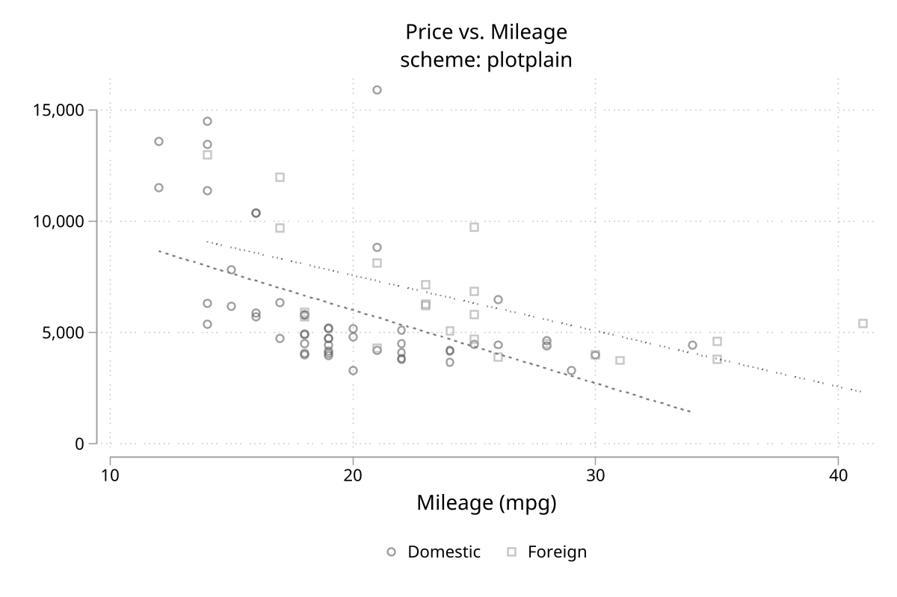 | `plotplain` |
| 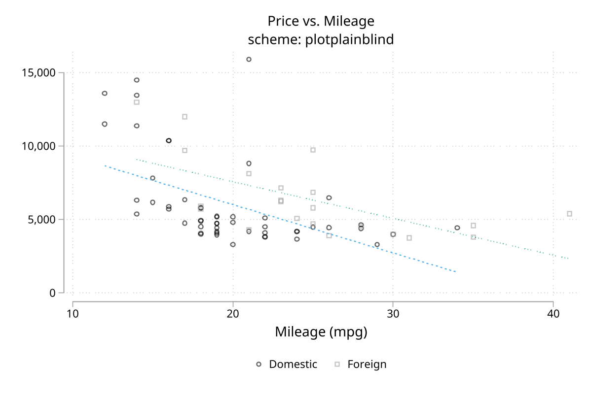 | `plotplainblind` |
| 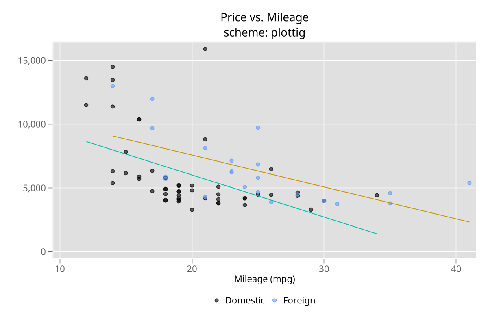 | `plottig` |
| 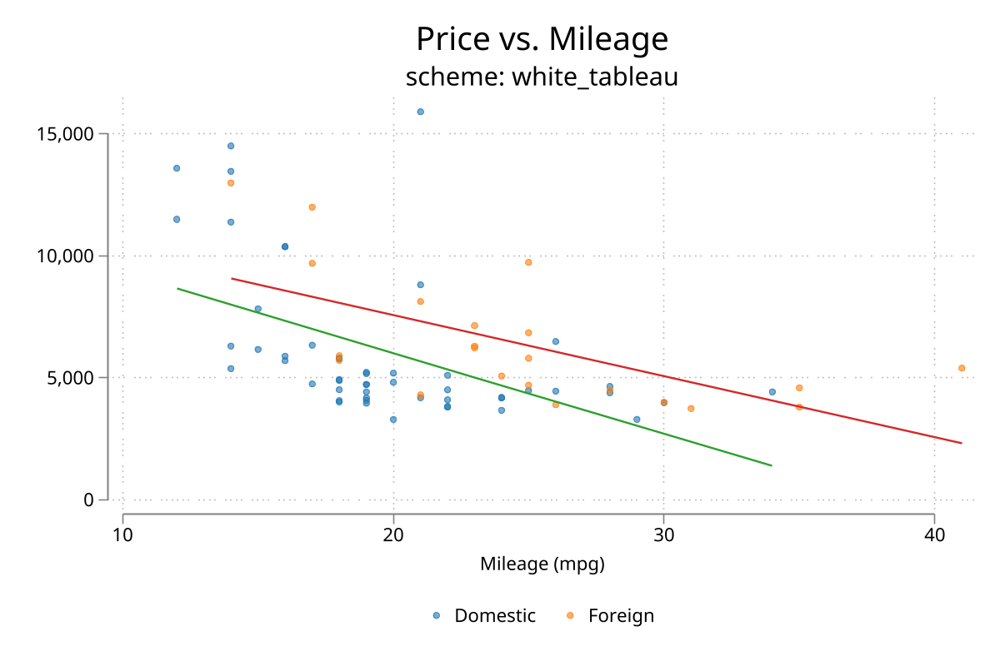 | `white_tableau` |
| 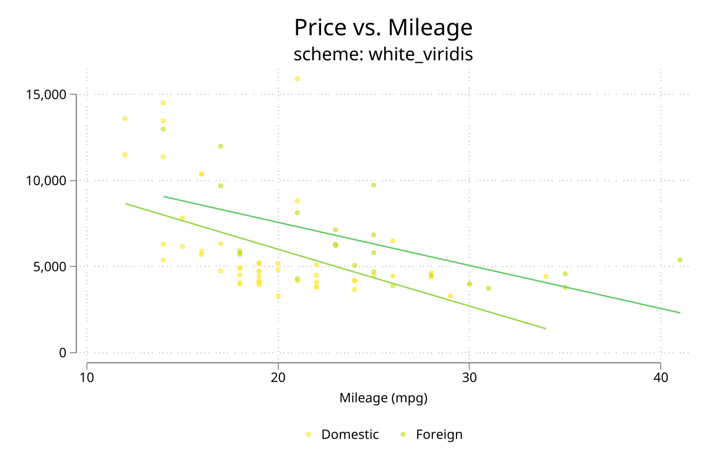 | `white_viridis` |
| 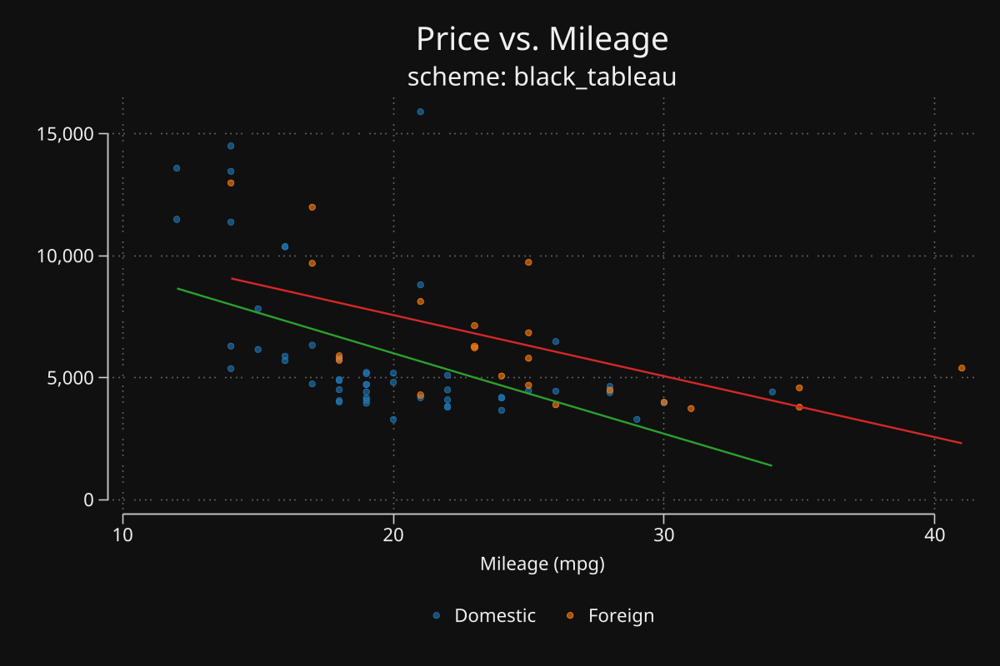 | `black_tableau` |
| 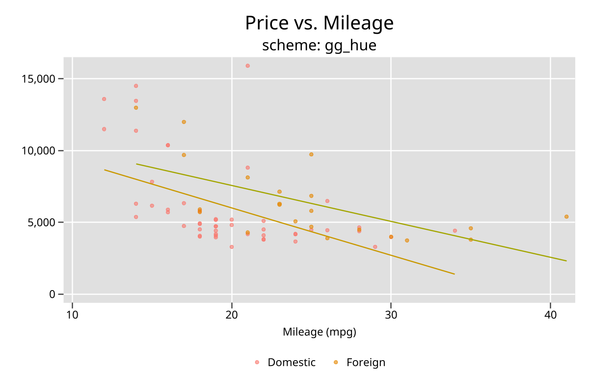 | `gg_hue` |
| 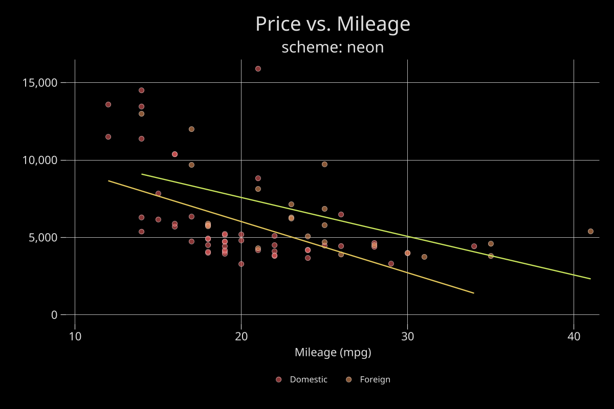 | `neon` |
| 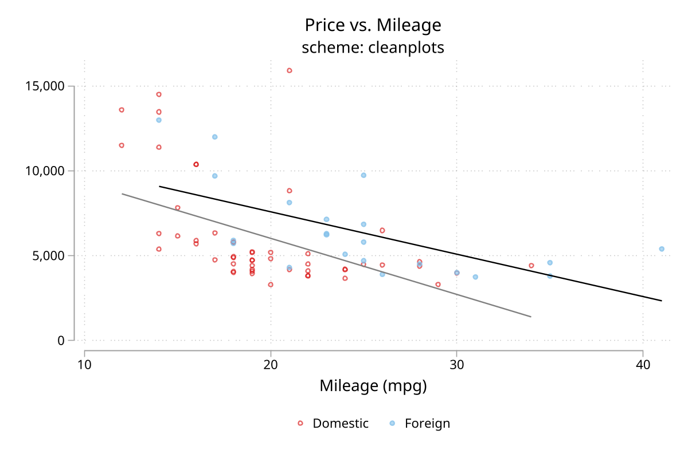 | `cleanplots` |
| 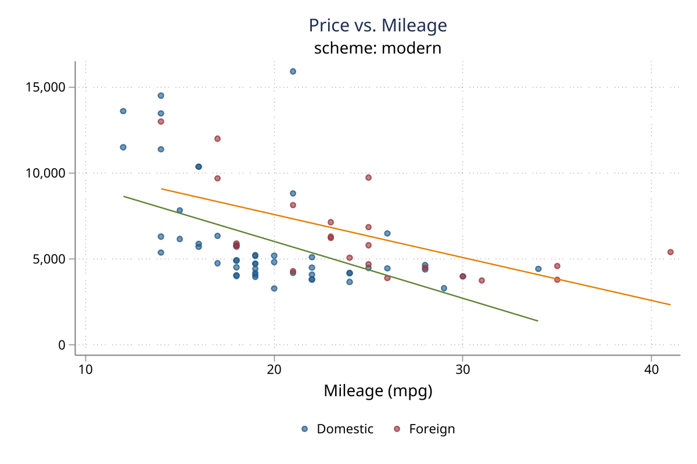 | `modern` |
| 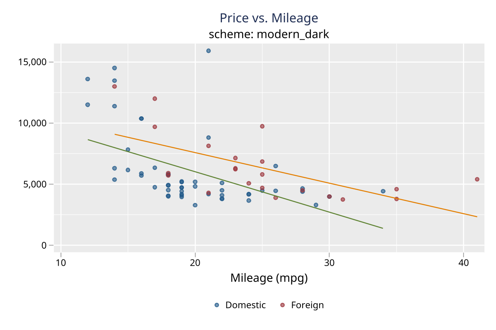 | `modern_dark` |
| 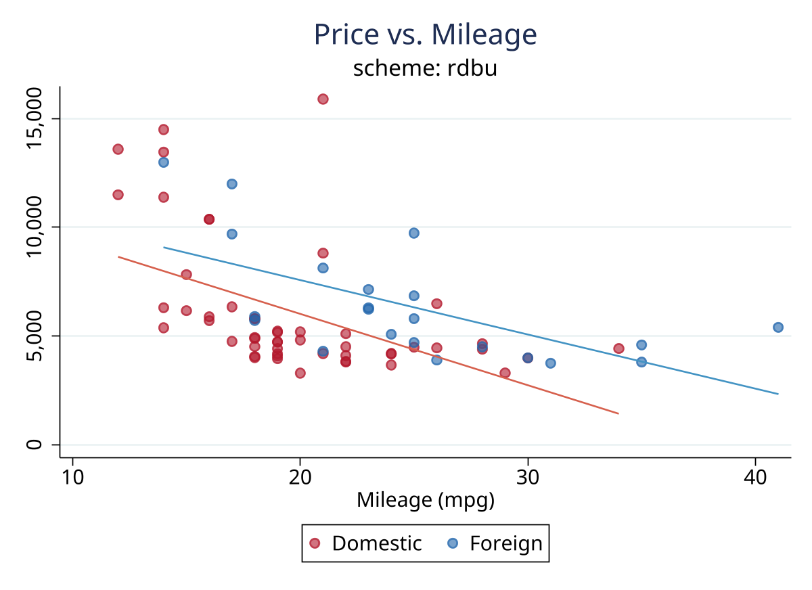 | `rdbu` |
| 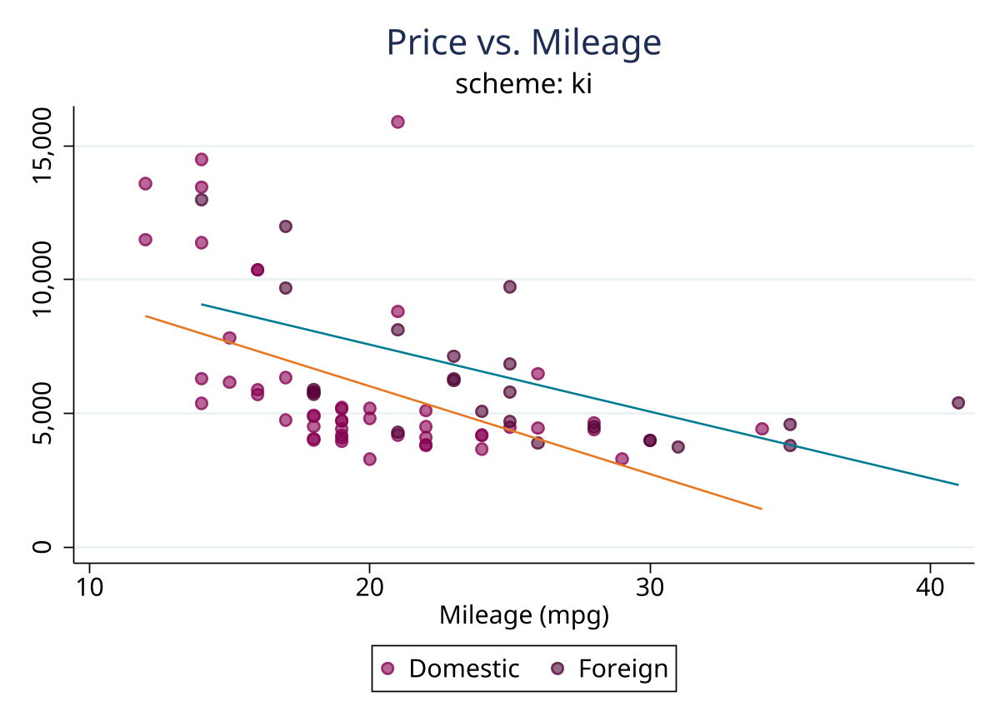 | `ki` |
| 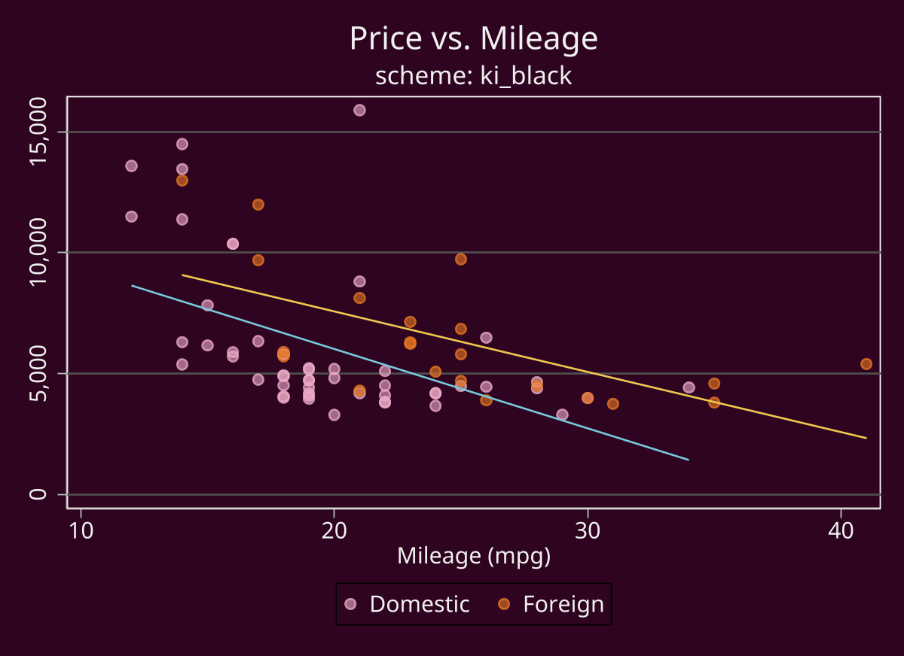 | `ki_black` |

## Command Reference

### Syntax

```stata
tc_schemes [, source(string) list detail]
```

### Display output

The default display groups schemes by source family, reports the selected total, and shows the `set scheme` and `scheme()` usage forms. `list` emits only the selected scheme names, while `detail` prints family descriptions, authorship, palette information, and usage notes.

## Key Options

| Option | Minimum abbreviation | Default | Effect |
|--------|----------------------|---------|--------|
| `source(string)` | `so` | `all` | Select `all`, `blindschemes`, `schemepack`, `cleanplots`, `modern`, or `tc` |
| `list` | `li` | off | Display selected scheme names as a simple list |
| `detail` | `de` | off | Display detailed descriptions and attribution |

`source()` is case-insensitive. `list` and `detail` cannot be combined; an invalid source or a conflicting pair of display options returns Stata error 198.

## Stored Results

After a successful call, `tc_schemes` stores the following results in `r()` regardless of whether the default, list, or detail display was requested:

| Result | Type | Meaning |
|--------|------|---------|
| `r(schemes)` | local macro | Space-separated scheme names in catalog order for the selected source |
| `r(n_schemes)` | scalar | Number of selected schemes |
| `r(sources)` | local macro | Selected source label(s); the default is `blindschemes schemepack cleanplots modern tc` |
| `r(version)` | local macro | Package version, currently `1.1.0` |

## Assumptions and Limits

- The package supplies scheme and style files; it does not replace Stata graph commands or create graphs without a graph command.
- Use the exact scheme names shown by `tc_schemes` with `set scheme` or `scheme()`.
- The `jet` family is included for compatibility, but the help file recommends caution because rainbow-style scales can mislead for continuous data.
- `cleanplots`, `modern`, and `modern_dark` are bundled unmodified with attribution. The wrapper code is MIT-licensed, while bundled upstream files retain their original licensing and attribution.

## References

### Bundled sources and attribution

- Daniel Bischof created `blindschemes`; Mead Over supplied compatibility fixes included in this consolidation. Bischof, D. (2015), “Figure Schemes for Decent Stata Figures: plotplain & plottig.”
- Asjad Naqvi created `schemepack`, including the palette and background series collected here.
- Trenton D. Mize created [`cleanplots`](https://www.trentonmize.com/software/cleanplots), which is bundled unmodified with attribution.
- Michael Droste created [`scheme-modern`](https://github.com/mdroste/stata-scheme-modern); `modern` and `modern_dark` are bundled unmodified with attribution.
- `rdbu` uses colors based on [ColorBrewer](https://colorbrewer2.org); `ki` and `ki_black` use Karolinska Institutet brand colors, including KI plum (RGB 135 0 82).

## Version History

- **1.1.0** (2026-06-28): Added six schemes for 45 total, bundled `cleanplots` and `modern`/`modern_dark` with attribution, and added original `rdbu`, `ki`, and `ki_black` schemes plus `source()` filters for `cleanplots`, `modern`, and `tc`.
- **1.0.0** (2026-04-08): Initial Stata-Tools release consolidating `blindschemes`, `blindschemes_fix`, and `schemepack` under one installable catalog command.

## Author

Timothy P Copeland, Karolinska Institutet

## License

MIT for the wrapper command and original `rdbu`, `ki`, and `ki_black` schemes. Bundled upstream scheme files retain their original licenses and attribution.
