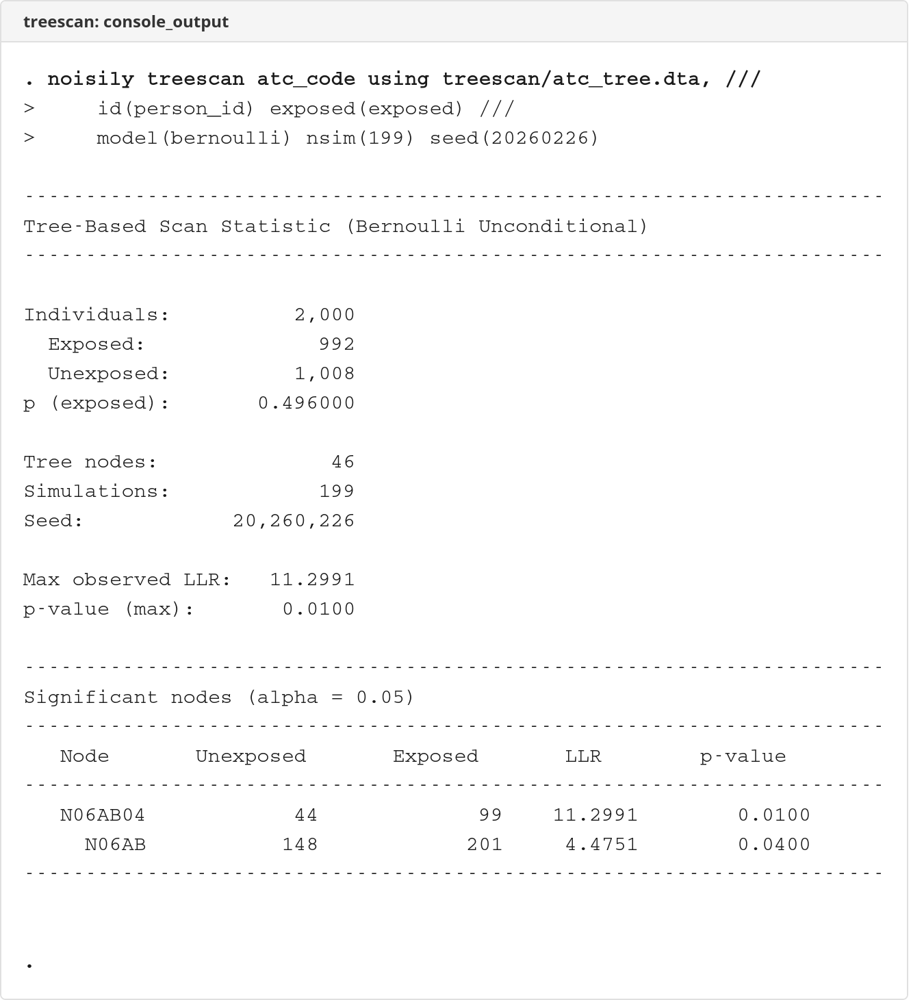

# treescan

Tree-based scan statistic for signal detection in Stata.

Version 1.3.5 | 2026-02-28

## Screenshots

### Console Output


## Overview

`treescan` implements the tree-based scan statistic (Kulldorff et al., 2003) for detecting excess risk across nodes in a hierarchical tree structure. It is used in pharmacovigilance and vaccine safety surveillance to identify unexpected adverse events associated with drug or vaccine exposure.

The method simultaneously tests all nodes in a hierarchical tree (e.g., ICD-10 diagnosis codes, ATC drug classes), adjusting for multiple comparisons via Monte Carlo simulation.

**Four model variants are available:**

- **Bernoulli unconditional** (default): Tests excess exposure at each node; null resamples exposure labels.
- **Bernoulli conditional**: Same LLR, but null permutes exactly N_exposed labels (fixed marginals).
- **Poisson unconditional**: Tests excess cases at each node with person-time; null resamples case labels.
- **Poisson conditional**: Same LLR, but null permutes exactly C case labels (fixed marginals).

**Additional features:**

- **Temporal scan windows**: Restrict analysis to events within a risk window relative to exposure onset.
- **Power evaluation**: Simulation-based power to detect a signal at a target node (`treescan_power`).

## Installation

```stata
* From local path
net install treescan, from("/path/to/treescan/") replace
```

## Commands

| Command | Description |
|---------|-------------|
| `treescan` | Tree-based scan statistic for signal detection |
| `treescan_power` | Simulation-based power evaluation |

## Syntax

```stata
* Bernoulli unconditional (default)
treescan diagvar, id(varname) exposed(varname) icdversion(cm|se|atc) [options]

* Bernoulli conditional
treescan diagvar, id(varname) exposed(varname) icdversion(cm|se|atc) conditional [options]

* Poisson model with person-time
treescan diagvar, id(varname) exposed(varname) persontime(varname) ///
    model(poisson) icdversion(cm|se|atc) [options]

* With temporal scan window
treescan diagvar, id(varname) exposed(varname) icdversion(cm|se|atc) ///
    eventdate(varname) expdate(varname) window(0 30) [options]

* With custom tree
treescan diagvar using treefile.dta, id(varname) exposed(varname) [options]

* Power evaluation
treescan_power diagvar, id(varname) exposed(varname) icdversion(cm|se|atc) ///
    target(node_code) rr(3) [options]
```

### Required Options

| Option | Description |
|--------|-------------|
| `id(varname)` | Person/unit identifier |
| `exposed(varname)` | Binary exposure variable (0/1) or case status for Poisson |
| `icdversion(cm\|se\|atc)` | Built-in tree: `cm` (ICD-10-CM), `se` (ICD-10-SE), or `atc` (ATC drugs) |

### Model Options

| Option | Default | Description |
|--------|---------|-------------|
| `model(string)` | bernoulli | Statistical model: `bernoulli` or `poisson` |
| `persontime(varname)` | — | Person-time variable (required for Poisson) |
| `conditional` | — | Use conditional (permutation) test |

### Temporal Scan Window Options

| Option | Default | Description |
|--------|---------|-------------|
| `eventdate(varname)` | — | Date of diagnosis event |
| `expdate(varname)` | — | Date of exposure onset |
| `window(# #)` | — | Risk window bounds in days |
| `windowscope(string)` | exposed | Apply filter to `exposed` or `all` individuals |

### Optional

| Option | Default | Description |
|--------|---------|-------------|
| `nsim(#)` | 999 | Number of Monte Carlo simulations |
| `alpha(#)` | 0.05 | Significance level for display |
| `seed(#)` | — | Random seed for reproducibility |
| `noisily` | — | Show progress during simulation |

### Power Options (treescan_power only)

| Option | Default | Description |
|--------|---------|-------------|
| `target(string)` | — | Node code where signal is injected |
| `rr(#)` | — | Relative risk to simulate (must be > 1) |
| `nsimpower(#)` | 500 | Number of power iterations |

## Examples

```stata
* Bernoulli unconditional: detect adverse events
treescan diagcode, id(patient_id) exposed(drug_exposed) ///
    icdversion(cm) nsim(999) seed(12345) noisily

* Bernoulli conditional: permutation-based test
treescan diagcode, id(patient_id) exposed(drug_exposed) ///
    icdversion(cm) conditional nsim(999) seed(12345)

* Poisson conditional: with person-time
treescan diagcode, id(patient_id) exposed(case) persontime(pyears) ///
    model(poisson) conditional icdversion(cm) nsim(999) seed(12345)

* Temporal window: events within 30 days of exposure
treescan diagcode, id(patient_id) exposed(drug_exposed) icdversion(cm) ///
    eventdate(diag_date) expdate(rx_date) window(0 30)

* Power: estimate power to detect RR=3 at node A000
treescan_power diagcode, id(patient_id) exposed(drug_exposed) ///
    icdversion(cm) target(A000) rr(3) nsim(999) nsimpower(500) seed(42)
```

## Built-in Trees

- **ICD-10-CM** (FY2025): ~98,000 nodes from CDC/CMS. Hierarchy: Root → Chapter → Block → Category → Subcode.
- **ICD-10-SE**: ~39,000 nodes from Socialstyrelsen via TreeMineR. Hierarchy: Root → Chapter → Block → Category → Subcode (up to 7 levels).
- **ATC** (WHO 2025): ~6,800 nodes from WHO ATC classification. Hierarchy: Root → Anatomical → Therapeutic → Pharmacological → Chemical → Substance.

## Custom Trees

A custom tree must be a Stata `.dta` file with variables:

| Variable | Type | Description |
|----------|------|-------------|
| `node` | string | Node identifier |
| `parent` | string | Parent node identifier (empty for root) |
| `level` | numeric | Hierarchy depth (0 = root) |

## Stored Results

### treescan

| Result | Description |
|--------|-------------|
| `r(max_llr)` | Maximum observed log-likelihood ratio |
| `r(p_value)` | Monte Carlo p-value for max LLR |
| `r(n_nodes)` | Number of tree nodes evaluated |
| `r(n_obs)` | Number of observations used |
| `r(n_exposed)` | Number of exposed individuals |
| `r(n_unexposed)` | Number of unexposed individuals |
| `r(nsim)` | Simulations performed |
| `r(model)` | Model used: bernoulli or poisson |
| `r(conditional)` | Contains "conditional" if conditional test used |
| `r(total_persontime)` | Total person-time (Poisson only) |
| `r(total_cases)` | Total cases (Poisson only) |
| `r(window_lo)` | Temporal window lower bound (when specified) |
| `r(window_hi)` | Temporal window upper bound (when specified) |
| `r(windowscope)` | Window scope (when specified) |
| `r(results)` | Matrix of significant nodes |

### treescan_power

| Result | Description |
|--------|-------------|
| `r(power)` | Estimated power |
| `r(power_ci_lo)` | Lower 95% CI for power |
| `r(power_ci_hi)` | Upper 95% CI for power |
| `r(crit_val)` | Critical LLR value at alpha |
| `r(rr)` | Relative risk used |
| `r(nsim)` | Number of null simulations |
| `r(nsim_power)` | Number of power iterations |
| `r(target)` | Target node |
| `r(model)` | Model used |

## References

- Kulldorff M, Fang Z, Walsh SJ. A tree-based scan statistic for database disease surveillance. *Biometrics*. 2003;59(2):323-331.
- Kulldorff M, et al. Drug safety data mining with a tree-based scan statistic. *Pharmacoepidemiol Drug Saf*. 2013;22(5):517-523.

## Requirements

- Stata 16.0+
- No external dependencies
