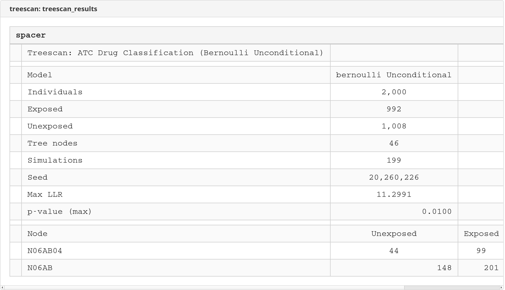

# treescan — Tree-Based Scan Statistic for Stata

 

**Version 1.4.0** | 2026-03-01

Implements the tree-based scan statistic (Kulldorff et al., 2003) for detecting excess risk across nodes in a hierarchical tree structure. Used in pharmacovigilance and vaccine safety surveillance to identify unexpected adverse events associated with drug or vaccine exposure.

## Table of Contents

- [Installation](#installation)
- [How It Works](#how-it-works)
- [Quick Start](#quick-start)
- [Commands](#commands)
- [Model Variants](#model-variants)
- [Command Reference](#command-reference)
  - [treescan](#treescan-1)
  - [treescan_power](#treescan_power)
- [Built-in Trees](#built-in-trees)
- [Custom Trees](#custom-trees)
- [Temporal Scan Windows](#temporal-scan-windows)
- [Worked Example: Pharmacovigilance Signal Detection](#worked-example-pharmacovigilance-signal-detection)
- [Stored Results](#stored-results)
- [Demo Output](#demo-output)
- [References](#references)
- [Version](#version)

---

## Installation

```stata
net install treescan, from("https://raw.githubusercontent.com/tpcopeland/Stata-Tools/main/treescan/") replace
```

Includes three built-in trees: ICD-10-CM (~98K nodes), ICD-10-SE (~39K nodes), ATC drug classes (~6.8K nodes). No external dependencies.

---

## How It Works

The tree-based scan statistic simultaneously tests all nodes in a hierarchical tree for excess risk, adjusting for multiple comparisons via Monte Carlo simulation.

```
                    Root
                   /    \
            Chapter A   Chapter B
              /   \         |
          Block    Block   Block
          A00-A09  A15-A19 B00-B09
          /  \       |
       A00    A01   A15
       / \
    A000  A001  ◄── Signal detected here: excess drug exposure
```

**Algorithm:**
1. Map each diagnosis code to all ancestors in the tree (e.g., A000 → A00 → A00-A09 → Chapter A → Root)
2. At each node, compute the log-likelihood ratio (LLR) measuring excess risk among the exposed
3. Run Monte Carlo simulations under the null to get the distribution of the maximum LLR
4. Compute p-values by comparing each node's observed LLR to the null max-LLR distribution

This provides a single test with family-wise error rate control across the entire tree — no Bonferroni needed.

---

## Quick Start

```stata
* Detect adverse events associated with drug exposure (ICD-10-CM tree)
treescan diagcode, id(patient_id) exposed(drug_exposed) ///
    icdversion(cm) nsim(999) seed(12345)

* Same with Swedish ICD-10 codes
treescan diagnos, id(lopnr) exposed(treated) ///
    icdversion(se) nsim(999) seed(42)

* Drug class signal detection (ATC tree)
treescan atc_code, id(patient_id) exposed(case) ///
    icdversion(atc) nsim(999) seed(42)
```

---

## Commands

| Command | Purpose |
|---------|---------|
| `treescan` | Tree-based scan statistic for signal detection |
| `treescan_power` | Simulation-based power evaluation |

---

## Model Variants

| Model | Exposure | Null hypothesis | When to use |
|-------|----------|----------------|-------------|
| **Bernoulli unconditional** (default) | Binary exposed/unexposed | Resample exposure labels with probability p = N_exp/N | Standard pharmacovigilance screening |
| **Bernoulli conditional** | Binary exposed/unexposed | Permute exactly N_exp labels (fixed marginals) | Better type I error when N_exp is small |
| **Poisson unconditional** | Cases + person-time | Resample case labels with probability C/N | Incidence rate comparisons |
| **Poisson conditional** | Cases + person-time | Permute exactly C case labels (fixed marginals) | Incidence rates with few cases |

---

## Command Reference

### treescan

**Syntax:**
```stata
* Using a built-in tree
treescan diagvar, id(varname) exposed(varname) icdversion(cm|se|atc) [options]

* Using a custom tree
treescan diagvar using treefile.dta, id(varname) exposed(varname) [options]
```

#### Required Options

| Option | Description |
|--------|-------------|
| `id(varname)` | Person/unit identifier. Each person may have multiple rows (one per diagnosis). |
| `exposed(varname)` | Binary exposure (0/1). For Bernoulli: drug-exposed vs unexposed. For Poisson: case vs non-case. Constant within person; if it varies, max is used (ever exposed = exposed). |
| `icdversion(cm\|se\|atc)` | Built-in tree to use (or `using` for custom tree). |

#### Model Options

| Option | Default | Description |
|--------|---------|-------------|
| `model(string)` | `bernoulli` | `bernoulli` or `poisson` |
| `persontime(varname)` | — | Person-time variable (**required** for Poisson) |
| `conditional` | — | Use conditional (permutation) test |

#### Temporal Scan Window

| Option | Description |
|--------|-------------|
| `eventdate(varname)` | Date of diagnosis event |
| `expdate(varname)` | Date of exposure onset |
| `window(# #)` | Risk window in days, e.g., `window(0 30)` |
| `windowscope(string)` | Apply window to `exposed` (default) or `all` individuals |

All three (`eventdate`, `expdate`, `window`) must be specified together. See [Temporal Scan Windows](#temporal-scan-windows).

#### Simulation Options

| Option | Default | Description |
|--------|---------|-------------|
| `nsim(#)` | `999` | Monte Carlo simulations. Use `9999` for publication. |
| `alpha(#)` | `0.05` | Significance level for display |
| `seed(#)` | — | Random seed for reproducibility |
| `noisily` | — | Show progress every 100 iterations |

#### Export Options

| Option | Description |
|--------|-------------|
| `xlsx(filename)` | Export results to Excel |
| `sheet(name)` | Worksheet name; default `"Results"` |
| `title(string)` | Title for first row of spreadsheet |

---

### treescan_power

Estimates statistical power to detect a signal of specified strength at a target node.

**Syntax:**
```stata
treescan_power diagvar, id(varname) exposed(varname) icdversion(cm|se|atc)
    target(string) rr(#) [options]
```

**How it works:**
1. Runs null simulations to establish the critical value (the (1-alpha) quantile of the null max-LLR distribution)
2. Repeatedly generates data with an injected signal at the target node (inflates exposure probability by the specified RR)
3. Estimates power as the fraction of iterations where max LLR exceeds the critical value

#### Required Options

| Option | Description |
|--------|-------------|
| `target(string)` | Node code where signal is injected (leaf or internal) |
| `rr(#)` | Relative risk to simulate (must be > 1) |

#### Simulation Options

| Option | Default | Description |
|--------|---------|-------------|
| `nsim(#)` | `999` | Null simulations for critical value |
| `nsimpower(#)` | `500` | Power evaluation iterations |
| `alpha(#)` | `0.05` | Significance level |
| `seed(#)` | — | Random seed |

Plus all model options from `treescan` (`model`, `conditional`, `persontime`).

#### Temporal Scan Window

| Option | Description |
|--------|-------------|
| `eventdate(varname)` | Date of diagnosis event |
| `expdate(varname)` | Date of exposure onset |
| `window(# #)` | Risk window in days (lower upper) |
| `windowscope(string)` | Apply window to `exposed` (default) or `all` |

All three (`eventdate`, `expdate`, `window`) must be specified together. See [Temporal Scan Windows](#temporal-scan-windows).

---

## Built-in Trees

| Tree | Codes | Nodes | Source |
|------|-------|-------|--------|
| **ICD-10-CM** | `icdversion(cm)` | ~98,000 | CDC/CMS FY2025 |
| **ICD-10-SE** | `icdversion(se)` | ~39,000 | Socialstyrelsen (Swedish) |
| **ATC** | `icdversion(atc)` | ~6,800 | WHO 2025 |

**ICD-10 hierarchy:** Root → Chapter → Block → Category → Subcode (up to 7 levels for SE)

**ATC hierarchy:** Root → Anatomical (1 char) → Therapeutic (3 chars) → Pharmacological (4 chars) → Chemical (5 chars) → Substance (7 chars)

---

## Custom Trees

Supply a `.dta` file with three variables:

| Variable | Type | Description |
|----------|------|-------------|
| `node` | string | Node identifier |
| `parent` | string | Parent node (empty for root) |
| `level` | numeric | Hierarchy depth (0 = root) |

```stata
treescan diagvar using my_custom_tree.dta, id(patient_id) exposed(case)
```

---

## Temporal Scan Windows

Restrict analysis to events occurring within a time window relative to exposure onset. Useful for acute adverse event detection.

```stata
* Events within 30 days of drug exposure
treescan diagcode, id(patient_id) exposed(drug_exposed) icdversion(cm) ///
    eventdate(diag_date) expdate(rx_date) window(0 30)

* Events from 7 days before to 90 days after exposure
treescan diagcode, id(patient_id) exposed(drug_exposed) icdversion(cm) ///
    eventdate(diag_date) expdate(rx_date) window(-7 90)

* Apply window to all individuals (not just exposed)
treescan diagcode, id(patient_id) exposed(drug_exposed) icdversion(cm) ///
    eventdate(diag_date) expdate(rx_date) window(0 30) windowscope(all)
```

By default (`windowscope(exposed)`), the window filter applies only to exposed individuals — unexposed individuals' events are kept regardless of timing. With `windowscope(all)`, events outside the window are dropped for everyone.

---

## Worked Example: Pharmacovigilance Signal Detection

Detect ICD-10 diagnosis codes with excess occurrence among drug-exposed individuals.

```stata
* Load pharmacovigilance dataset
* Each row = one diagnosis for one patient
* Columns: patient_id, diagcode, drug_exposed (0/1)
use pharma_data, clear

* Run the scan with Bernoulli unconditional model
* 999 simulations for multiple comparison adjustment
treescan diagcode, id(patient_id) exposed(drug_exposed) ///
    icdversion(cm) nsim(999) seed(12345) noisily

* Check stored results
display "Max LLR: " r(max_llr)
display "P-value: " r(p_value)
display "Nodes evaluated: " r(n_nodes)

* If significant nodes found, they're in r(results)
matrix list r(results)

* Export to Excel for regulatory submission
treescan diagcode, id(patient_id) exposed(drug_exposed) ///
    icdversion(cm) nsim(9999) seed(12345) ///
    xlsx(signal_detection) title("Drug X Safety Signal Detection")
```

### Bernoulli conditional (permutation test)

```stata
* Better type I error control when N_exposed is small
treescan diagcode, id(patient_id) exposed(drug_exposed) ///
    icdversion(cm) conditional nsim(999) seed(12345)
```

### Poisson model with person-time

```stata
* When individuals contribute different amounts of follow-up
treescan diagcode, id(patient_id) exposed(case) ///
    persontime(pyears) model(poisson) icdversion(cm) ///
    nsim(999) seed(12345)
```

### Power evaluation

```stata
* Can we detect a 3-fold excess risk at node A000?
treescan_power diagcode, id(patient_id) exposed(drug_exposed) ///
    icdversion(cm) target(A000) rr(3) ///
    nsim(999) nsimpower(500) seed(42)

display "Power: " r(power) " (" r(power_ci_lo) ", " r(power_ci_hi) ")"
```

### Power evaluation with temporal window

```stata
* Power to detect a 3-fold risk within 30 days of drug exposure
treescan_power diagcode, id(patient_id) exposed(drug_exposed) ///
    icdversion(cm) target(A000) rr(3) ///
    eventdate(diag_date) expdate(rx_date) window(0 30) ///
    nsim(999) nsimpower(500) seed(42)

display "Power: " r(power)
display "Window: " r(window_lo) " to " r(window_hi) " days"
```

---

## Stored Results

### treescan → r()

| Result | Description |
|--------|-------------|
| `r(max_llr)` | Maximum observed log-likelihood ratio |
| `r(p_value)` | Monte Carlo p-value for max LLR |
| `r(n_nodes)` | Tree nodes evaluated |
| `r(n_obs)` | Observations used |
| `r(n_exposed)` | Exposed individuals (Bernoulli) or cases (Poisson) |
| `r(n_unexposed)` | Unexposed individuals or non-cases |
| `r(nsim)` | Simulations performed |
| `r(alpha)` | Significance level |
| `r(model)` | `bernoulli` or `poisson` |
| `r(conditional)` | `"conditional"` if conditional test used |
| `r(total_persontime)` | Total person-time (Poisson only) |
| `r(total_cases)` | Total cases (Poisson only) |
| `r(window_lo)` / `r(window_hi)` | Temporal window bounds (when specified) |
| `r(windowscope)` | Window scope (when specified) |
| `r(results)` | Matrix of significant nodes: (n0, n1, LLR, pvalue) for Bernoulli; (cases, persontime, LLR, pvalue) for Poisson |

### treescan_power → r()

| Result | Description |
|--------|-------------|
| `r(power)` | Estimated power |
| `r(power_ci_lo)` / `r(power_ci_hi)` | 95% CI for power |
| `r(crit_val)` | Critical LLR at alpha |
| `r(rr)` | Relative risk used |
| `r(target)` | Target node |
| `r(nsim)` | Null simulations |
| `r(nsim_power)` | Power iterations |
| `r(n_reject)` | Number of rejections |
| `r(n_individuals)` | Unique individuals |
| `r(n_nodes)` | Tree nodes evaluated |
| `r(model)` | Model used |
| `r(window_lo)` / `r(window_hi)` | Temporal window bounds (when specified) |
| `r(windowscope)` | Window scope (when specified) |

---

## Demo Output




---

## Validation

The `qa/` directory contains **~15 tests** across 2 validation files, all passing.

### Hand-computed LLR verification (V1, V2, V5 — 6 tests)

Verifies log-likelihood ratio computation against hand-calculated values with tolerance < 0.001:
- **Bernoulli minimal tree (V1):** Expected LLR = 1.6279 for a 4-exposed/3-unexposed split across 20 individuals
- **Asymmetric tree (V2):** Expected LLR = 1.7193 for an internal node with 3 exposed at a 0.75 concentration
- **Poisson model (V5):** Expected LLR = 2.5642 for 5 cases across 55 person-years with 4 cases concentrated at one node

### R TreeMineR cross-validation (V3 — 3 tests)

Cross-validates against R `TreeMineR` using its built-in ICD-10-SE diagnoses dataset (~969 exposed, ~8,865 unexposed). Both tools detect a strong signal (LLR > 5) at the same top node. TreeMineR benchmark: node "12" with LLR = 11.995, p = 0.001. The treescan p-value is significant at α = 0.05.

### Null distribution (V4 — 1 test)

Confirms that 200 random observations with no true signal produce a non-significant p-value (> 0.01), validating type I error control.

### Conditional model equivalence (V6, V7 — 4 tests)

Verifies that conditional and unconditional models produce identical observed LLR values (tolerance < 1e-10) for both Bernoulli and Poisson models, confirming that the permutation test implementation is consistent with the unconditional test.

## Performance

Runtime scales linearly with `nsim` and the number of unique (individual, node) pairs. Rough guidelines:

| Tree | Individuals | nsim | Expected time |
|------|-------------|------|---------------|
| ATC (~6.8K nodes) | 2,000 | 999 | < 1 minute |
| ICD-10-SE (~39K nodes) | 5,000 | 999 | 2-5 minutes |
| ICD-10-CM (~98K nodes) | 10,000 | 999 | 5-15 minutes |

Use `noisily` to monitor progress during long runs.

---

## References

- Kulldorff M, Fang Z, Walsh SJ. A tree-based scan statistic for database disease surveillance. *Biometrics*. 2003;59(2):323-331.
- Kulldorff M, et al. Drug safety data mining with a tree-based scan statistic. *Pharmacoepidemiol Drug Saf*. 2013;22(5):517-523.

## Author

Timothy P. Copeland
Department of Clinical Neuroscience
Karolinska Institutet, Stockholm, Sweden

## License

MIT

## Requirements

- Stata 16.0+
- No external dependencies

## Version

Version 1.4.0, 2026-03-01
