# tte — Target Trial Emulation for Stata

 

The first Stata implementation of the complete target trial emulation workflow. Implements the sequential trials framework (Hernan & Robins, 2016) with the clone-censor-weight approach for estimating per-protocol, intention-to-treat, and as-treated effects from observational data.

Goes beyond the R `TrialEmulation` package by adding Cox model support, a Hernan 7-component protocol table generator, weight/balance diagnostics, and publication-ready reporting — all in a single, integrated pipeline.

## Table of Contents

- [Installation](#installation)
- [Quick Start](#quick-start)
- [Commands](#commands)
- [The Pipeline](#the-pipeline)
- [Estimands](#estimands)
- [Command Reference](#command-reference)
  - [tte_prepare](#tte_prepare)
  - [tte_validate](#tte_validate)
  - [tte_expand](#tte_expand)
  - [tte_weight](#tte_weight)
  - [tte_fit](#tte_fit)
  - [tte_predict](#tte_predict)
  - [tte_diagnose](#tte_diagnose)
  - [tte_plot](#tte_plot)
  - [tte_report](#tte_report)
  - [tte_protocol](#tte_protocol)
- [Worked Example: ITT Analysis](#worked-example-itt-analysis)
- [Worked Example: Per-Protocol Analysis with IPTW](#worked-example-per-protocol-analysis-with-iptw)
- [Technical Notes](#technical-notes)
- [Features Beyond R TrialEmulation](#features-beyond-r-trialemulation)
- [Stored Results](#stored-results)
- [Demo Output](#demo-output)
- [References](#references)
- [Version](#version)

---

## Installation

```stata
net install tte, from("https://raw.githubusercontent.com/tpcopeland/Stata-Tools/main/tte")
```

The package includes `tte_example.dta` (503 patients, 48,400 person-periods) for testing.

---

## Quick Start

```stata
use tte_example, clear

* ITT analysis in 5 commands
tte_prepare, id(patid) period(period) treatment(treatment) ///
    outcome(outcome) eligible(eligible) ///
    covariates(age sex comorbidity biomarker) estimand(ITT)
tte_validate
tte_expand, maxfollowup(8)
tte_fit, outcome_cov(age sex comorbidity) nolog
tte_predict, times(0 2 4 6 8) type(cum_inc) difference samples(100) seed(12345)
```

---

## Commands

| Command | Purpose |
|---------|---------|
| `tte` | Package overview and workflow guide |
| `tte_prepare` | Map variables and set the estimand |
| `tte_validate` | Run 10 data quality checks |
| `tte_expand` | Create sequential emulated trials (clone-censor) |
| `tte_weight` | Calculate stabilized inverse probability weights |
| `tte_fit` | Fit the outcome model (pooled logistic or Cox MSM) |
| `tte_predict` | Marginal cumulative incidence with Monte Carlo CIs |
| `tte_diagnose` | Weight diagnostics and covariate balance |
| `tte_plot` | KM curves, cumulative incidence, weight distributions |
| `tte_report` | Publication-quality results tables (display/Excel/CSV) |
| `tte_protocol` | Hernan & Robins 7-component protocol table |

---

## The Pipeline

Data flows through the commands in order. Each step stores metadata as dataset characteristics so downstream commands know what has been done.

```
                          ┌──────────────────┐
                          │   Person-period  │
                          │      data        │
                          └────────┬─────────┘
                                   │
                          ┌────────▼─────────┐
                    ┌─────│   tte_prepare    │  Map variables, set estimand
                    │     └────────┬─────────┘
                    │              │
                    │     ┌────────▼─────────┐
                    │     │   tte_validate   │  10 data quality checks
                    │     └────────┬─────────┘
                    │              │
                    │     ┌────────▼─────────┐
  tte_protocol ─────┤     │   tte_expand     │  Clone → censor → sequential trials
  (any time)        │     └────────┬─────────┘
                    │              │
                    │     ┌────────▼─────────┐
                    │     │   tte_weight     │  Stabilized IPTW (PP/AT only)
                    │     └────────┬─────────┘
                    │              │
                    │     ┌────────▼─────────┐
                    │     │   tte_fit        │  Pooled logistic or Cox MSM
                    │     └────────┬─────────┘
                    │              │
                    │     ┌────────▼─────────┐
                    │     │   tte_predict    │  Marginal cumulative incidence
                    │     └────────┬─────────┘
                    │              │
                    │     ┌────────▼─────────┐
                    └─────│   tte_report     │  Publication tables
                          │   tte_diagnose   │  Weight/balance diagnostics
                          │   tte_plot       │  Visualization
                          └──────────────────┘
```

**ITT**: Skip `tte_weight` (no artificial censoring, weights = 1).
**PP/AT**: Include `tte_weight` to adjust for the artificial censoring introduced by `tte_expand`.

---

## Estimands

| Estimand | What it asks | Censoring rule | Weights needed? |
|----------|-------------|----------------|-----------------|
| **ITT** | What if everyone followed their *initial* assignment? | None | No |
| **PP** | What if everyone *adhered* to their assigned treatment? | Censor at treatment deviation | Yes (IPTW) |
| **AT** | What if everyone *continued* as actually treated? | Censor at treatment switching | Yes (IPTW) |

Set the estimand once in `tte_prepare, estimand(PP)` — all downstream commands inherit it automatically.

---

## Command Reference

### tte_prepare

Entry point. Maps your variable names to internal names and stores metadata for downstream commands.

**Syntax:**
```stata
tte_prepare, id(varname) period(varname) treatment(varname)
    outcome(varname) eligible(varname)
    [censor(varname) covariates(varlist) baseline_covariates(varlist)
     estimand(string) generate(string)]
```

**Required options:**

| Option | Description |
|--------|-------------|
| `id(varname)` | Patient identifier |
| `period(varname)` | Time period variable (integer, e.g., 0 1 2 ... T) |
| `treatment(varname)` | Binary treatment indicator (0/1) |
| `outcome(varname)` | Binary outcome indicator (0/1) |
| `eligible(varname)` | Binary trial eligibility indicator (0/1) |

**Optional:**

| Option | Description |
|--------|-------------|
| `censor(varname)` | Binary censoring indicator (0/1) |
| `covariates(varlist)` | Time-varying covariates (frozen at trial entry by `tte_expand`) |
| `baseline_covariates(varlist)` | Baseline-only covariates |
| `estimand(string)` | `ITT`, `PP` (default), or `AT` |
| `generate(string)` | Variable prefix; default `_tte_` |

**Data requirements:**
- Person-period (long) format: one row per individual per time period
- No duplicate `(id, period)` combinations
- Treatment/outcome/eligible must be binary 0/1
- Periods should be consecutive integers

---

### tte_validate

Runs 10 checks on the prepared data. Catches problems before the expensive expansion step.

**Syntax:**
```stata
tte_validate [, strict verbose]
```

| Option | Description |
|--------|-------------|
| `strict` | Treat warnings as errors (exit 198) |
| `verbose` | Show affected individual counts |

**Checks performed:**
1. Data structure (person-period format)
2. No gaps in period sequences
3. Treatment variable consistency
4. Outcome variable consistency
5. Missing data in key variables
6. Eligibility patterns
7. Sufficient sample size
8. Positivity (treated and untreated in each period)
9. Period numbering
10. Event rates

---

### tte_expand

The core algorithm. Expands person-period data into sequential emulated trials using the clone-censor-weight approach.

**Syntax:**
```stata
tte_expand [, trials(numlist) maxfollowup(#) grace(#)
    chunk_size(#) save(filename) replace keepvars(varlist)]
```

| Option | Description |
|--------|-------------|
| `trials(numlist)` | Specific trial periods to emulate (default: all eligible) |
| `maxfollowup(#)` | Maximum follow-up periods |
| `grace(#)` | Grace period for non-adherence; default `0` |
| `chunk_size(#)` | IDs per processing chunk (for large data); default `0` (all in memory) |
| `save(filename)` | Save expanded dataset to disk |
| `keepvars(varlist)` | Additional variables to carry forward |

**What it does (PP/AT):**
1. At each eligible period *t*, identifies eligible individuals
2. Clones each into treatment arm (arm=1) and control arm (arm=0)
3. Follows forward through subsequent periods
4. Censors when observed treatment deviates from assigned arm (after the grace period)
5. Drops post-censoring rows

**For ITT:** No cloning or artificial censoring — each individual enters once per eligible period.

**Covariate freezing:** All covariates from `tte_prepare` are frozen at their trial-entry (period *t*) values. This ensures the MSM conditions on baseline covariates L₀ only. Treatment retains its observed time-varying values.

**Grace periods:** With `grace(1)`, a treatment-arm patient who stops treatment at follow-up 0 is not censored until follow-up 1. This accommodates brief non-adherence.

---

### tte_weight

Calculates stabilized inverse probability weights to adjust for the artificial censoring introduced by `tte_expand`. Required for PP and AT; skipped for ITT (weights = 1).

**Syntax:**
```stata
tte_weight [, switch_d_cov(varlist) switch_n_cov(varlist)
    censor_d_cov(varlist) censor_n_cov(varlist)
    pool_switch pool_censor truncate(numlist)
    stabilized generate(name) replace nolog]
```

**Switch models (treatment switching):**

| Option | Description |
|--------|-------------|
| `switch_d_cov(varlist)` | Covariates for switch denominator (more variables = less confounding bias) |
| `switch_n_cov(varlist)` | Covariates for switch numerator (fewer variables = more stable weights) |

**Censoring models (informative censoring):**

| Option | Description |
|--------|-------------|
| `censor_d_cov(varlist)` | Covariates for censoring denominator |
| `censor_n_cov(varlist)` | Covariates for censoring numerator |

**Other:**

| Option | Description |
|--------|-------------|
| `stabilized` | Stabilized weights (default; recommended) |
| `truncate(numlist)` | Truncate at percentiles, e.g., `truncate(1 99)` |
| `pool_switch` | Pool switch models across arms |
| `nolog` | Suppress logistic model iteration logs |

**Weight formula (stabilized):**

```
w = Pr(Aₜ | Aₜ₋₁, L₀) / Pr(Aₜ | Aₜ₋₁, L₀, Lₜ)
```

The numerator conditions on fewer covariates → weights are closer to 1 → reduced variance. Always include `switch_d_cov()` at minimum.

---

### tte_fit

Fits the marginal structural model. Supports pooled logistic regression (default, matching R TrialEmulation) and Cox proportional hazards (Stata extension).

**Syntax:**
```stata
tte_fit [, outcome_cov(varlist) model(string)
    followup_spec(string) trial_period_spec(string)
    robust cluster(varname) level(#) nolog]
```

| Option | Description |
|--------|-------------|
| `outcome_cov(varlist)` | Covariates for the outcome model |
| `model(string)` | `logistic` (default) or `cox` |
| `followup_spec(string)` | `linear`, `quadratic` (default), `cubic`, `ns(#)`, or `none` |
| `trial_period_spec(string)` | `linear`, `quadratic`, `cubic`, `ns(#)`, or `none` |
| `robust` | Robust/sandwich SEs (on by default) |
| `cluster(varname)` | Cluster variable; default is patient ID |
| `nolog` | Suppress iteration log |

**Pooled logistic** (default): Fits `glm outcome arm [time terms] [covariates] [pw=weight], family(binomial) link(logit) vce(cluster id)`. The treatment effect coefficient (on `arm`) is the log odds ratio for being assigned to treatment vs. control.

**Cox MSM**: Sets up survival data with `stset` and fits `stcox` with `pweight`s and clustered SEs.

**Natural splines:** `followup_spec(ns(3))` creates restricted cubic splines with 3 interior knots at equally spaced quantiles. More flexible than polynomial terms for long follow-up.

---

### tte_predict

Generates marginal cumulative incidence or survival curves with Monte Carlo confidence intervals.

**Syntax:**
```stata
tte_predict, times(numlist)
    [type(string) samples(#) seed(#) level(#) difference]
```

| Option | Description |
|--------|-------------|
| `times(numlist)` | Follow-up times for prediction (**required**) |
| `type(string)` | `cum_inc` (default) or `survival` |
| `samples(#)` | MC samples for CIs; default `100` (use 500+ for publication) |
| `seed(#)` | Random seed for reproducibility |
| `difference` | Also compute risk differences between arms |

**How it works:**
1. Draws `samples` coefficient vectors from MVN(b, V)
2. For each draw, iterates through every follow-up time computing cumulative incidence:
   `P(T <= t) = P(T <= t-1) + [1 - P(T <= t-1)] * h(t)`
3. Averages over the reference population (all observations at follow-up = 0)
4. Takes pointwise percentile CIs across draws

**Risk differences:** With `difference`, returns `r(rd_#)` scalars for the risk difference at each requested time.

---

### tte_diagnose

Weight diagnostics and covariate balance assessment.

**Syntax:**
```stata
tte_diagnose [, balance_covariates(varlist) weight_summary
    by_trial by_period export(filename)]
```

| Option | Description |
|--------|-------------|
| `balance_covariates(varlist)` | Covariates for SMD balance checks |
| `weight_summary` | Show weight summary statistics (default if weights exist) |
| `by_trial` | Break down weight distribution by trial period |
| `by_period` | Break down by follow-up period |
| `export(filename)` | Export diagnostics to file |

Reports: mean/SD/min/max weights, effective sample size, unweighted vs. weighted standardized mean differences.

---

### tte_plot

Diagnostic and results visualizations.

**Syntax:**
```stata
tte_plot [, type(string) by(varname) ci scheme(string)
    title(string) export(filename) replace]
```

| Type | What it plots |
|------|---------------|
| `km` | Kaplan-Meier survival curves |
| `cumhaz` | Cumulative incidence from `tte_predict` |
| `weights` | Weight distribution histograms by arm |
| `balance` | Love plot (SMDs from `tte_diagnose`) |

---

### tte_report

Publication-quality results tables.

**Syntax:**
```stata
tte_report [, format(string) export(filename) decimals(#)
    eform ci_separator(string) title(string) replace
    predictions(name)]
```

| Option | Description |
|--------|-------------|
| `format(string)` | `display` (default), `csv`, or `excel` |
| `export(filename)` | Save to file |
| `eform` | Exponentiate coefficients (show OR/HR instead of log) |
| `decimals(#)` | Decimal places; default `3` |
| `predictions(name)` | Include prediction matrix from `tte_predict` |

---

### tte_protocol

Generates the Hernan & Robins 7-component target trial specification table. Unique to the Stata `tte` package — R TrialEmulation does not provide this.

**Syntax:**
```stata
tte_protocol, eligibility(string) treatment(string) assignment(string)
    followup_start(string) outcome(string) causal_contrast(string)
    analysis(string) [export(filename) format(string) title(string) replace]
```

All 7 components are required:

| Component | What to specify |
|-----------|----------------|
| `eligibility()` | Who is eligible for the trial |
| `treatment()` | Treatment strategies being compared |
| `assignment()` | How treatment is assigned |
| `followup_start()` | When follow-up begins (time zero) |
| `outcome()` | Outcome of interest |
| `causal_contrast()` | ITT, PP, or AT effect |
| `analysis()` | Statistical approach |

Export formats: `display` (console), `csv`, `excel`, `latex`.

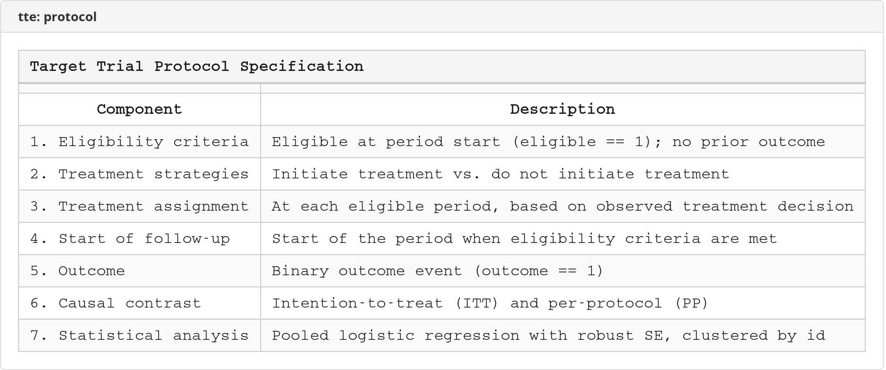

---

## Worked Example: ITT Analysis

Intention-to-treat: everyone analyzed as initially assigned, regardless of subsequent treatment changes. No weights needed.

```stata
* Load the trial_example dataset (503 patients, 48,400 person-periods)
use tte_example, clear

* Step 1: Map variables and set estimand
tte_prepare, id(patid) period(period) treatment(treatment) ///
    outcome(outcome) eligible(eligible) ///
    covariates(age sex comorbidity biomarker) estimand(ITT)

* Step 2: Validate data quality
tte_validate

* Step 3: Expand into sequential trials (no cloning for ITT)
tte_expand, maxfollowup(8)

* Step 4: Fit pooled logistic MSM
*   - Quadratic terms for follow-up time and trial period (default)
*   - Robust SEs clustered by patient ID (default)
tte_fit, outcome_cov(age sex comorbidity) nolog

* Step 5: Predict cumulative incidence at each follow-up period
tte_predict, times(0(1)8) type(cum_inc) difference ///
    samples(100) seed(12345)

* Step 6: Plot and report
tte_plot, type(cumhaz) ci title("Cumulative Incidence (ITT)")
tte_report, eform
```

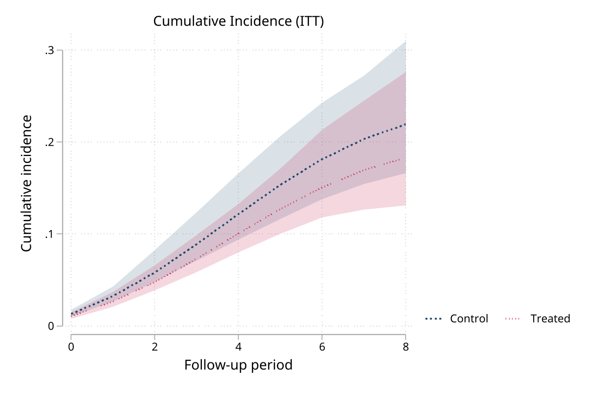

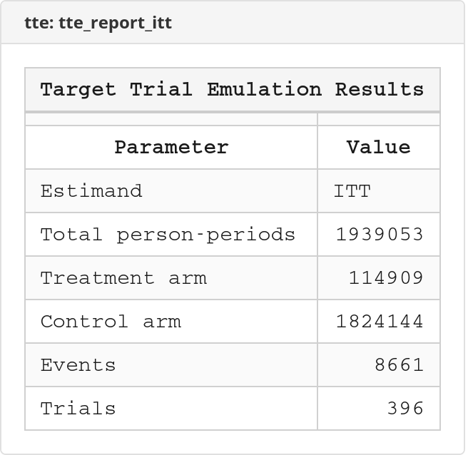

---

## Worked Example: Per-Protocol Analysis with IPTW

Per-protocol: censor individuals who deviate from their assigned treatment, then reweight with IPTW to adjust for the informative censoring. This is the clone-censor-weight approach.

```stata
use tte_example, clear

* Step 1: Prepare (same as ITT but estimand = PP)
tte_prepare, id(patid) period(period) treatment(treatment) ///
    outcome(outcome) eligible(eligible) ///
    covariates(age sex comorbidity biomarker) estimand(PP)

* Step 2: Validate
tte_validate

* Step 3: Expand — clones each person into treatment and control arms,
*   censors when observed treatment deviates from assigned arm
tte_expand, maxfollowup(8)

* Step 4: Calculate stabilized IP weights
*   - Denominator model: all covariates (captures confounding)
*   - Numerator model: subset of covariates (stabilizes weights)
*   - Truncate at 1st/99th percentiles (reduces extreme weights)
tte_weight, switch_d_cov(age sex comorbidity biomarker) ///
    switch_n_cov(age sex) ///
    stabilized truncate(1 99) nolog

* Step 5: Check weight diagnostics
tte_diagnose, balance_covariates(age sex comorbidity biomarker)

* Step 6: Fit weighted outcome model
tte_fit, outcome_cov(age sex comorbidity) nolog

* Step 7: Predict and report
tte_predict, times(0(1)8) type(cum_inc) difference ///
    samples(100) seed(12345)

tte_plot, type(cumhaz) ci title("Cumulative Incidence (Per-Protocol)")
tte_plot, type(weights) title("IPTW Distribution by Arm")

tte_report, format(excel) export(tte_results.xlsx) replace
```

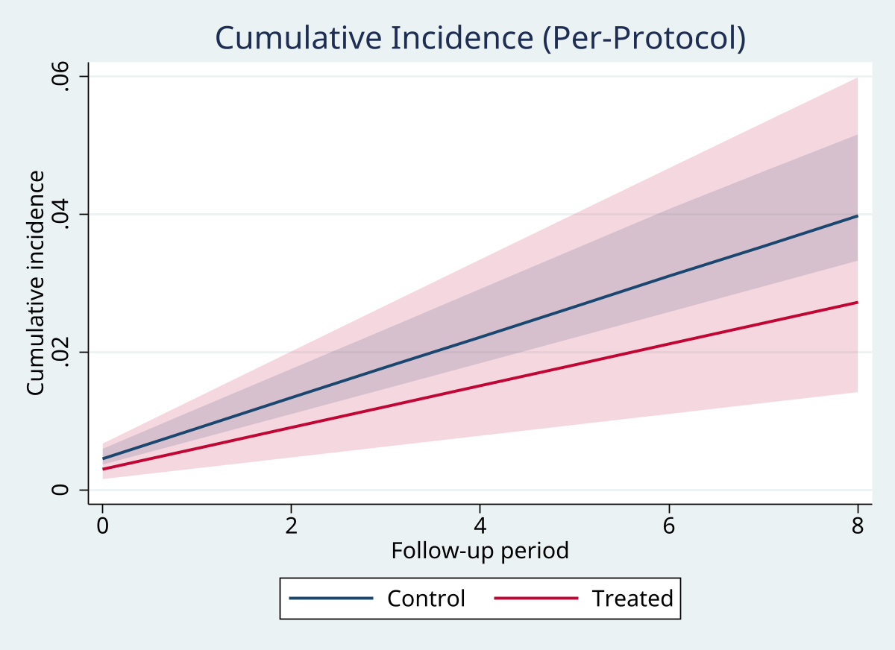

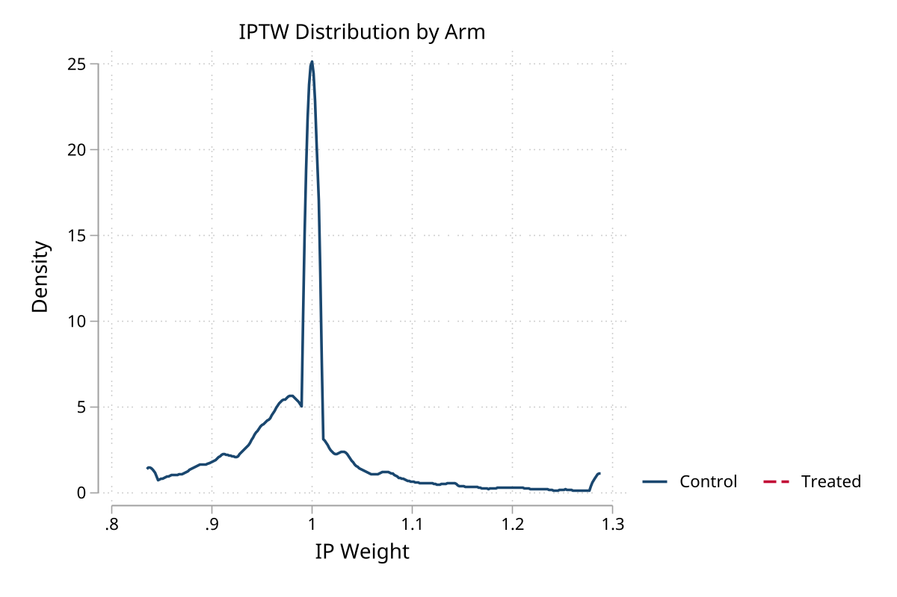

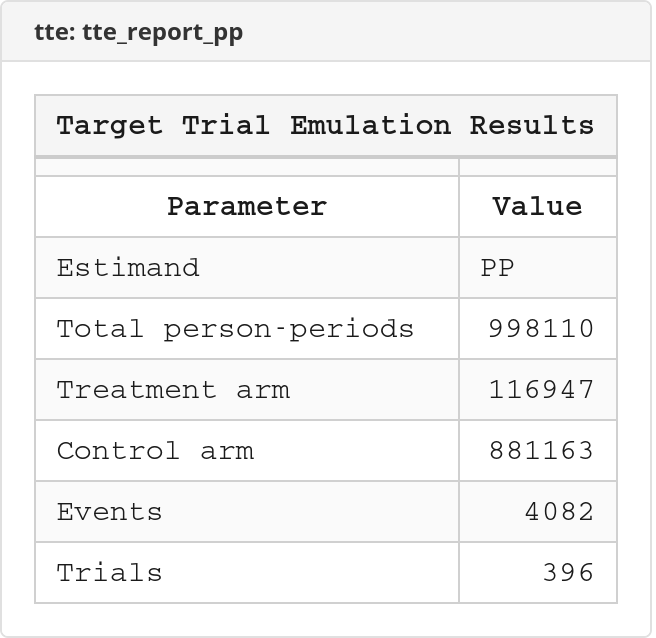

---

## Technical Notes

### Covariate freezing

After `tte_expand`, all covariates from `tte_prepare` carry their trial-entry values. The MSM conditions on L₀ only; time-varying confounding is handled by the IP weights. Treatment retains its observed time-varying values throughout follow-up.

### Weight model stratification

Switch models are fitted separately by arm (2 strata). R TrialEmulation uses 4 strata (arm x lagged treatment). Both are valid and produce the same causal estimand when correctly specified.

### Robust SE differences vs. R

Stata's `vce(cluster)` uses a G/(G-1) finite-sample correction. R's `sandwich::vcovCL()` uses (N-1)/(N-k). Point estimates are identical; SEs differ slightly. The difference is negligible for N > 500.

### Natural spline basis

`followup_spec(ns(#))` uses restricted cubic splines (Harrell formulation). R uses `splines::ns()`. Both span the same function space but use different basis representations — individual coefficients differ, but marginal predictions from `tte_predict` are comparable.

### Monte Carlo predictions

CIs from `tte_predict` capture coefficient uncertainty only (parametric bootstrap on the MSM coefficients). They do not propagate uncertainty from the weight estimation step. This matches R TrialEmulation's approach.

---

## Features Beyond R TrialEmulation

| Feature | R TrialEmulation | tte (Stata) |
|---------|-----------------|-------------|
| Pooled logistic regression | Yes | Yes |
| Cox / parametric survival MSM | No | Yes |
| Protocol table (Hernan 7-component) | No | Yes |
| Data validation command | No | Yes (`tte_validate`, 10 checks) |
| Publication report generation | No | Yes (display/Excel/CSV/LaTeX) |
| Love plot / balance diagnostics | No | Yes (`tte_diagnose`) |
| Weight distribution plots | No | Yes (`tte_plot, type(weights)`) |
| Grace period handling | Limited | Full (integer grace periods) |
| Natural spline support | Via R formula | Built-in `ns(#)` option |
| Chunked processing for large data | No | Yes (`chunk_size()`) |

---

## Stored Results

### tte_prepare → r()

| Result | Description |
|--------|-------------|
| `r(N)` | Number of observations |
| `r(n_ids)` | Unique individuals |
| `r(n_periods)` | Distinct time periods |
| `r(n_eligible)` | Eligible observations |
| `r(n_events)` | Outcome events |
| `r(n_censored)` | Censored observations |
| `r(n_treated)` | Treated observations |
| `r(estimand)` | Estimand (ITT/PP/AT) |

### tte_validate → r()

| Result | Description |
|--------|-------------|
| `r(n_checks)` | Checks run |
| `r(n_errors)` | Errors found |
| `r(n_warnings)` | Warnings found |
| `r(validation)` | `"passed"` or `"failed"` |

### tte_expand → r()

| Result | Description |
|--------|-------------|
| `r(n_trials)` | Emulated trials created |
| `r(n_expanded)` | Total expanded observations |
| `r(n_treat)` | Treatment arm observations |
| `r(n_control)` | Control arm observations |
| `r(n_censored)` | Censored observations |
| `r(n_events)` | Outcome events |
| `r(expansion_ratio)` | Expansion ratio |

### tte_weight → r()

| Result | Description |
|--------|-------------|
| `r(mean_weight)` | Mean weight |
| `r(sd_weight)` | SD of weights |
| `r(min_weight)` / `r(max_weight)` | Range |
| `r(ess)` | Effective sample size |
| `r(n_truncated)` | Truncated weights |

### tte_fit → e()

Standard `glm` or `stcox` results, plus:

| Result | Description |
|--------|-------------|
| `e(tte_model)` | `"logistic"` or `"cox"` |
| `e(tte_estimand)` | ITT, PP, or AT |
| `e(tte_followup_spec)` | Follow-up time specification |
| `e(tte_trial_spec)` | Trial period specification |

### tte_predict → r()

| Result | Description |
|--------|-------------|
| `r(predictions)` | Matrix: time, est_0, ci_lo_0, ci_hi_0, est_1, ci_lo_1, ci_hi_1 [, diff, diff_lo, diff_hi] |
| `r(rd_#)` | Risk difference at time # (with `difference`) |
| `r(n_times)` | Number of prediction times |
| `r(samples)` | MC samples used |

### tte_diagnose → r()

| Result | Description |
|--------|-------------|
| `r(ess)` | Effective sample size (overall) |
| `r(ess_treat)` / `r(ess_control)` | ESS by arm |
| `r(max_smd_unwt)` | Max unweighted SMD |
| `r(max_smd_wt)` | Max weighted SMD |
| `r(balance)` | Covariate balance matrix |

---

## Demo Output

The demo runs both ITT and PP analyses on the `trial_example` dataset and benchmarks against R TrialEmulation reference results.

<details>
<summary>Console output (click to expand)</summary>

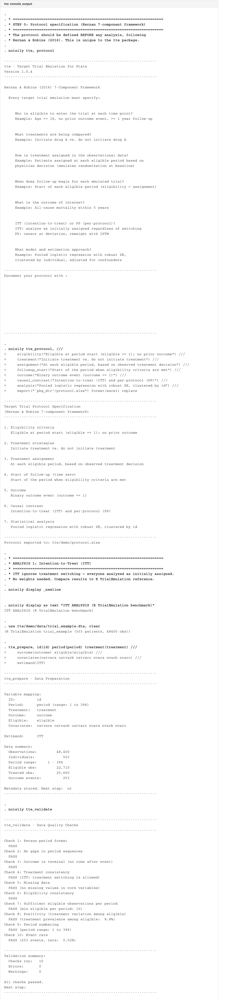
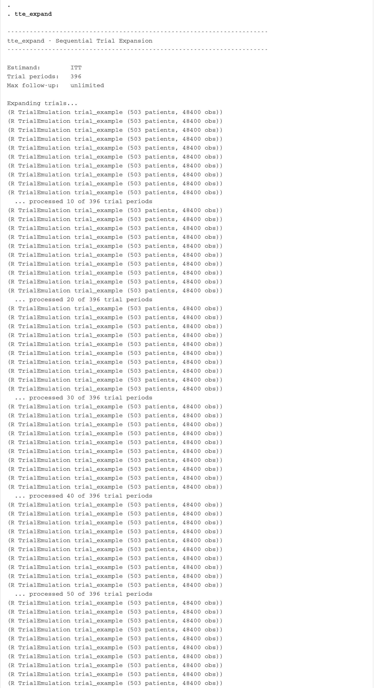
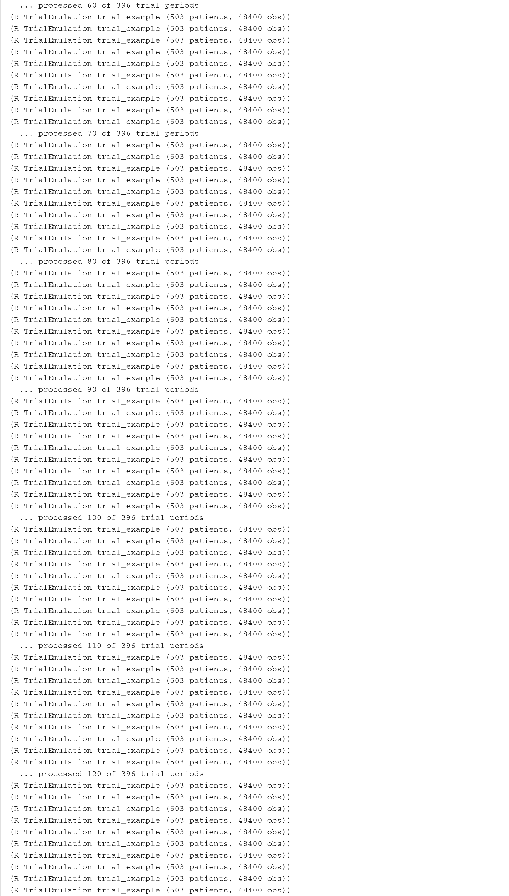
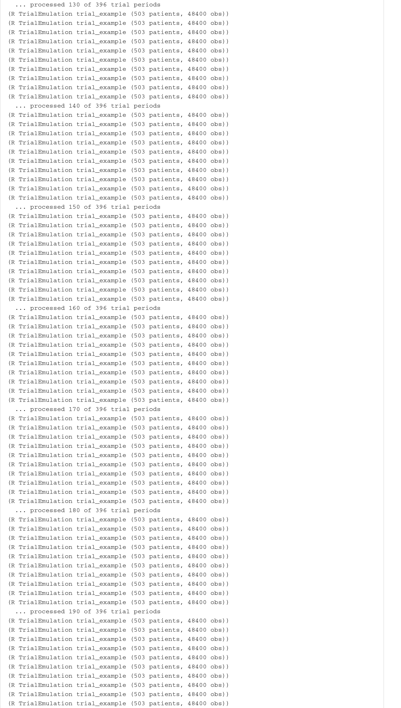
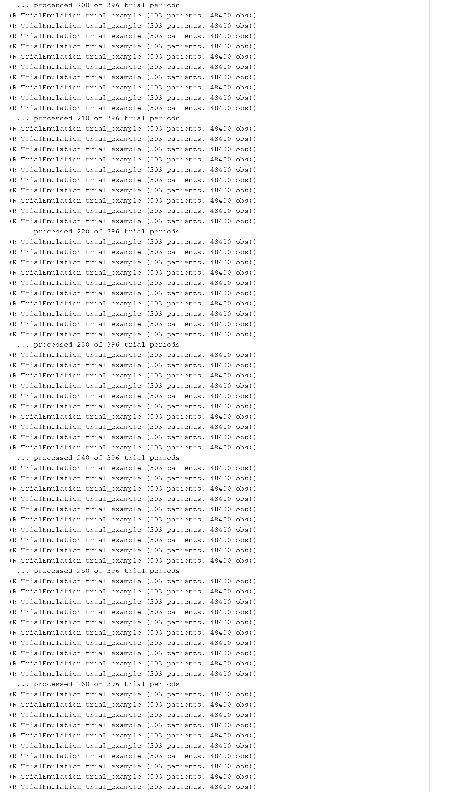

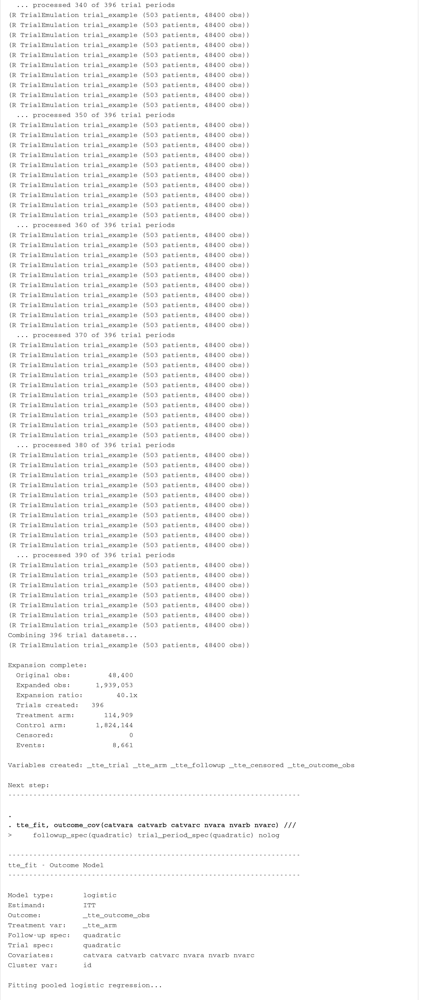
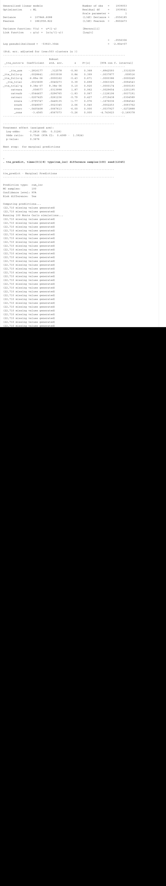

</details>

---

## References

- Hernan MA, Robins JM. Using Big Data to Emulate a Target Trial When a Randomized Trial Is Not Available. *Am J Epidemiol*. 2016;183(8):758-764.
- Hernan MA, Robins JM. *Causal Inference: What If*. Boca Raton: Chapman & Hall/CRC; 2020.
- Maringe C, Benitez Majano S, et al. TrialEmulation: An R Package for Target Trial Emulation. *arXiv*. 2024;2402.12083.

## Author

Timothy P Copeland
Department of Clinical Neuroscience
Karolinska Institutet

## License

MIT License

## Version

Version 1.0.3, 2026-03-01
