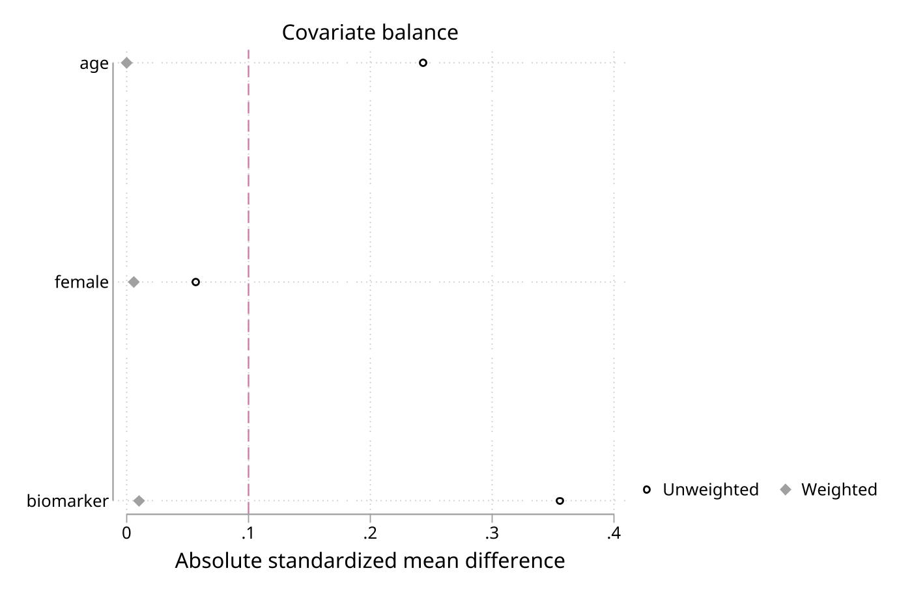

# tvtools - Time-varying exposure workflow for survival analysis

**Version 1.6.1** | 2026-06-29

`tvtools` is a workflow package for building analysis-ready time-varying survival data in Stata. It starts from person-level follow-up plus episode-format exposure records and helps you derive exposure intervals, align multiple time-varying sources, add outcomes and competing risks, diagnose gaps and overlaps, estimate IPTW weights, create age-band intervals, and split follow-up time along date-derived or multiple (Lexis) timescales.

## Requirements

- Stata 16 or later
- Internet access if you want to run the public `_data/` examples directly from GitHub

## Installation

```stata
capture ado uninstall tvtools
net install tvtools, from("https://raw.githubusercontent.com/tpcopeland/Stata-Tools/main/tvtools") replace
```

If you want the optional menu-setup helper that ships with the package, download the ancillary files separately:

```stata
net get tvtools, from("https://raw.githubusercontent.com/tpcopeland/Stata-Tools/main/tvtools")
do tvtools_menu_setup.do
```

## Commands

| Command | Purpose | Help |
|---------|---------|------|
| `tvtools` | Package index: lists all commands and their categories | `help tvtools` |
| `tvexpose` | Create time-varying exposure intervals from episode data | `help tvexpose` |
| `tvmerge` | Merge multiple time-varying datasets into aligned person-time intervals | `help tvmerge` |
| `tvevent` | Add outcomes and competing risks to an interval dataset | `help tvevent` |
| `tvdiagnose` | Check coverage, gaps, overlaps, and exposure summaries | `help tvdiagnose` |
| `tvweight` | Estimate inverse probability of treatment weights for interval data | `help tvweight` |
| `tvage` | Create time-varying age intervals from dates of birth and follow-up dates | `help tvage` |
| `tvband` | Split follow-up intervals along a single date-derived axis | `help tvband` |
| `tvsplit` | Multi-timescale Lexis splitting of follow-up intervals | `help tvsplit` |
| `tvpanel` | Build a fixed-width, entry-anchored person-period panel for marginal structural models | `help tvpanel` |

## How It Works

The package follows a pipeline where each command produces output in a consistent id/start/stop format:

```
cohort.dta + episodes.dta
        |
     tvexpose  -->  person-period intervals (one exposure)
        |
     tvmerge   -->  aligned intervals (multiple exposures)
        |
     tvevent   -->  intervals with outcome/competing-risk flags
        |
     tvdiagnose -->  quality report (coverage, gaps, overlaps)
        |
     tvweight  -->  IPTW weights for causal inference
```

**Key conventions:**

- The **cohort or event data stay in memory**; exposure episodes are supplied through `using` files.
- All date variables must be **Stata daily dates** (integer days, `%td` format). Datetime variables (`%tc`/`%tC`) are rejected with a clear error.
- Intervals use a **closed [start, stop] convention** where both endpoints are inclusive.
- `tvmerge` operates on **tvexpose output**, not raw episode files.
- For `tvevent`, the **event data** is the master (in memory) and the **interval data** is the using file.

## Demo Output

Generated by `tvtools/demo/demo_tvtools.do` (a 200-patient synthetic SSRI/SNRI cohort plus a 400-person longitudinal panel) and rendered with [logdoc](../logdoc/).

### Frames-first pipeline

The whole `tvexpose` → `tvmerge` → `tvevent` chain runs in memory via `frameout()` / `frames()` — no intermediate `save`/`use`. Each producer returns the names it created (`r(genvar)`, `r(startname)`, `r(generate)`).

<details>
<summary>Console output</summary>

### Package overview

```stata
use "`pkg_dir'/_cohort.dta", clear
```

```stata
noisily tvtools
```

```
----------------------------------------------------------------------
tvtools - Time-Varying Exposure Analysis Suite
----------------------------------------------------------------------

Data Preparation
  tvexpose   - Create time-varying exposure variables
  tvmerge    - Merge multiple time-varying datasets
  tvevent    - Integrate events and competing risks
  tvage      - Add time-varying age to stset data
  tvband     - Split intervals on one date-derived axis
  tvsplit    - Multi-timescale Lexis interval splitting
  tvpanel    - Build fixed-width MSM panel grid

Diagnostics
  tvdiagnose - Diagnostic tools for TV datasets

Weighting
  tvweight   - Calculate IPTW weights

----------------------------------------------------------------------
Total commands: 9

Help: help tvtools for workflow guide
      help <command> for individual command help

```

### Step 1: tvexpose -> frame (caller's data left intact)

<!-- * The exposure interval set is written to a frame; the cohort stays in memory. -->

<!-- * The generated variable name is returned in r(genvar). -->

```stata
use "`pkg_dir'/_cohort.dta", clear
```

```stata
noisily tvexpose using "`pkg_dir'/_episodes_antidep.dta",
id(id) start(rx_start) stop(rx_stop)
exposure(drug) reference(0)
entry(study_entry) exit(study_exit)
keepvars(age female) keepdates frameout(f_antidep)
```

```
Note: output exposure variable named tv_drug (from exposure(drug)); use generate() to override.

Warning! Overlapping exposure categories detected for 2 IDs
  (specify verbose to list affected IDs)

Default behavior: Later exposures take precedence (layer-style resolution)
Consider using one of these options to resolve overlaps explicitly:
  priority(numlist) - Specify precedence order for exposure types
  layer - Later exposures take precedence, earlier resume after
  split - Create separate periods at all boundaries
  combine(newvar) - Encode overlaps as combined values

Gaps in Coverage
------------------------------------------------------------
No gaps found in coverage

Time-varying exposure dataset created
Exposure Operationalization: timevarying
--------------------------------------------------
    Persons:            200
    Time-varying periods:            891
    Total person-time (days):        222,316
    Exposed person-time:         52,945 (23.8%)
    Unexposed person-time:        169,371
    Note: Baseline periods included (complete person-time coverage)
--------------------------------------------------
Result placed in frame: f_antidep

```

```stata
local gA = r(genvar)
```

```stata
noisily display "antidepressant exposure variable: " as result "`gA'"
```

```
antidepressant exposure variable: tv_drug

```

```stata
quietly tvexpose using "`pkg_dir'/_episodes_benzo.dta",
id(id) start(rx_start) stop(rx_stop)
exposure(benzo_use) reference(0)
entry(study_entry) exit(study_exit)
keepvars(age female) keepdates frameout(f_benzo)
```

```stata
local gB = r(genvar)
```

```stata
noisily display "benzodiazepine exposure variable: " as result "`gB'"
```

```
benzodiazepine exposure variable: tv_benzo_use

```

### Step 2: tvdiagnose on the in-memory frame

```stata
noisily frame f_antidep: tvdiagnose, id(id) start(rx_start) stop(rx_stop)
entry(study_entry) exit(study_exit) coverage gaps
```

```
----------------------------------------------------------------------
Time-Varying Data Diagnostics
----------------------------------------------------------------------
Dataset summary:
  Observations:          891
  Persons:          200
  Periods/person:      4.5

----------------------------------------------------------------------
Coverage Diagnostics
----------------------------------------------------------------------
----------------------------------------------------------------------
Coverage Summary:
  Mean coverage: 100.0%
  Min coverage:  100.0%
  Max coverage:  100.0%
  Persons with gaps: 0 ( 0.0%)
----------------------------------------------------------------------

----------------------------------------------------------------------
Gap Analysis
----------------------------------------------------------------------
No gaps found in coverage

----------------------------------------------------------------------
Diagnostic Complete
----------------------------------------------------------------------

```

### Step 3: tvmerge reads both frames, writes a merged frame

```stata
noisily tvmerge, frames(f_antidep f_benzo) id(id)
start(rx_start rx_start) stop(rx_stop rx_stop)
exposure(`gA' `gB') frameout(f_merged)
```

```
Merged time-varying dataset successfully created
--------------------------------------------------
    Observations:          1,502
    Persons:            200
    Exposure variables:  tv_drug tv_benzo_use
--------------------------------------------------
Result placed in frame: f_merged

```

```stata
noisily display "merged interval vars: " as result "`r(startname)' / `r(stopname)'"
```

```
merged interval vars: start / stop

```

### Step 4: tvevent reads the merged frame, adds the outcome in memory

```stata
use "`pkg_dir'/_events.dta", clear
```

```stata
noisily tvevent, frame(f_merged) id(id)
date(cv_event_date) compete(death_date) generate(outcome)
```

```
Splitting intervals for 22 internal events...
Single event type: Censored person-time after first event.


--------------------------------------------------
Event integration complete
  Observations: 1464
  Events flagged (outcome): 22
  Variable outcome labels:
0 1 2
    0 = Censored
    1 = Event: cv_event_date
    2 = Competing: death_date
--------------------------------------------------

```

```stata
noisily display "event indicator: " as result "`r(generate)'"
```

```
>     "   intervals: " as result "`r(startvar)'/`r(stopvar)'"
event indicator: outcome   intervals: start/stop

```

</details>

### MSM weighting: IPTW × IPCW + positivity

With `ipcw()`, `tvweight` fits a censoring model alongside the propensity model and forms the cumulative IPTW × IPCW weight a marginal structural model needs, then reports a positivity / overlap diagnostic.

<details>
<summary>Console output</summary>

### Combined treatment + censoring weights

<!-- * tvweight fits a propensity model and (with ipcw()) a censoring model, then -->

<!-- * forms the cumulative IPTW x IPCW weight that a marginal structural model needs. -->

<!-- * A positivity / overlap block reports near-violations and weight concentration. -->

```stata
use "`pkg_dir'/_panel.dta", clear
```

```stata
noisily tvweight treat, covariates(age female biomarker)
id(id) time(period) ipcw(censored) censorcovariates(age biomarker)
stabilized generate(iptw) balance nolog
```

```
----------------------------------------------------------------------
IPTW Weight Calculation
----------------------------------------------------------------------

Exposure variable: treat
Number of levels:  2
Model type:        logit
Weight type:       iptw
Covariates:        age female biomarker
Observations:      2296
Panel structure:   400 clusters
Obs per cluster:    5.7 (range: 1-6)
Time FE:           i.period

Fitting propensity score model...

Calculating weights...
Calculating stabilized weights...

Fitting censoring model and computing IPCW...
  Censoring weight ipcw and combined weight iptw_ipcw created.

----------------------------------------------------------------------
Weight Diagnostics
----------------------------------------------------------------------

Weight distribution:
  Mean:        1.0005
  SD:          0.2349
  Min:         0.5331
  Max:         2.8214

Percentiles:
  1%:          0.6121
  5%:          0.7148
  25%:         0.8512
  50%:         0.9494
  75%:         1.0955
  95%:         1.4476
  99%:         1.7644

Effective sample size:
  ESS:         2176.1 (of 2296 observations)
  ESS %:         94.8%

Combined IPTW x IPCW weight:
  Mean:        1.0291
  Min/Max:     0.2124 /    3.9174
  99th pct:    2.7079
  ESS:         1948.2 (84.9% of 2296)

Positivity / overlap:
  P(observed treatment) range: 0.1331 to 0.8893
  Near-violations (P<0.05):    0 ( 0.0% of obs)
  PS range, treated:           0.1331 to 0.7042
  PS range, reference:         0.1107 to 0.7195
  Weight mass in top 1% of rows:   2.9%

Weights by exposure group:
--------------------------------------------------
  Reference (treat=0): N=1434, Mean=  1.000, SD=  0.180
  Exposed (treat!=0):  N=862, Mean=  1.001, SD=  0.305
----------------------------------------------------------------------

----------------------------------------------------------------------
Covariate balance (standardized mean differences)
----------------------------------------------------------------------
Covariate                        SMD (unwtd)     SMD (wtd)
age                                   0.2434        0.0000
female                               -0.0569        0.0059
biomarker                             0.3557       -0.0102
----------------------------------------------------------------------

Weight variable iptw created successfully.
----------------------------------------------------------------------

```

```stata
noisily display "combined-weight ESS: " as result %6.1f r(ess_combined)
```

```
>     "   positivity near-violations: " as result %4.1f r(pct_nonoverlap) "%"
combined-weight ESS: 1948.2   positivity near-violations:  0.0%

```

</details>



### Recurrent events (PWP / Andersen-Gill)

`tvevent, type(recurring)` splits follow-up at each event and adds an event-sequence stratum (`enum()`) plus a gap-time clock (`gaptime`) that resets at each event — ready for Andersen-Gill, PWP total-time, and PWP gap-time models.

<details>
<summary>Console output</summary>

### tvevent type(recurring) with enum stratum + gap-time clock

<!-- * The base follow-up interval is split at each hospitalization; tvevent adds the -->

<!-- * event-sequence stratum (enum) and a gap-time clock that resets at each event, -->

<!-- * so the output feeds Andersen-Gill, PWP total-time, and PWP gap-time models. -->

```stata
use "`pkg_dir'/_recur.dta", clear
```

```stata
rename study_entry win_start
```

```stata
rename study_exit win_stop
```

```stata
keep id win_start win_stop
```

```stata
tempfile recint
```

```stata
save "`recint'"
```

```
file /tmp/St1749944.000001 saved as .dta format

```

```stata
use "`pkg_dir'/_recur.dta", clear
```

```stata
keep id hosp1 hosp2 hosp3
```

```stata
noisily tvevent using "`recint'", id(id) date(hosp) type(recurring)
generate(hosp_ev) start(win_start) stop(win_stop)
enum(stratum) gaptime gapstart(t0) gapstop(t) timegen(tstop) timeunit(days)
```

```
Recurring events: Found 3 event variables (hosp1 hosp2 hosp3)
Splitting intervals for 297 internal events...
Recurring event type: Retained all person-time.
Recurrent formatting: stratum stratum + gap time (t0,t) added.


--------------------------------------------------
Event integration complete
  Observations: 497
  Events flagged (hosp_ev): 297
  Variable hosp_ev labels:
0 1
    0 = Censored
    1 = Event: hosp
--------------------------------------------------

```

```stata
noisily display "stratum var: " as result "`r(enum)'"
```

```
>     "   gap-time clock: " as result "`r(gapstart)'/`r(gapstop)'"
stratum var: stratum   gap-time clock: t0/t

```

### A few persons with repeated events

```stata
noisily list id win_start win_stop hosp_ev stratum t0 t in 1/12,
sepby(id) noobs abbreviate(12)
```

```
  +------------------------------------------------------------------+
  | id    win_start     win_stop       hosp_ev   stratum   t0      t |
  |------------------------------------------------------------------|
  |  1   2015/05/20   2015/11/12   Event: hosp         1    0    176 |
  |  1   2015/11/13   2019/12/07      Censored         2    0   1485 |
  |------------------------------------------------------------------|
  |  2   2015/01/13   2019/11/08      Censored         1    0   1760 |
  |------------------------------------------------------------------|
  |  3   2015/01/13   2015/10/06   Event: hosp         1    0    266 |
  |  3   2015/10/07   2018/04/26      Censored         2    0    932 |
  |------------------------------------------------------------------|
  |  4   2015/02/23   2015/12/09   Event: hosp         1    0    289 |
  |  4   2015/12/10   2016/04/10      Censored         2    0    122 |
  |------------------------------------------------------------------|
  |  5   2015/02/09   2015/06/20   Event: hosp         1    0    131 |
  |  5   2015/06/21   2019/12/27      Censored         2    0   1650 |
  |------------------------------------------------------------------|
  |  6   2015/01/05   2015/04/07   Event: hosp         1    0     92 |
  |  6   2015/04/08   2015/06/29   Event: hosp         2    0     82 |
  |  6   2015/06/30   2018/03/12      Censored         3    0    986 |
  +------------------------------------------------------------------+

```

</details>

### Multi-group weighting and age bands

`tvweight` switches to multinomial logit for 3+ treatment categories; `tvage` uses the harmonized `id()`/`dob()`/`entry()`/`exit()` option names.

<details>
<summary>Console output</summary>

### tvweight with multinomial logit (3 treatment categories)

```stata
use "`pkg_dir'/_cohort.dta", clear
```

```stata
quietly tvexpose using "`pkg_dir'/_episodes_antidep.dta",
id(id) start(rx_start) stop(rx_stop)
exposure(drug) reference(0)
entry(study_entry) exit(study_exit)
keepvars(age female) keepdates
```

```stata
noisily tvweight tv_drug, covariates(age female)
generate(iptw_mg) model(mlogit) stabilized truncate(1 99) nolog
```

```
----------------------------------------------------------------------
IPTW Weight Calculation
----------------------------------------------------------------------

Exposure variable: tv_drug
Number of levels:  3
Model type:        mlogit
Weight type:       iptw
Covariates:        age female
Observations:      891

Fitting propensity score model...

Calculating weights...
Calculating stabilized weights...
Truncating weights at 1th and 99th percentiles...
  Truncated 17 observations (5 low, 12 high)

----------------------------------------------------------------------
Weight Diagnostics
----------------------------------------------------------------------

Weight distribution:
  Mean:        1.0001
  SD:          0.0851
  Min:         0.8267
  Max:         1.2746

Percentiles:
  1%:          0.8267
  5%:          0.8592
  25%:         0.9446
  50%:         0.9918
  75%:         1.0502
  95%:         1.1578
  99%:         1.2746

Effective sample size:
  ESS:          884.6 (of 891 observations)
  ESS %:         99.3%

Positivity / overlap:
  P(observed treatment) range: 0.1156 to 0.7642
  Near-violations (P<0.05):    0 ( 0.0% of obs)
  Weight mass in top 1% of rows:   1.7%

Weights by exposure group:
--------------------------------------------------
0 1 2
  Level 0: N=627, Mean=  1.000, SD=  0.051
  Level 1: N=133, Mean=  1.000, SD=  0.157
  Level 2: N=131, Mean=  1.001, SD=  0.109
----------------------------------------------------------------------

Weight variable iptw_mg created successfully.
----------------------------------------------------------------------

```

### tvage with harmonized option names (id/dob/entry/exit)

```stata
use "`pkg_dir'/_cohort.dta", clear
```

```stata
noisily tvage, id(id) dob(dob) entry(study_entry) exit(study_exit)
groupwidth(5) minage(40) maxage(80)
```

</details>

### Exposure swimlane

`tvdiagnose, swimlane` visualizes per-person exposure intervals over calendar time.


## Worked Examples

### Fitting a competing-risks model after the pipeline

After running the pipeline and adding events, the interval dataset is ready for `stset` and analysis (with `generate()` omitted, `tvexpose using ... exposure(drug)` names its output `tv_drug`):

```stata
stset stop, id(id) failure(outcome==1) enter(start)
stcrreg i.tv_drug, compete(outcome==2)
```

The outcome variable uses `0` for censoring, `1` for the primary event, and `2` for the competing event.

## Command Reference

### tvexpose

Transforms episode-format exposure records into person-period intervals. Supports:

- **Default**: categorical time-varying exposure
- **evertreated**: binary ever/never (corrects immortal time bias)
- **currentformer**: three-level never/current/former
- **duration()**: cumulative duration categories
- **continuousunit()**: continuous cumulative exposure (days, weeks, months, quarters, years)
- **recency()**: time since last exposure
- **dose**: cumulative dose tracking with proportional overlap allocation
- **grace()**, **lag()**, **washout()**: exposure timing adjustments
- **priority()**, **layer**, **split**, **combine()**: overlap resolution

### tvmerge

Merges two or more `tvexpose` outputs into a single dataset with synchronized time periods. Uses Cartesian interval intersection. Continuous exposures are pro-rated when intervals are split. The `force` option handles non-matching IDs across datasets.

### tvevent

Integrates outcomes and competing risks into interval data. Splits intervals at event dates, adjusts continuous variables proportionally, and flags events (0=censored, 1=primary, 2+=competing). Supports `type(single)` (terminal first event) and `type(recurring)` (wide-format repeated events).

### tvdiagnose

Quality-control tool for interval datasets. Four reports: `coverage` (fraction of follow-up covered), `gaps` (unexposed intervals), `overlaps` (concurrent records), and `summarize` (exposure frequency and person-time). Use `all` to run everything. The `verbose` option shows individual records.

### tvweight

Estimates inverse probability of treatment weights (IPTW) for causal inference. Supports binary (`logit`) and multinomial (`mlogit`) propensity score models, stabilized weights, percentile truncation, and panel-aware weighting with cluster-robust SEs. Reports weight distribution, percentiles, and effective sample size (ESS).

### tvage

Creates time-varying age intervals from dates of birth and follow-up dates. Expands one-record-per-person data into one row per age (or age group). Output is compatible with `tvmerge` for merging age bands with other time-varying covariates.

## QA

Canonical QA lives in `qa/`; the full runner is:

```bash
cd tvtools/qa && stata-mp -b do run_all.do full
```

Functional suites: `test_tvage.do`, `test_tvevent.do`, `test_tvexpose.do`,
`test_tvmerge.do`, `test_tvpanel.do`, `test_tvweight.do`,
`test_tvdiagnose.do`, `test_tvtools.do`, `test_options.do`,
`test_integration.do`, `test_edge_cases.do`, `test_verbose.do`, and
`test_regressions.do`.

Validation and cross-validation suites: `validation_known_answers.do`,
`validation_tvage.do`, `validation_tvevent.do`, `validation_tvexpose.do`,
`validation_tvmerge.do`, `validation_tvweight.do`,
`validation_tvdiagnose.do`, `validation_boundary.do`,
`validation_pipeline.do`, `validation_supplemental.do`, and
`crossval_tvtools.do`.

## Version History

- **1.6.1** (2026-06-29): Documentation maintenance. Added the `tvband` (single date-derived axis) and `tvsplit` (multi-timescale Lexis) commands to the README Commands table and intro, where they were previously omitted, and to the `tvtools` package-index `Also see` footer. Hard-wrapped long prose source lines in the `tvevent`, `tvexpose`, and `tvmerge` help files to ~80 columns so the GUI Viewer no longer drops characters at wrap boundaries. No command behavior changed.
- **1.6.0** (2026-06-29): Method-depth release. **IPCW censoring weights** complete the marginal structural model in `tvweight`: the new `ipcw()` option fits a pooled-logistic censoring model and produces a cumulative inverse-probability-of-censoring weight plus a combined weight equal to the (stabilized) cumulative IPTW times the cumulative IPCW (`censgenerate()`/`combgenerate()`, defaulting to `ipcw` and `{weight}_ipcw`; `censorcovariates()` selects the censoring-model covariates; requires `id()`/`time()`). With `truncate()`, truncation now targets the final combined weight. **Positivity / overlap diagnostic** (always on) reports the range of the propensity of the observed treatment, the share of near-violations (P < 0.05), per-arm PS ranges (binary), and the weight mass held by the top 1% of rows — returned in `r(overlap_lo)`, `r(overlap_hi)`, `r(pct_nonoverlap)`, `r(n_nonoverlap)`, `r(top1_wt_share)`, and `r(ess_combined)`. **Recurrent-event formatting** in `tvevent` adds, under `type(recurring)`, an event-sequence stratum (`enum()`) and an optional gap-time clock (`gaptime`, `gapstart()`/`gapstop()`) so the output feeds Andersen-Gill, PWP conditional (total-time), and PWP gap-time models directly. New parity QA: `crossval_tvweight_ipcw.do` (known-truth recovery of a censored population mean, plus row-for-row agreement with an independent R `glm` IPCW oracle) and `crossval_tvevent_recurring.do` (the stratum and gap-time clock validated against a first-principles event-date oracle and an independent R recomputation).
- **1.5.0** (2026-06-29): Ergonomics release (backward compatible). **Frames-first output:** `tvexpose` and `tvmerge` gain a `frameout(name)` option that places the result into a named frame and leaves the data in the current frame untouched, so a `tvexpose` → `tvmerge` → `tvevent` pipeline can run entirely in memory without the save/use round-trips it previously required (the output frame is returned in `r(frameout)`; `tvevent` already lands its result in memory and reads inputs via `frame()`). **Option-name harmonization:** `tvage` now accepts the suite-standard `id()`/`dob()`/`entry()`/`exit()` names, and `tvevent` accepts `start()`/`stop()`; the original `idvar()`/`dobvar()`/`entryvar()`/`exitvar()` and `startvar()`/`stopvar()` spellings remain accepted as synonyms (specifying both spellings for one slot errors). **Scriptable chaining:** `tvevent` now returns the chosen output-variable names in `r(generate)`, `r(startvar)`, `r(stopvar)`, and `r(timegen)` (matching `tvexpose`'s `r(genvar)` and `tvmerge`'s `r(startname)`/`r(stopname)`/`r(generated_names)`). New QA covers the frames-first pipeline (non-destructive, byte-identical to the `saveas` path) and the alias/return-macro surface.
- **1.4.0** (2026-06-29): Usability release. **Behavior change:** when `generate()` is omitted, `tvexpose` now names its output exposure variable after the `exposure()` varname as `tv_`{`exposure`} (for example, `exposure(drug_class)` yields `tv_drug_class`) instead of the fixed `tv_exposure`. Distinct exposures therefore get distinct names and chain straight into `tvmerge`/`tvevent` without the save/use/rename round-trip that every multi-exposure workflow previously needed. The name falls back to the historical `tv_exposure` only when the derived name would be an illegal Stata name, exceed 32 characters, or collide with the `id()` or `combine()` variable; passing `generate()` explicitly is unaffected. The chosen name is now returned in `r(genvar)`. Scripts that relied on the old fixed `tv_exposure` default should either pass `generate(tv_exposure)` or update downstream references to the derived name. New QA: `test_default_naming.do` covers the derived name, explicit-override, collision/over-length fallbacks, and rename-free `tvmerge` chaining.
- **1.3.0** (2026-06-28): Feature release. New `tvband` splits follow-up intervals along a single date-derived axis — age (relative to date of birth), calendar period, or elapsed time since a reference date — generalizing `tvage` to any continuous time axis while preserving covariates on each split row. New `tvsplit` performs multi-timescale (Lexis) splitting on age, calendar period, and time-since-entry simultaneously, so every output sub-interval lies in exactly one band on every requested axis — equivalent to repeated Stata `stsplit` / R `Epi` multi-timescale splitting, ready for age- and period-adjusted Cox or Poisson models. Both share a single splitting engine (`_tvband_split`) and use the suite's inclusive abutting-interval convention, so output merges with `tvexpose`/`tvmerge` and feeds `stset`. New parity QA: `crossval_tvsplit_lexis.do` validates the Lexis grid against an independent cut-enumeration oracle, Stata `stsplit` (age axis), and day-exact R `Epi::splitLexis` (calendar + elapsed axes). Also fixes a `tvage` bug where `minage()`/`maxage()` mislabeled person-time: the first/last interval started/ended at the raw study entry/exit while carrying the clamped age band, so follow-up before `minage` (or after `maxage`) was counted under the boundary band. `tvage` now left/right-truncates that person-time at the age-band boundary. Output is unchanged when `minage`/`maxage` do not bind.
- **1.2.0** (2026-06-28): Performance release (behavior-preserving). `tvmerge` replaces its `joinby`/`batch()` Cartesian-then-filter core with a compiled Mata interval-overlap sweep that emits only the overlapping interval pairs per person, never materializing the within-person Cartesian product — substantially faster and lighter on memory at registry scale, with identical output. The `batch(#)` option is now deprecated and ignored (accepted as a no-op so existing scripts keep working). `tvexpose` consolidates its weeks/months/quarters/years `expandunit()` row generation into a single Mata routine (bit-identical bin boundaries). Both commands show a one-line matching/overlap progress indicator on very large runs (>100k rows), suppressed under `quietly`. New parity QA: `crossval_tvmerge_mata.do` (vs an independent day-by-day expansion oracle) and `crossval_tvexpose_expand.do` (vs the documented bin formula).
- **1.1.0** (2026-06-28): Feature release. `tvweight` gains covariate-balance diagnostics (`balance`, standardized mean differences before/after weighting in `r(balance)`), overlap (ATO) and matching weights (`wtype()`), an optional stored propensity model (`estname()`), within-person cumulative MSM weights (`cumulative`/`cumgenerate()`), and built-in love-plot and weight-distribution graphs (`loveplot`, `histogram`). It also fixes a bug where panel-aware weighting (`id()`+`time()`) without `nolog` failed with `invalid 'vce'`. `tvmerge`, `tvevent`, and `tvpanel` now accept inputs from named frames (`frames()`/`frame()`) instead of disk files, and `tvmerge` auto-suffixes duplicate `tv_exposure` output names instead of erroring. `tvexpose`, `tvmerge`, and `tvevent` gain an opt-in attrition/flow report (`flow`, returned in `r(flow)`). `tvdiagnose` gains an exposure `swimlane` plot. The `tvtools` package index now lists `tvpanel`.
- **1.0.3** (2026-06-26): Bug fixes and QA hardening. `tvpanel` now uses collision-safe temporary variables for internal row/class/cumulative bookkeeping and avoids stale value-label mappings when episode labels share names with labels already in memory. `tvexpose` dose-overlap handling now avoids internal `__seg_*` names that can collide with user `keepvars()`. Expanded `tvpanel` and dose-overlap regression QA and wired `test_tvpanel.do` into the canonical runner.
- **1.0.2** (2026-06-19): Documentation maintenance. Standardized public help-file Author sections and shortened the `tvexpose` `r(overlap_ids)` stored-results synopt.
- **1.0.1** (2026-06-15): Bug fixes. `tvmerge` now shows variable-not-found and option-parsing errors that were previously suppressed inside a `quietly` block (silent `exit` with no message). `tvevent` uses a tempvar for its reshape row-id instead of a hardcoded `_obs`. Internal `tvevent` helper option abbreviations aligned with the documented forms. Canonical author/affiliation standardized across all files.
- **1.0.0** (2026-04-08): Initial Stata-Tools release

## Author

Timothy P Copeland, Karolinska Institutet
