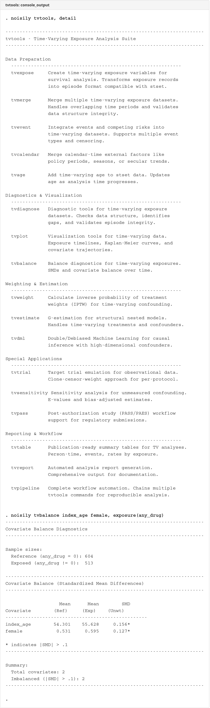
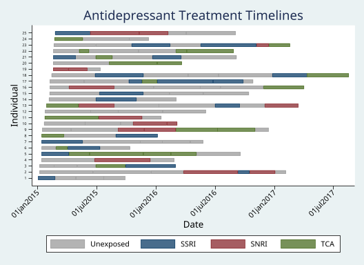
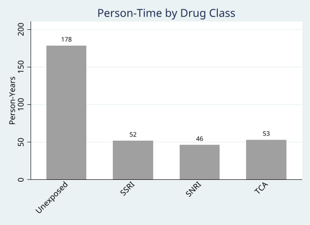

# tvtools

  

Comprehensive toolkit for time-varying exposure analysis in survival studies.

## Table of Contents

- [Screenshots](#screenshots)
- [Package Overview](#package-overview)
- [Installation](#installation)
- **Data Preparation**
  - [tvexpose](#tvexpose---create-time-varying-exposure-variables) — Create time-varying exposure variables
  - [tvmerge](#tvmerge---merge-multiple-time-varying-datasets) — Merge multiple time-varying datasets
  - [tvevent](#tvevent---integrate-events-and-competing-risks) — Integrate events and competing risks
  - [tvage](#tvage---time-varying-age-intervals) — Time-varying age intervals
- **Diagnostics**
  - [tvdiagnose](#tvdiagnose---data-quality-diagnostics) — Data quality diagnostics
- **Weighting**
  - [tvweight](#tvweight---calculate-iptw-weights) — Inverse probability of treatment weights
- [Quick Start Example](#quick-start-example)
- [Version](#version)

## Screenshots

### Console Output


> Note: tvtools console output is intentionally compact. For detailed output from each subcommand, see the individual help files.

### Swimlane Plot


### Person-Time Plot


## Package Overview

**tvtools** provides 7 commands for creating, diagnosing, and analyzing time-varying exposure data in survival analysis:

### Data Preparation
1. **tvexpose** - Create time-varying exposure variables from period-based exposure data
2. **tvmerge** - Merge multiple time-varying exposure datasets with temporal alignment
3. **tvevent** - Integrate events and competing risks into time-varying datasets
4. **tvage** - Generate time-varying age intervals for survival analysis

### Diagnostics
5. **tvdiagnose** - Assess data quality with coverage, gap, and overlap diagnostics

### Weighting
6. **tvweight** - Calculate inverse probability of treatment weights (IPTW)

### Package Information
7. **tvtools** - List available commands and display workflow guide

### Typical Workflow

```
Raw exposure data
        ↓
    tvexpose  ←──────────── Create time-varying exposure variables
        ↓
   [tvmerge]  ←──────────── Merge multiple exposures (optional)
        ↓
  [tvdiagnose] ←─────────── Check data quality (optional)
        ↓
    tvevent   ←──────────── Integrate events and competing risks
        ↓
  [tvweight]  ←──────────── Calculate IPTW weights (optional)
        ↓
     stset    ←──────────── Declare survival-time data
        ↓
  stcox/streg ←──────────── Survival analysis
```

### Key Features

- **Comprehensive exposure definitions**: Basic time-varying, ever-treated, current/former, duration categories, continuous cumulative, recency, dose tracking
- **Diagnostic tools**: Coverage analysis, gap detection, overlap checking
- **Advanced data handling**: Grace periods, gap filling, overlap resolution, lag/washout periods
- **Flexible merging**: Cartesian product temporal matching, continuous vs categorical exposures, batch processing
- **Competing risks support**: Multiple competing events, automatic interval splitting, custom event labels
- **Validation tools**: Coverage diagnostics, gap detection, overlap checking, summary statistics
- **Performance optimized**: Batch processing for large datasets, efficient memory management

---

## Installation

```stata
net install tvtools, from("https://raw.githubusercontent.com/tpcopeland/Stata-Tools/main/tvtools")
```

### Optional: Menu Setup Script

To get the menu setup script (adds tvtools to Stata's User menu):

```stata
net get tvtools, from("https://raw.githubusercontent.com/tpcopeland/Stata-Tools/main/tvtools")
do tvtools_menu_setup.do
```

Note: `net install` installs program files (.ado, .sthlp, .dlg). Use `net get` to download ancillary files like .do scripts to your current working directory.

---

## tvexpose - Create Time-Varying Exposure Variables

**tvexpose** creates time-varying exposure variables suitable for survival analysis from a dataset containing exposure periods. It merges exposure data with a master cohort dataset, creating periods where exposure status changes over time.

### Syntax

```stata
tvexpose using filename,
    id(varname)
    start(varname)
    exposure(varname)
    reference(#)
    entry(varname)
    exit(varname)
    [options]
```

### Required Options

| Option | Description |
|--------|-------------|
| `using filename` | Dataset containing exposure periods |
| `id(varname)` | Person identifier linking to master dataset |
| `start(varname)` | Start date of exposure period in using dataset |
| `exposure(varname)` | Categorical exposure status variable |
| `reference(#)` | Value indicating unexposed/reference status (typically 0) |
| `entry(varname)` | Study entry date from master dataset |
| `exit(varname)` | Study exit date from master dataset |

### Core Options

| Option | Description | Default |
|--------|-------------|---------|
| `stop(varname)` | End date of exposure period | Required unless `pointtime` specified |
| `pointtime` | Data are point-in-time (start only, no stop date) | — |

### Exposure Definition Options

| Option | Description | Default |
|--------|-------------|---------|
| *[none specified]* | Basic time-varying implementation of exposures | Default |
| `evertreated` | Binary ever/never exposed (switches at first exposure) | — |
| `currentformer` | Trichotomous: 0=never, 1=current, 2=former | — |
| `duration(numlist)` | Cumulative duration categories (cutpoints) | Years if `continuousunit` not specified |
| `continuousunit(unit)` | Continuous cumulative exposure in: days, weeks, months, quarters, years | — |
| `expandunit(unit)` | Row expansion granularity: days, weeks, months, quarters, years | — |
| `bytype` | Create separate variables for each exposure type | Single variable |
| `recency(numlist)` | Time since last exposure categories (cutpoints in years) | — |
| `dose` | Cumulative dose tracking (exposure contains dose amounts) | — |
| `dosecuts(numlist)` | Cutpoints for dose categorization (use with `dose`) | — |

### Data Handling Options

| Option | Description | Default |
|--------|-------------|---------|
| `grace(#)` | Days grace period to merge gaps | 0 (no merging) |
| `grace(exp=# exp=# ...)` | Different grace periods by exposure category | — |
| `merge(#)` | Days within which to merge same-type periods | 120 |
| `fillgaps(#)` | Assume exposure continues # days beyond last record | — |
| `carryforward(#)` | Carry forward last exposure # days through gaps | — |

### Competing Exposures Options

| Option | Description | Default |
|--------|-------------|---------|
| `layer` | Later exposures take precedence; earlier resume after | Default |
| `priority(numlist)` | Priority order when periods overlap (highest first) | — |
| `split` | Split overlapping periods at all boundaries | — |
| `combine(newvar)` | Create combined exposure variable for overlaps | — |

### Lag and Washout Options

| Option | Description | Default |
|--------|-------------|---------|
| `lag(#)` | Days lag before exposure becomes active | 0 |
| `washout(#)` | Days exposure persists after stopping | 0 |
| `window(# #)` | Minimum and maximum days for acute exposure window | — |

### Pattern Tracking Options

| Option | Description | Default |
|--------|-------------|---------|
| `switching` | Create binary indicator for any exposure switching | — |
| `switchingdetail` | Create string variable showing switching pattern | — |
| `statetime` | Create cumulative time in current exposure state | — |

### Output Options

| Option | Description | Default |
|--------|-------------|---------|
| `generate(newvar)` | Name for output exposure variable | tv_exposure |
| `referencelabel(text)` | Label for reference category | "Unexposed" |
| `label(text)` | Custom variable label for output exposure variable | Derived from source |
| `saveas(filename)` | Save time-varying dataset to file | — |
| `replace` | Overwrite existing output file | — |
| `keepvars(varlist)` | Additional variables from master dataset | — |
| `keepdates` | Keep entry and exit dates in output | Drop dates |

### Diagnostic Options

| Option | Description |
|--------|-------------|
| `check` | Display coverage diagnostics by person |
| `gaps` | Show persons with gaps in coverage |
| `overlaps` | Show overlapping exposure periods |
| `summarize` | Display exposure distribution summary |
| `validate` | Create validation dataset with coverage metrics |

### Examples

All examples use synthetic data from `_data/`. Intermediate files are saved to `_data/`.

#### Example 1: Basic Time-Varying Exposure

```stata
use _data/cohort.dta, clear

tvexpose using _data/tv_antidep_episodes.dta, ///
    id(id) start(rx_start) stop(rx_stop) ///
    exposure(drug_class) reference(0) ///
    entry(study_entry) exit(study_exit)
```

Creates `tv_exposure` showing drug class (0=unexposed, 1=SSRI, 2=SNRI) during each time period.

#### Example 2: Ever-Treated Analysis

```stata
use _data/cohort.dta, clear

tvexpose using _data/tv_antidep_episodes.dta, ///
    id(id) start(rx_start) stop(rx_stop) ///
    exposure(drug_class) reference(0) ///
    entry(study_entry) exit(study_exit) ///
    evertreated generate(ever_antidep)
```

Variable `ever_antidep` = 0 before first dispensing, = 1 from first dispensing onward. Useful for correcting immortal time bias.

#### Example 3: Current vs Former Exposure

```stata
use _data/cohort.dta, clear

tvexpose using _data/tv_antidep_episodes.dta, ///
    id(id) start(rx_start) stop(rx_stop) ///
    exposure(drug_class) reference(0) ///
    entry(study_entry) exit(study_exit) ///
    currentformer generate(antidep_status)
```

Variable `antidep_status`: 0=never exposed, 1=currently dispensed, 2=formerly dispensed.

#### Example 4: Duration Categories

```stata
use _data/cohort.dta, clear

tvexpose using _data/tv_antidep_episodes.dta, ///
    id(id) start(rx_start) stop(rx_stop) ///
    exposure(drug_class) reference(0) ///
    entry(study_entry) exit(study_exit) ///
    duration(365 1095 1825) continuousunit(days)
```

Creates categories: 0=unexposed, 1=<1 year, 2=1-<3 years, 3=3-<5 years, 4=5+ years of cumulative antidepressant use. Uses days with integer thresholds to avoid floating-point precision issues.

#### Example 5: Continuous Cumulative Exposure

```stata
use _data/cohort.dta, clear

tvexpose using _data/tv_antidep_episodes.dta, ///
    id(id) start(rx_start) stop(rx_stop) ///
    exposure(drug_class) reference(0) ///
    entry(study_entry) exit(study_exit) ///
    continuousunit(months) generate(cumul_antidep_months)
```

#### Example 6: Grace Period for Gaps

```stata
use _data/cohort.dta, clear

tvexpose using _data/tv_antidep_episodes.dta, ///
    id(id) start(rx_start) stop(rx_stop) ///
    exposure(drug_class) reference(0) ///
    entry(study_entry) exit(study_exit) ///
    grace(30) currentformer
```

Treats gaps ≤30 days as continuous exposure. Useful when short gaps represent prescription refill delays rather than true cessation.

#### Example 7: Separate Variables by Type (bytype)

```stata
use _data/cohort.dta, clear

tvexpose using _data/tv_antidep_episodes.dta, ///
    id(id) start(rx_start) stop(rx_stop) ///
    exposure(drug_class) reference(0) ///
    entry(study_entry) exit(study_exit) ///
    continuousunit(years) bytype
```

Creates `tv_exp1` (cumulative years on SSRI) and `tv_exp2` (cumulative years on SNRI) as separate variables.

#### Example 8: Cumulative Dose Tracking

```stata
use _data/cohort.dta, clear

tvexpose using _data/tv_antidep_episodes.dta, ///
    id(id) start(rx_start) stop(rx_stop) ///
    exposure(ddd) reference(0) ///
    entry(study_entry) exit(study_exit) ///
    dose generate(cumul_ddd)
```

Creates `cumul_ddd` showing cumulative defined daily doses at each time point.

#### Example 9: Categorical Dose for Dose-Response

```stata
use _data/cohort.dta, clear

tvexpose using _data/tv_antidep_episodes.dta, ///
    id(id) start(rx_start) stop(rx_stop) ///
    exposure(ddd) reference(0) ///
    entry(study_entry) exit(study_exit) ///
    dose dosecuts(100 500 1000) generate(ddd_cat)
```

Creates `ddd_cat` with categories: 0=no dose, 1=<100 DDD, 2=100-<500 DDD, 3=500-<1000 DDD, 4=1000+ DDD.

#### Example 10: Complete Workflow for Survival Analysis

```stata
* Complete SSRI vs SNRI survival analysis

* Step 1: Create time-varying antidepressant exposure and save
use _data/cohort.dta, clear
tvexpose using _data/tv_antidep_episodes.dta, ///
    id(id) start(rx_start) stop(rx_stop) ///
    exposure(drug_class) reference(0) ///
    entry(study_entry) exit(study_exit) ///
    currentformer generate(antidep_status) ///
    keepvars(index_age female education) ///
    saveas(_data/tv_antidep.dta) replace

* Step 2: Load events as master, integrate with TV data
use _data/tv_events.dta, clear
tvevent using _data/tv_antidep.dta, id(id) ///
    date(cv_event_date) compete(death_date) generate(outcome) ///
    startvar(rx_start) stopvar(rx_stop)

* Step 3: Declare survival-time data
stset rx_stop, failure(outcome==1) enter(rx_start) id(id) scale(365.25)

* Step 4: Estimate hazard ratios
stcox i.antidep_status index_age i.female i.education
```

### Remarks

**Choice of Exposure Definition:**

- **[No option specified]**: For basic time-varying implementation of exposures
- **evertreated**: For intent-to-treat analyses or immortal time bias correction
- **currentformer**: For distinguishing active vs past exposure effects
- **duration()**: For dose-response by cumulative duration
- **continuousunit()**: For continuous dose-response models
- **recency()**: For time-since-exposure effects

**Performance Considerations:**

For very large cohorts or complex exposure patterns, `tvexpose` may take several minutes. The `expandunit()` option can dramatically increase output size when splitting into fine time units. Consider using coarser units (months instead of days) when fine granularity is not needed.

**Important Notes:**

- `tvexpose` modifies the data in memory and changes the sort order to id-start-stop
- Always preserve your data or work with copies
- The output is long-format with one row per person-time period
- Compatible with `stset` and `stcox` for survival analysis

### Stored Results

`tvexpose` stores the following in `r()`:

| Scalar | Description |
|--------|-------------|
| `r(N_persons)` | Number of unique persons |
| `r(N_periods)` | Number of time-varying periods |
| `r(total_time)` | Total person-time in days |
| `r(exposed_time)` | Exposed person-time in days |
| `r(unexposed_time)` | Unexposed person-time in days |
| `r(pct_exposed)` | Percentage of time exposed |

---

## tvmerge - Merge Multiple Time-Varying Datasets

**tvmerge** merges multiple time-varying exposure datasets created by `tvexpose`. Unlike standard Stata `merge`, it performs time-interval matching and creates new time intervals representing the intersections of exposure periods.

### Syntax

```stata
tvmerge dataset1 dataset2 [dataset3 ...],
    id(varname)
    start(namelist)
    stop(namelist)
    exposure(namelist)
    [options]
```

### Required Options

| Option | Description |
|--------|-------------|
| `id(varname)` | Person identifier variable present in all datasets |
| `start(namelist)` | Start date variables (one per dataset, in order) |
| `stop(namelist)` | Stop date variables (one per dataset, in order) |
| `exposure(namelist)` | Exposure variables (one per dataset, in order) |

### Exposure Type Options

| Option | Description | Default |
|--------|-------------|---------|
| `continuous(namelist)` | Specify which exposures are continuous (rates per day) | Categorical |

**Note:** Continuous exposure values are prorated proportionally when intervals are split during merging.

### Output Naming Options

| Option | Description | Default |
|--------|-------------|---------|
| `generate(namelist)` | New names for exposure variables (one per dataset) | exp1, exp2, ... |
| `prefix(string)` | Prefix for all exposure variable names | — |
| `startname(string)` | Name for output start date variable | start |
| `stopname(string)` | Name for output stop date variable | stop |
| `dateformat(fmt)` | Stata date format for output dates | %tdCCYY/NN/DD |

**Note:** `generate()` and `prefix()` are mutually exclusive.

### Data Management Options

| Option | Description | Default |
|--------|-------------|---------|
| `saveas(filename)` | Save merged dataset to file | — |
| `replace` | Overwrite existing file | — |
| `keep(varlist)` | Additional variables to keep from source datasets (suffixed with _ds#) | — |

### Diagnostic Options

| Option | Description |
|--------|-------------|
| `check` | Display coverage diagnostics |
| `validatecoverage` | Verify all person-time accounted for (check for gaps) |
| `validateoverlap` | Verify overlapping periods make sense |
| `summarize` | Display summary statistics of start/stop dates |

### Performance Options

| Option | Description | Default |
|--------|-------------|---------|
| `batch(#)` | Process IDs in batches (percentage of total IDs per batch: 1-100) | 20 |

**Batch Processing:**
- **Larger batches** (e.g., 50): Faster but uses more memory. Good for <10,000 IDs.
- **Smaller batches** (e.g., 10): Slower but uses less memory. Good for >50,000 IDs.
- **Default (20)**: Good balance for most use cases.

For a dataset with 10,000 unique IDs, batch processing reduces I/O operations from 10,000 to 5 batches, resulting in 10-50x faster execution.

### Examples

#### Example 1: Basic Two-Dataset Merge

**CRITICAL PREREQUISITE:** First create time-varying datasets using `tvexpose`. Each dataset must have a uniquely-named exposure variable.

```stata
* Step 1: Create time-varying antidepressant dataset
use _data/cohort.dta, clear
tvexpose using _data/tv_antidep_episodes.dta, ///
    id(id) start(rx_start) stop(rx_stop) ///
    exposure(drug_class) reference(0) ///
    entry(study_entry) exit(study_exit) ///
    saveas(_data/tv_antidep.dta) replace

* Rename exposure (tvmerge requires unique names per dataset)
use _data/tv_antidep.dta, clear
rename tv_exposure drug_class
save _data/tv_antidep.dta, replace

* Step 2: Create time-varying benzodiazepine dataset
use _data/cohort.dta, clear
tvexpose using _data/tv_benzo_episodes.dta, ///
    id(id) start(rx_start) stop(rx_stop) ///
    exposure(benzo_use) reference(0) ///
    entry(study_entry) exit(study_exit) ///
    saveas(_data/tv_benzo.dta) replace

use _data/tv_benzo.dta, clear
rename tv_exposure benzo
save _data/tv_benzo.dta, replace

* Step 3: Merge the two time-varying datasets
tvmerge _data/tv_antidep _data/tv_benzo, id(id) ///
    start(rx_start rx_start) stop(rx_stop rx_stop) ///
    exposure(drug_class benzo)
```

#### Example 2: Merge with Custom Output Names

```stata
* (After creating tv_antidep.dta and tv_benzo.dta with renamed exposures)
tvmerge _data/tv_antidep _data/tv_benzo, id(id) ///
    start(rx_start rx_start) stop(rx_stop rx_stop) ///
    exposure(drug_class benzo) ///
    generate(antidep_class concomitant_benzo) ///
    startname(period_start) stopname(period_end)
```

#### Example 3: Keep Additional Covariates

```stata
use _data/cohort.dta, clear
tvexpose using _data/tv_antidep_episodes.dta, ///
    id(id) start(rx_start) stop(rx_stop) ///
    exposure(drug_class) reference(0) ///
    entry(study_entry) exit(study_exit) ///
    keepvars(index_age female) saveas(_data/tv_antidep.dta) replace

use _data/tv_antidep.dta, clear
rename tv_exposure drug_class
save _data/tv_antidep.dta, replace

use _data/cohort.dta, clear
tvexpose using _data/tv_benzo_episodes.dta, ///
    id(id) start(rx_start) stop(rx_stop) ///
    exposure(benzo_use) reference(0) ///
    entry(study_entry) exit(study_exit) ///
    keepvars(education income_quintile) saveas(_data/tv_benzo.dta) replace

use _data/tv_benzo.dta, clear
rename tv_exposure benzo
save _data/tv_benzo.dta, replace

tvmerge _data/tv_antidep _data/tv_benzo, id(id) ///
    start(rx_start rx_start) stop(rx_stop rx_stop) ///
    exposure(drug_class benzo) ///
    keep(index_age female education income_quintile)
```

#### Example 4: Diagnostics and Validation

```stata
tvmerge _data/tv_antidep _data/tv_benzo, id(id) ///
    start(rx_start rx_start) stop(rx_stop rx_stop) ///
    exposure(drug_class benzo) ///
    check validatecoverage validateoverlap summarize
```

- `check`: Shows persons merged, average periods per person, maximum periods
- `validatecoverage`: Identifies gaps in merged timeline
- `validateoverlap`: Flags unexpected overlapping periods
- `summarize`: Shows date range statistics

### Remarks

**Understanding Merge Strategies:**

The merge creates all possible combinations of overlapping periods (Cartesian product). For example, if person 1 has two HRT periods that overlap with three DMT periods, the merge produces six output records representing all combinations.

**Time Period Validity:**

All input datasets must have valid time periods where start < stop. Records with invalid periods (start >= stop) are automatically excluded with a warning. Point-in-time observations (start = stop) are valid.

**Variable Naming:**

When using `keep()`, additional variables from different source datasets receive `_ds#` suffixes (where # is 1, 2, 3, etc., corresponding to dataset order). This prevents naming conflicts when the same variable name appears in multiple datasets.

**Performance Considerations:**

Cartesian merges with multiple datasets can produce very large output datasets. The command uses batch processing to optimize performance by processing groups of IDs together instead of one at a time. Execution time varies from seconds for small datasets to several minutes for very large datasets.

**Important:**

`tvmerge` replaces the dataset currently in memory with the merged result. Use `saveas()` to save results or load your original data from a saved file before running.

### Stored Results

`tvmerge` stores the following in `r()`:

| Result | Description |
|--------|-------------|
| `r(N)` | Number of observations in merged dataset |
| `r(N_persons)` | Number of unique persons |
| `r(mean_periods)` | Mean periods per person |
| `r(max_periods)` | Maximum periods for any person |
| `r(N_datasets)` | Number of datasets merged |
| `r(n_continuous)` | Number of continuous exposures (if continuous() used) |
| `r(n_categorical)` | Number of categorical exposures |
| `r(datasets)` | List of datasets merged |
| `r(exposure_vars)` | Names of exposure variables in output |
| `r(continuous_vars)` | Names of continuous exposure variables (if continuous() used) |
| `r(categorical_vars)` | Names of categorical exposure variables |
| `r(startname)` | Name of start date variable in output |
| `r(stopname)` | Name of stop date variable in output |
| `r(dateformat)` | Date format applied to output |
| `r(prefix)` | Prefix used (if prefix option used) |
| `r(generated_names)` | Generated names (if generate option used) |
| `r(output_file)` | Output filename (if saveas option used) |

---

## tvevent - Integrate Events and Competing Risks

**tvevent** is the third step in the tvtools workflow. It processes time-varying datasets (created by `tvexpose` and `tvmerge`) to integrate outcomes and competing risks, preparing data for survival analysis.

### Syntax

```stata
tvevent using filename,
    id(varname)
    date(varname)
    [options]
```

### Required Options

| Option | Description |
|--------|-------------|
| `using filename` | Dataset containing event dates |
| `id(varname)` | Person identifier matching the master dataset |
| `date(varname)` | Variable in using file containing primary event date |

**Important:** The master dataset (currently in memory) must contain variables named `start` and `stop` representing interval boundaries. These are created automatically by `tvexpose` and `tvmerge`.

### Competing Risks Options

| Option | Description | Default |
|--------|-------------|---------|
| `compete(varlist)` | Date variables in using file representing competing risks | — |

### Event Definition Options

| Option | Description | Default |
|--------|-------------|---------|
| `type(string)` | Event type: **single** or **recurring** (see below for wide format requirement) | single |
| `generate(newvar)` | Name for event indicator variable | _failure |
| `continuous(varlist)` | Cumulative exposure variables to adjust proportionally when splitting intervals | — |
| `eventlabel(string)` | Custom value labels for the generated event variable | Derived from variable labels |

### Time Generation Options

| Option | Description | Default |
|--------|-------------|---------|
| `timegen(newvar)` | Create a variable representing duration of each interval | — |
| `timeunit(string)` | Unit for timegen: **days**, **months**, or **years** | days |

### Data Handling Options

| Option | Description | Default |
|--------|-------------|---------|
| `keepvars(varlist)` | Additional variables to keep from event dataset | — |
| `replace` | Replace output variables if they already exist | — |

### How tvevent Works

`tvevent` performs the following key tasks:

1. **Resolves Event Dates:** Compares the primary `date()` and any variables in `compete()`. The earliest occurring date becomes the effective event date for that person.

2. **Splitting:** If the event occurs in the middle of an existing exposure interval (start < event < stop), the interval is automatically split into two parts: pre-event and post-event.

3. **Continuous Adjustment:** If `continuous()` is specified, cumulative variables (like total dose) are proportionally reduced for split rows based on the new interval duration.

4. **Flagging:** Creates a status variable (default `_failure`) coded as:
   - 0 = Censored (No event)
   - 1 = Primary Event (from `date()`)
   - 2+ = Competing Events (corresponding to the order in `compete()`)

5. **Type Handling:**
   - `type(single)`: All data after the first occurring event is dropped (standard survival analysis)
   - `type(recurring)`: Retains all follow-up time for multiple events per person

### Examples

#### Example 1: Primary Outcome with Competing Risk (Death)

```stata
* Step 1: Create TV exposure and save
use _data/cohort.dta, clear
tvexpose using _data/tv_antidep_episodes.dta, ///
    id(id) start(rx_start) stop(rx_stop) ///
    exposure(drug_class) reference(0) ///
    entry(study_entry) exit(study_exit) ///
    saveas(_data/tv_antidep.dta) replace

* Step 2: Load event data as master, TV data as using
use _data/tv_events.dta, clear
tvevent using _data/tv_antidep.dta, id(id) ///
    date(cv_event_date) compete(death_date) generate(outcome) ///
    startvar(rx_start) stopvar(rx_stop)

stset rx_stop, id(id) failure(outcome==1) enter(rx_start)
stcrreg i.tv_exposure, compete(outcome==2)
```

The `outcome` variable is coded: 0=Censored, 1=Cardiovascular event, 2=Death.

#### Example 2: Custom Event Labels

```stata
use _data/cohort.dta, clear
tvexpose using _data/tv_antidep_episodes.dta, ///
    id(id) start(rx_start) stop(rx_stop) ///
    exposure(drug_class) reference(0) ///
    entry(study_entry) exit(study_exit) ///
    saveas(_data/tv_antidep_temp.dta) replace

use _data/tv_events.dta, clear
tvevent using _data/tv_antidep_temp.dta, id(id) ///
    date(cv_event_date) ///
    compete(death_date) ///
    eventlabel(0 "Censored" 1 "CV Event" 2 "Death") ///
    generate(status) ///
    startvar(rx_start) stopvar(rx_stop)
```

#### Example 3: Continuous Dose Adjustment

```stata
use _data/cohort.dta, clear
tvexpose using _data/tv_antidep_episodes.dta, ///
    id(id) start(rx_start) stop(rx_stop) ///
    exposure(drug_class) reference(0) ///
    entry(study_entry) exit(study_exit) ///
    continuousunit(years) ///
    saveas(_data/tv_antidep_temp.dta) replace

use _data/tv_events.dta, clear
tvevent using _data/tv_antidep_temp.dta, id(id) ///
    date(cv_event_date) type(single) continuous(tv_exposure) ///
    startvar(rx_start) stopvar(rx_stop)
```

If an event occurs mid-interval, the continuous variable is adjusted by the ratio (new duration / original duration).

#### Example 5: Generate Time Duration Variable

```stata
use _data/cohort.dta, clear
tvexpose using _data/tv_antidep_episodes.dta, ///
    id(id) start(rx_start) stop(rx_stop) ///
    exposure(drug_class) reference(0) ///
    entry(study_entry) exit(study_exit) ///
    saveas(_data/tv_antidep_temp.dta) replace

use _data/tv_events.dta, clear
tvevent using _data/tv_antidep_temp.dta, id(id) ///
    date(cv_event_date) ///
    timegen(interval_years) timeunit(years) ///
    startvar(rx_start) stopvar(rx_stop)
```

#### Example 6: Complete Workflow with All Three Commands

```stata
* Step 1: Create time-varying antidepressant dataset
use _data/cohort.dta, clear
tvexpose using _data/tv_antidep_episodes.dta, ///
    id(id) start(rx_start) stop(rx_stop) ///
    exposure(drug_class) reference(0) ///
    entry(study_entry) exit(study_exit) ///
    saveas(_data/tv_antidep.dta) replace

* Rename exposure for tvmerge (needs unique names per dataset)
use _data/tv_antidep.dta, clear
rename tv_exposure drug_class
save _data/tv_antidep.dta, replace

* Step 2: Create time-varying benzodiazepine dataset
use _data/cohort.dta, clear
tvexpose using _data/tv_benzo_episodes.dta, ///
    id(id) start(rx_start) stop(rx_stop) ///
    exposure(benzo_use) reference(0) ///
    entry(study_entry) exit(study_exit) ///
    saveas(_data/tv_benzo.dta) replace

use _data/tv_benzo.dta, clear
rename tv_exposure benzo
save _data/tv_benzo.dta, replace

* Step 3: Merge (exposure names must be unique)
tvmerge _data/tv_antidep _data/tv_benzo, id(id) ///
    start(rx_start rx_start) stop(rx_stop rx_stop) ///
    exposure(drug_class benzo)

* Step 4: Save merged TV data, then load event data as master
save _data/tv_merged.dta, replace
use _data/tv_events.dta, clear
tvevent using _data/tv_merged.dta, id(id) ///
    date(cv_event_date) compete(death_date) ///
    generate(outcome) type(single) ///
    startvar(start) stopvar(stop)

* Step 5: Set up for survival analysis
stset stop, id(id) failure(outcome==1) enter(start)

* Step 6: Analyze with competing risks regression
stcrreg i.drug_class i.benzo, compete(outcome==2)
```

### Remarks

**Event Type Selection:**

- **type(single)**: Use for terminal events (death, study outcomes). All follow-up after the first event is dropped. This is the most common scenario for survival analysis.
- **type(recurring)**: Use for events that can occur multiple times per person (hospitalizations, disease relapses). Retains all follow-up time. **Important:** Requires wide-format event data where `date()` specifies a stubname (e.g., `date(hosp)` expects variables `hosp1`, `hosp2`, etc.). The `compete()` option is not supported with recurring events.

**Continuous Variable Adjustment:**

When using `continuous()`, variables representing cumulative amounts (total dose, cumulative duration) are automatically adjusted when intervals are split by events. The adjustment preserves the rate: new_value = old_value × (new_duration / old_duration).

**Competing Risks:**

The command identifies the earliest occurring event among `date()` and `compete()` variables. The status variable indicates which event occurred first:
- 0 = Censored
- 1 = Primary event
- 2 = First competing risk
- 3 = Second competing risk
- etc.

**Important Notes:**

- By default, `tvevent` keeps all variables from the master dataset
- Variables are merged back based on id, start, and stop
- The master dataset must contain `start` and `stop` variables

### Stored Results

`tvevent` stores the following in `r()`:

| Scalar | Description |
|--------|-------------|
| `r(N)` | Total number of observations in output |
| `r(N_events)` | Total number of events/failures flagged |
| `r(v_outside_bounds)` | Events outside interval boundaries (if validate) |
| `r(v_multiple_events)` | Persons with multiple events (if validate, type(single)) |
| `r(v_same_date_compete)` | Competing events on same date as primary (if validate) |

---

## tvdiagnose - Data Quality Diagnostics

**tvdiagnose** provides diagnostic tools to assess data quality in time-varying exposure datasets. It can identify coverage gaps, overlapping periods, and exposure distribution issues.

### Syntax

```stata
tvdiagnose, id(varname) start(varname) stop(varname) [options]
```

### Required Options

| Option | Description |
|--------|-------------|
| `id(varname)` | Person identifier variable |
| `start(varname)` | Period start date variable |
| `stop(varname)` | Period stop date variable |

### Report Options

| Option | Description | Requirements |
|--------|-------------|--------------|
| `coverage` | Coverage diagnostics by person | Requires `entry()` and `exit()` |
| `gaps` | Gap analysis between periods | — |
| `overlaps` | Overlap detection | — |
| `summarize` | Exposure distribution summary | Requires `exposure()` |
| `all` | Run all diagnostic reports | — |

### Additional Options

| Option | Description | Default |
|--------|-------------|---------|
| `exposure(varname)` | Exposure variable (for summarize) | — |
| `entry(varname)` | Study entry date (for coverage) | — |
| `exit(varname)` | Study exit date (for coverage) | — |
| `threshold(#)` | Flag gaps exceeding # days | 30 |

### Examples

```stata
* Check coverage after tvexpose
tvexpose using medications, id(id) start(rx_start) stop(rx_stop) ///
    exposure(drug) reference(0) entry(entry) exit(exit)
tvdiagnose, id(id) start(start) stop(stop) coverage entry(entry) exit(exit)

* Run all diagnostics
tvdiagnose, id(id) start(start) stop(stop) exposure(tv_exposure) ///
    entry(entry) exit(exit) all

* Check for gaps exceeding 90 days
tvdiagnose, id(id) start(start) stop(stop) gaps threshold(90)
```

### Stored Results

| Result | Description |
|--------|-------------|
| `r(n_persons)` | Number of unique persons |
| `r(n_observations)` | Number of observations |
| `r(mean_coverage)` | Mean coverage percentage (if coverage) |
| `r(n_with_gaps)` | Persons with incomplete coverage (if coverage) |
| `r(n_gaps)` | Total number of gaps (if gaps) |
| `r(mean_gap)` | Mean gap duration in days (if gaps) |
| `r(max_gap)` | Maximum gap duration in days (if gaps) |
| `r(n_large_gaps)` | Gaps exceeding threshold (if gaps) |
| `r(n_overlaps)` | Number of overlapping periods (if overlaps) |
| `r(n_ids_affected)` | Persons with overlaps (if overlaps) |
| `r(total_person_time)` | Total person-time in days (if summarize) |
| `r(id)` | Name of ID variable |
| `r(start)` | Name of start variable |
| `r(stop)` | Name of stop variable |

---

## tvweight - Calculate IPTW Weights

**tvweight** calculates inverse probability of treatment weights (IPTW) for time-varying confounding adjustment. It supports binary and categorical exposures, stabilized weights, truncation, and time-varying covariates.

### Syntax

```stata
tvweight exposure, covariates(varlist) [options]
```

### Required Options

| Option | Description |
|--------|-------------|
| `exposure` | Binary or categorical exposure variable |
| `covariates(varlist)` | Covariates for propensity score model |

### Weight Options

| Option | Description | Default |
|--------|-------------|---------|
| `generate(name)` | Weight variable name | iptw |
| `stabilized` | Calculate stabilized weights | — |
| `truncate(# #)` | Truncate at lower and upper percentiles | — |

### Model Options

| Option | Description | Default |
|--------|-------------|---------|
| `model(string)` | Model type: `logit` (binary) or `mlogit` (categorical) | logit |
| `tvcovariates(varlist)` | Time-varying covariates (requires id and time) | — |
| `id(varname)` | Person identifier for panel-aware weighting | — |
| `time(varname)` | Time variable for time-varying models | — |

### Output Options

| Option | Description | Default |
|--------|-------------|---------|
| `denominator(name)` | Also generate propensity score variable | — |
| `replace` | Replace existing weight variable | — |
| `nolog` | Suppress model iteration log | — |

### Examples

```stata
* Basic IPTW weights
tvweight tv_exposure, covariates(age sex comorbidity)

* Stabilized and truncated weights
tvweight tv_exposure, covariates(age sex comorbidity) ///
    stabilized truncate(1 99)

* Time-varying model with panel structure
tvweight tv_exposure, covariates(age sex) ///
    tvcovariates(bmi smoking) id(id) time(period) ///
    stabilized generate(sw)
```

### Stored Results

| Result | Description |
|--------|-------------|
| `r(N)` | Number of observations |
| `r(n_levels)` | Number of exposure levels |
| `r(ess)` | Effective sample size |
| `r(ess_pct)` | ESS as percentage of N |
| `r(w_mean)` | Mean weight |
| `r(w_sd)` | Standard deviation of weights |
| `r(w_min)` | Minimum weight |
| `r(w_max)` | Maximum weight |
| `r(w_p1)` | 1st percentile of weights |
| `r(w_p5)` | 5th percentile of weights |
| `r(w_p25)` | 25th percentile of weights |
| `r(w_p50)` | Median weight |
| `r(w_p75)` | 75th percentile of weights |
| `r(w_p95)` | 95th percentile of weights |
| `r(w_p99)` | 99th percentile of weights |
| `r(n_truncated)` | Number truncated (if truncate specified) |
| `r(trunc_lo)` | Lower truncation bound (if truncate specified) |
| `r(trunc_hi)` | Upper truncation bound (if truncate specified) |
| `r(exposure)` | Exposure variable name |
| `r(covariates)` | Covariates used |
| `r(model)` | Model type used |
| `r(generate)` | Weight variable name |
| `r(stabilized)` | "stabilized" if stabilized weights |
| `r(denominator)` | Denominator variable name (if specified) |

---

## tvage - Time-Varying Age Intervals

**tvage** creates a long-format dataset with time-varying age intervals for survival analysis. Each observation represents a period where an individual was at a specific age (or age group), enabling age-adjusted Cox models with time-varying age.

### Syntax

```stata
tvage, idvar(varname) dobvar(varname) entryvar(varname) exitvar(varname) ///
    [generate(name) startgen(name) stopgen(name) groupwidth(#) ///
     minage(#) maxage(#) saveas(filename) replace noisily]
```

### Required Options

| Option | Description |
|--------|-------------|
| `idvar(varname)` | Person identifier variable |
| `dobvar(varname)` | Date of birth variable (Stata date format) |
| `entryvar(varname)` | Study entry date variable (Stata date format) |
| `exitvar(varname)` | Study exit date variable (Stata date format) |

### Optional Options

| Option | Description | Default |
|--------|-------------|---------|
| `generate(name)` | Name for generated age variable | age_tv |
| `startgen(name)` | Name for interval start date variable | age_start |
| `stopgen(name)` | Name for interval stop date variable | age_stop |
| `groupwidth(#)` | Width of age groups in years (1 = continuous) | 1 |
| `minage(#)` | Minimum age to include | 0 |
| `maxage(#)` | Maximum age to include | 120 |
| `saveas(filename)` | Save expanded dataset to file | — |
| `replace` | Overwrite existing file | — |
| `noisily` | Display progress and summary | — |

### Examples

#### Example 1: Continuous Age (Default)

```stata
use _data/cohort.dta, clear
tvage, idvar(id) dobvar(birth_date) ///
    entryvar(study_entry) exitvar(study_exit) noisily
```

Creates `age_tv` with continuous age values and corresponding `age_start`/`age_stop` dates.

#### Example 2: 5-Year Age Groups

```stata
use _data/cohort.dta, clear
tvage, idvar(id) dobvar(birth_date) ///
    entryvar(study_entry) exitvar(study_exit) ///
    groupwidth(5) minage(18) maxage(85) noisily
```

Creates `age_tv` with labeled groups (18-22, 23-27, ...).

#### Example 3: Save to File

```stata
use _data/cohort.dta, clear
tvage, idvar(id) dobvar(birth_date) ///
    entryvar(study_entry) exitvar(study_exit) ///
    groupwidth(10) saveas(_data/tv_age_data) replace noisily
```

#### Example 4: Use with tvmerge

```stata
* Create time-varying age dataset
use _data/cohort.dta, clear
tvage, idvar(id) dobvar(birth_date) ///
    entryvar(study_entry) exitvar(study_exit) ///
    groupwidth(5) saveas(_data/tv_age.dta) replace

* Create time-varying exposure dataset
use _data/cohort.dta, clear
tvexpose using _data/tv_antidep_episodes.dta, ///
    id(id) start(rx_start) stop(rx_stop) ///
    exposure(drug_class) reference(0) ///
    entry(study_entry) exit(study_exit) ///
    saveas(_data/tv_antidep.dta) replace

* Merge age and exposure
tvmerge _data/tv_age _data/tv_antidep, id(id) ///
    start(age_start rx_start) stop(age_stop rx_stop) ///
    exposure(age_tv tv_exposure) ///
    generate(age_group medication)
```

### Stored Results

| Result | Description |
|--------|-------------|
| `r(n_persons)` | Number of unique persons |
| `r(n_observations)` | Total person-age periods |
| `r(groupwidth)` | Age group width used |
| `r(varname)` | Name of age variable |
| `r(startvar)` | Name of start date variable |
| `r(stopvar)` | Name of stop date variable |

---

## Requirements

- Stata 16.0 or higher
- No additional dependencies (uses only built-in Stata commands)

## Dialog Interfaces

Access the graphical interfaces:

```stata
db tvexpose
db tvmerge
db tvevent
```

Optional menu integration (requires `net get`, see Installation above):

```stata
do tvtools_menu_setup.do
```

After menu setup, access via: **User > Time-varying exposures**

## Quick Start Example

Complete tvtools workflow using the SSRI vs SNRI synthetic data:

```stata
* Complete tvtools workflow: SSRI vs SNRI

* Step 1: Create time-varying antidepressant exposure
use _data/cohort.dta, clear
tvexpose using _data/tv_antidep_episodes.dta, ///
    id(id) start(rx_start) stop(rx_stop) ///
    exposure(drug_class) reference(0) ///
    entry(study_entry) exit(study_exit) ///
    keepvars(index_age female education) ///
    saveas(_data/tv_antidep.dta) replace

* Rename for tvmerge compatibility (needs unique exposure names)
use _data/tv_antidep.dta, clear
rename tv_exposure drug_class
save _data/tv_antidep.dta, replace

* Step 2: Create time-varying benzodiazepine exposure
use _data/cohort.dta, clear
tvexpose using _data/tv_benzo_episodes.dta, ///
    id(id) start(rx_start) stop(rx_stop) ///
    exposure(benzo_use) reference(0) ///
    entry(study_entry) exit(study_exit) ///
    saveas(_data/tv_benzo.dta) replace

use _data/tv_benzo.dta, clear
rename tv_exposure benzo
save _data/tv_benzo.dta, replace

* Step 3: Merge antidepressant and benzodiazepine exposures
tvmerge _data/tv_antidep _data/tv_benzo, id(id) ///
    start(rx_start rx_start) stop(rx_stop rx_stop) ///
    exposure(drug_class benzo)

* Step 4: Check data quality
tvdiagnose, id(id) start(start) stop(stop) ///
    exposure(drug_class) gaps overlaps threshold(30)

* Step 5: Save merged TV data, then integrate events
save _data/tv_merged.dta, replace
use _data/tv_events.dta, clear
tvevent using _data/tv_merged.dta, id(id) ///
    date(cv_event_date) compete(death_date) generate(status) ///
    startvar(start) stopvar(stop)

* Step 6: Set up survival data
stset stop, id(id) failure(status==1) enter(start)

* Step 7: Analyze
stcox i.drug_class i.benzo index_age i.female
```

### Minimal Workflow (Core Commands Only)

```stata
use _data/cohort.dta, clear
tvexpose using _data/tv_antidep_episodes.dta, ///
    id(id) start(rx_start) stop(rx_stop) ///
    exposure(drug_class) reference(0) ///
    entry(study_entry) exit(study_exit) ///
    saveas(_data/tv_antidep.dta) replace
use _data/tv_events.dta, clear
tvevent using _data/tv_antidep.dta, id(id) ///
    date(cv_event_date) generate(status) ///
    startvar(rx_start) stopvar(rx_stop)
stset rx_stop, id(id) failure(status==1) enter(rx_start)
stcox i.tv_exposure
```

## When to Use Each Command

| Scenario | Command | Purpose |
|----------|---------|---------|
| Converting prescription records to time-varying exposure | `tvexpose` | Core workflow |
| Analyzing multiple concurrent medications | `tvmerge` | Core workflow |
| Adding death or disease outcome events | `tvevent` | Core workflow |
| Adding time-varying age to survival data | `tvage` | Core workflow |
| Checking for data quality issues before analysis | `tvdiagnose` | Quality assurance |
| Adjusting for time-varying confounding | `tvweight` | Causal inference |

### Command Decision Tree

```
Do you have exposure period data to convert?
  └─ YES → tvexpose
       └─ Multiple exposures to combine? → tvmerge
            └─ Check data quality? → tvdiagnose
                 └─ Add outcomes? → tvevent
                      └─ Adjust for time-varying confounding? → tvweight
```

## Troubleshooting

### "no observations" error after tvexpose

This usually indicates date misalignment:
```stata
* Check that exposure dates fall within study period
summarize rx_start rx_stop study_entry study_exit, format
* Ensure dates are numeric Stata dates
describe rx_start rx_stop
```

### Unexpected exposure patterns

Use diagnostics to investigate:
```stata
* Built-in diagnostics
tvexpose ..., check gaps overlaps summarize

* Or standalone diagnostics
tvdiagnose, id(id) start(start) stop(stop) all
```

### Memory errors with large datasets

Reduce batch size in tvmerge:
```stata
tvmerge file1 file2, ... batch(5)  // Process 5% of IDs per batch
```

### Proportional hazards assumption violated

After fitting the Cox model:
```stata
stcox i.tv_exposure age sex
estat phtest, detail
* Consider stratification or time-partitioned models if violated
```

## Documentation

- Core commands: `help tvexpose`, `help tvmerge`, `help tvevent`, `help tvage`
- Diagnostics: `help tvdiagnose`
- Weighting: `help tvweight`
- Package overview: `help tvtools`

## Author

Timothy P Copeland<br>
Department of Clinical Neuroscience<br>
Karolinska Institutet

## License

MIT License

## Version

| Command | Version | Date |
|---------|---------|------|
| tvtools | 1.0.0 | 2026-04-08 |
| tvexpose | 1.0.0 | 2026-04-08 |
| tvmerge | 1.0.0 | 2026-04-08 |
| tvevent | 1.0.0 | 2026-04-08 |
| tvage | 1.0.0 | 2026-04-08 |
| tvdiagnose | 1.0.0 | 2026-04-08 |
| tvweight | 1.0.0 | 2026-04-08 |

Package Distribution-Date: 20260408

### Checking Installed Version

```stata
which tvexpose
which tvmerge
which tvevent
which tvage
which tvdiagnose
which tvweight
```

## See Also

- Stata help: `help stset`, `help stcox`, `help stcrreg`, `help stsplit`
- Manual: [ST] stset, [ST] stcox, [ST] stcrreg
