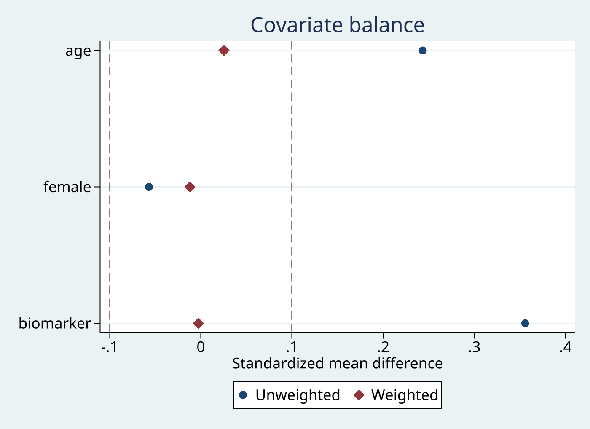
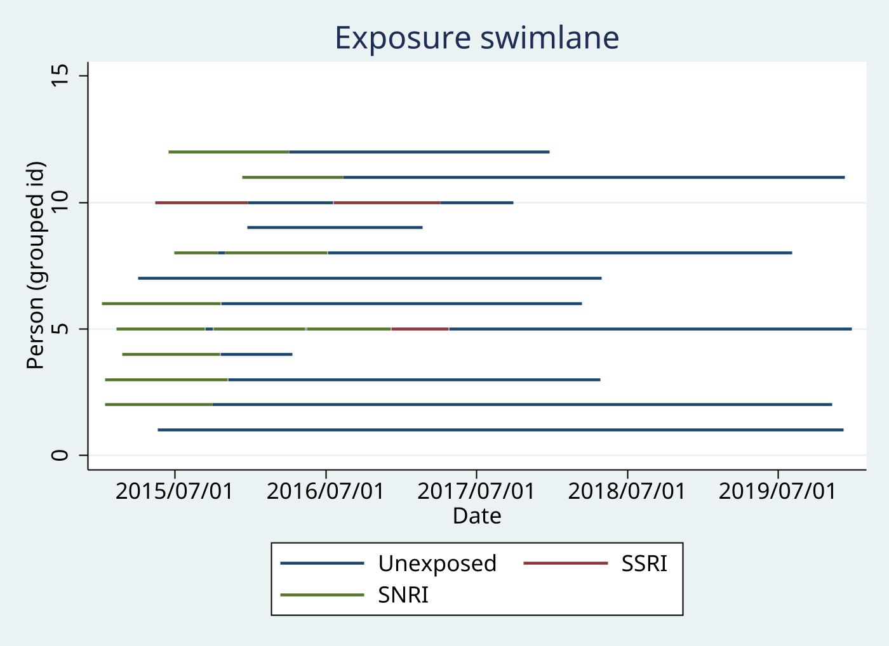

# tvtools — Time-varying exposure workflow for survival analysis

**Version 1.13.1** | 2026-08-05

`tvtools` turns person-level follow-up and episode records into analysis-ready time-varying survival data. It gives applied survival analysts transactional builds, composable interval primitives, diagnostics, weighting, fixed-width panels, and exact calendar-timescale splitting.

## Quick Start

This complete example creates its own cohort and episode data, so it runs after installation from any working directory.

```stata
clear
input long id study_entry study_exit
1 21915 22280
2 21915 22280
end
format study_entry study_exit %td
tempfile cohort episodes
save `cohort'

clear
input long id rx_start rx_stop byte rx_class
1 21919 21965 1
1 22024 22069 2
2 22100 22151 1
end
save `episodes'

use `cohort', clear
tvbuild, sourceusing(`"`episodes'"') id(id) entry(study_entry) exit(study_exit) ///
    start(rx_start) stop(rx_stop) exposure(rx_class) reference(0) ///
    generate(tv_drug) frameout(analysis) replace
frame analysis: tvdiagnose, id(id) start(start) stop(stop) ///
    entry(study_entry) exit(study_exit) all
frame change analysis
generate byte _failure = 0
generate double analysis_t0 = start - 1
stset stop, id(id) failure(_failure) time0(analysis_t0)
```

`tvbuild` leaves the person-level master unchanged, commits the interval result in frame `analysis`, and creates `analysis_manifest` unless `nomanifest` is specified. The subtraction of one day maps the package’s closed `[start, stop]` intervals to Stata’s open-left survival-time convention.

## Requirements

- Stata 16 or later.
- No required community package.
- Optional `psdash` for `tvweight, loveplot`; weighting, balance output, and `r(balance)` do not require it.
- Optional `msm` for downstream `msm_prepare` and `msm_weight` workflows after `tvpanel`.

## Installation

Install the released package from Stata-Tools:

```stata
capture ado uninstall tvtools
net install tvtools, from("https://raw.githubusercontent.com/tpcopeland/Stata-Tools/main/tvtools") replace
```

Install optional integrations only when those workflows are needed:

```stata
net install psdash, from("https://raw.githubusercontent.com/tpcopeland/Stata-Tools/main/psdash") replace
net install msm, from("https://raw.githubusercontent.com/tpcopeland/Stata-Tools/main/msm") replace
```

The ancillary menu helper is available with `net get tvtools`; run `do tvtools_menu_setup.do` only if you want to add its Stata menu entry.

## Commands

| Command | Purpose |
|---|---|
| `tvtools` | List and categorize the suite |
| `tvbuild` | Build a committed interval frame from a cohort and one or more sources |
| `tvspec` | Create and inspect the multi-source specification frame consumed by `tvbuild` |
| `tvexpose` | Convert raw episodes or point-time records into time-varying exposure intervals |
| `tvmerge` | Align two or more interval datasets and combine exposure quantities |
| `tvevent` | Add single, competing, or recurrent events to interval data |
| `tvdiagnose` | Report coverage, gaps, overlaps, exposure summaries, and swimlanes |
| `tvweight` | Estimate treatment and censoring weights and report balance and overlap diagnostics |
| `tvage` | Expand one row per person into exact calendar-age intervals |
| `tvband` | Split existing intervals on one age, calendar, or elapsed-time axis |
| `tvsplit` | Split existing intervals on several Lexis timescales at once |
| `tvpanel` | Build a fixed-width, entry-anchored person-period grid for MSM work |

## How It Works

`tvbuild` is the recommended front door for a cohort plus one or more longitudinal sources: it normalizes a one-source shortcut or a typed `tvspec` frame, performs a read-only preflight, constructs intervals through the shared engines, optionally integrates events, and commits the destination frame and provenance manifest transactionally.

The primitive workflow is `tvexpose` → `tvmerge` → `tvevent` → `tvdiagnose` and/or `tvweight`. Use the primitives when the exposure definition, overlap rule, quantity algebra, or alignment must remain visible as a separate analytical decision.

Every interval in the construction commands is a closed, inclusive interval of integer Stata daily dates, `[start, stop]`. Abutting rows satisfy `next_start = prior_stop + 1`; a shared date is an overlap, not an abutment.

`tvage`, `tvband`, and `tvsplit` add exact birthday, calendar, and elapsed-time axes, while `tvpanel` creates a uniform entry-anchored grid and can carry cumulative exposure history into each period.

## Choosing a Workflow

| Need | Use | Result |
|---|---|---|
| One or several sources with a committed, auditable destination | `tvspec` + `tvbuild` | Named output frame, optional manifest, stage counts, and a verified signature |
| An advanced exposure rule or custom interval alignment | `tvexpose`, `tvmerge`, and `tvevent` | Explicit primitive stages that can be inspected or chained through frames |
| A uniform panel for time-varying treatment models | `tvpanel`, then `tvweight` | Entry-anchored periods, active class, and optional cumulative histories |
| Age, calendar, or follow-up timescale splitting | `tvage`, `tvband`, or `tvsplit` | Inclusive sub-intervals with exact calendar boundaries |

## Worked Examples

The setup block below creates reusable tempfiles for the examples. Run it once in the same Stata session before copying any one of the workflow blocks.

```stata
clear
input long id study_entry study_exit byte female
1 21915 22280 1
2 21915 22280 0
3 21930 22280 1
4 21930 22280 0
end
format study_entry study_exit %td
tempfile cohort episodes episodes2 events recurrent
save `cohort'

clear
input long id rx_start rx_stop byte rx_class
1 21919 21965 1
1 22024 22069 2
2 22000 22040 1
3 21950 22030 2
end
save `episodes'

clear
input long id rx_start rx_stop byte rx_class
1 21930 21990 1
2 22050 22100 1
3 21970 22010 1
end
save `episodes2'

clear
input long id event_date death_date
1 22010  .
2     . 22100
3 22020  .
4     .     .
end
save `events'

clear
input long id hosp1 hosp2
1 22010 22100
2 22050     .
3 21980 22030
4     .     .
end
save `recurrent'
```

### 1. Plan and commit with `tvbuild`

`dryrun` validates the plan and changes nothing; the second call commits the same plan to a named frame and manifest.

```stata
use `cohort', clear
tvbuild, sourceusing(`"`episodes'"') id(id) entry(study_entry) exit(study_exit) ///
    start(rx_start) stop(rx_stop) exposure(rx_class) reference(0) ///
    generate(tv_drug) frameout(analysis) dryrun
tvbuild, sourceusing(`"`episodes'"') id(id) entry(study_entry) exit(study_exit) ///
    start(rx_start) stop(rx_stop) exposure(rx_class) reference(0) ///
    generate(tv_drug) frameout(analysis) manifestframe(provenance) replace
frame provenance: list stage source_name n_input n_output, noobs
```

### 2. Describe multiple sources with `tvspec`

`tvspec` appends one typed row per source and preserves row order; `tvbuild` applies the cross-source rules and performs the build.

```stata
tvspec create build_spec, replace
tvspec add build_spec, name(drug) using(`"`episodes'"') start(rx_start) stop(rx_stop) ///
    exposure(rx_class) generate(tv_drug) reference(0)
tvspec add build_spec, name(second) using(`"`episodes2'"') start(rx_start) stop(rx_stop) ///
    exposure(rx_class) generate(tv_second) reference(0)
tvspec list build_spec
use `cohort', clear
tvbuild, specframe(build_spec) id(id) entry(study_entry) exit(study_exit) ///
    frameout(analysis) manifestframe(provenance) replace
```

### 3. Keep a primitive workflow in frames

`frameout()` leaves the caller’s data intact, and `frames()` lets `tvmerge` consume named intermediate results without save/use round trips.

```stata
use `cohort', clear
tvexpose using `"`episodes'"', id(id) start(rx_start) stop(rx_stop) ///
    exposure(rx_class) reference(0) entry(study_entry) exit(study_exit) ///
    generate(tv_drug) frameout(f_drug) replace
tvexpose using `"`episodes2'"', id(id) start(rx_start) stop(rx_stop) ///
    exposure(rx_class) reference(0) entry(study_entry) exit(study_exit) ///
    generate(tv_second) frameout(f_second) replace
tvmerge, frames(f_drug f_second) id(id) start(rx_start rx_start) ///
    stop(rx_stop rx_stop) exposure(tv_drug tv_second) frameout(f_merged) replace
use `events', clear
tvevent, frame(f_merged) id(id) date(event_date) compete(death_date) generate(_failure)
```

### 4. Track dose history on a regular exposure scale

In dose mode, `exposure()` is the amount, `reference()` defaults to zero, and cumulative history is measured at the start of each output row.

```stata
clear
input long id study_entry study_exit
1 21915 22280
2 21915 22280
3 21930 22280
end
tempfile dose_cohort dose_episodes
save `dose_cohort'
clear
input long id rx_start rx_stop double dose_mg
1 21920 21950 10
1 21980 22020 20
2 22000 22060 15
3 21960 22030 5
end
save `dose_episodes'
use `dose_cohort', clear
tvexpose using `"`dose_episodes'"', id(id) start(rx_start) stop(rx_stop) ///
    exposure(dose_mg) entry(study_entry) exit(study_exit) dose ///
    generate(cum_dose) keepdates
tvdiagnose, id(id) start(rx_start) stop(rx_stop) exposure(cum_dose) summarize
```

### 5. Format recurrent events

For a wide event stub such as `hosp1`, `hosp2`, and so on, `type(recurring)` creates the event-sequence stratum and `gaptime` adds a reset clock.

```stata
use `recurrent', clear
tempfile recurrent_events
save `recurrent_events'
use `cohort', clear
keep id study_entry study_exit
rename study_entry win_start
rename study_exit win_stop
tempfile recurrent_intervals
save `recurrent_intervals'
use `recurrent_events', clear
tvevent using `recurrent_intervals', id(id) date(hosp) type(recurring) ///
    generate(hosp_event) start(win_start) stop(win_stop) enum(stratum) ///
    gaptime gapstart(t0) gapstop(t) timegen(tstop) timeunit(days)
```

### 6. Build an MSM panel and estimate weights

`tvpanel` emits every entry-anchored period, including reference periods, and `tvweight` can use its period index for a stabilized treatment model.

The synthetic exposure below covers the middle periods for every person, so the all-reference boundary periods are removed before fitting the illustrative treatment model; real analyses should retain only periods with support for the model they specify.

```stata
clear
set seed 20260805
set obs 40
generate long id = _n
generate double study_entry = 21915 + floor(runiform() * 20)
generate double study_exit = study_entry + 364
generate double age = 45 + 10 * runiform()
generate byte female = runiform() > .5
generate byte rx_class = runiform() < invlogit(-.4 + .04 * (age - 50) + .4 * female)
tempfile panel_cohort panel_episodes
save `panel_cohort'
keep id study_entry study_exit rx_class
generate double rx_start = study_entry + 40
generate double rx_stop = study_exit - 40
save `panel_episodes'
use `panel_cohort', clear
tvpanel using `"`panel_episodes'"', id(id) entry(study_entry) exit(study_exit) ///
    exposure(rx_class) start(rx_start) stop(rx_stop) width(91) ///
    period(period) generate(tv_class) keepvars(age female) replace
drop if period == 0 | period == 4
tvweight tv_class, covariates(age female) id(id) time(period) ///
    stabilized generate(iptw) nolog
```

### 7. Split one interval on several time axes

`tvsplit` accepts one or more axes and carries the other variables onto every resulting row.

```stata
clear
input long id double start stop dob entry
1 21915 22280  -3653 21915
2 21930 22280  1826 21930
end
format start stop dob entry %td
tvsplit, id(id) start(start) stop(stop) ///
    age(dob, width(5) generate(ageband)) ///
    calendar(, width(1) anchor(2020) generate(calband)) ///
    elapsed(entry, width(1) unit(year) generate(fuband))
```

## Demo

Regenerate the checked-in figures and console assets by running [demo/demo_tvtools.do](demo/demo_tvtools.do) from a repository checkout; the demo script creates its own synthetic data and is not part of the `net install` payload.

```stata
local demo_dir "/path/to/checked-out/tvtools/demo"
do "`demo_dir'/demo_tvtools.do" "`demo_dir'"
```





## Command Reference

### `tvtools`

```stata
tvtools [, list detail category(string)]
```

`list` prints command names, `detail` prints descriptions, and `category()` filters to `all` (the default), `prep`, `diag`, or `weight`. It returns `r(commands)`, `r(n_commands)`, `r(version)`, and `r(categories)`.

#### Options

| Option | Purpose |
|---|---|
| `list` | Print command names only |
| `detail` | Print command names with descriptions |
| `category(string)` | Select `all` (default), `prep`, `diag`, or `weight` |

### `tvspec`

```stata
tvspec create framename [, replace]
tvspec add framename, name(name) (frame(name) | using(filename)) ///
    start(name) stop(name) exposure(namelist) generate(namelist) ///
    [reference(#) kind(episodes|intervals) referencelabel(string) ///
     label(string) description(string) rate(namelist) total(namelist) ///
     cumulative(namelist)]
tvspec list framename
```

`create` writes the empty typed schema; `add` defaults `kind(episodes)`, requires exactly one of `frame()` and `using()`, and maps `exposure()` to `generate()` positionally. Episode rows require `reference()`; interval rows use `kind(intervals)` and must not specify a reference. `rate()`, `total()`, and `cumulative()` are optional subsets of `exposure()`.

### `tvbuild`

```stata
tvbuild, specframe(name) id(varname) entry(varname) exit(varname) frameout(name) [options]
tvbuild, (sourceframe(name) | sourceusing(filename)) id(varname) entry(varname) exit(varname) ///
    start(name) stop(name) exposure(name) reference(#) generate(name) frameout(name) [options]
```

Options are `sourcename()`, `referencelabel()`, `label()`, `startname()`, `stopname()`, `dateformat()`, `keepvars()`, `dropdates`, `coverage()`, `eventframe()`, `eventusing()`, `eventdate()`, `eventtype()`, `compete()`, `eventgenerate()`, `eventlabel()`, `timegen()`, `timeunit()`, `enum()`, `gaptime`, `gapstart()`, `gapstop()`, `manifestframe()`, `nomanifest`, `dryrun`, and `replace`. Defaults include `coverage(strict)`, `startname(start)`, `stopname(stop)`, `dateformat(%tdCCYY/NN/DD)`, `eventtype(single)`, `eventgenerate(_failure)`, `timeunit(days)`, and `<frameout>_manifest` for the manifest frame.

### `tvexpose`

```stata
tvexpose using filename, id(varname) start(varname) exposure(varname) ///
    [reference(#)] entry(varname) exit(varname) [options]
```

Options are `stop()`, `reference()`, `generate()`, `saveas()`, `frameout()`, `replace`, `merge()`, `evertreated`, `currentformer`, `duration()`, `dose`, `dosecuts()`, `continuousunit()`, `expandunit()`, `bytype`, `recency()`, `recencyunit()`, `grace()`, `lag()`, `washout()`, `pointtime`, `fillgaps()`, `carryforward()`, `keepvars()`, `check`, `gaps`, `overlaps`, `summarize`, `validate`, `priority()`, `split`, `layer`, `combine()`, `window()`, `switching`, `switchingdetail`, `statetime`, `keepdates`, `referencelabel()`, `label()`, `flow`, `dropinvalid`, and `verbose`. Categorical output is the default; `dose` defaults `reference(0)`, `grace(0)`, `merge(0)`, `lag(0)`, `washout(0)`, and a derived `tv_<exposure>` output name.

### `tvmerge`

```stata
tvmerge [dataset1 dataset2 ...], id(varname) start(namelist) stop(namelist) exposure(namelist) [options]
tvmerge, frames(namelist) id(varname) start(namelist) stop(namelist) exposure(namelist) [options]
```

Options are `frames()`, `generate()`, `prefix()`, `startname()`, `stopname()`, `idname()`, `dateformat()`, `saveas()`, `frameout()`, `replace`, `keep()`, `continuous()`, `rate()`, `total()`, `cumulative()`, `dropinvalid`, `batch()`, `force`, `check`, `validatecoverage`, `validateoverlap`, `summarize`, `flow`, and `verbose`. `continuous()` is the deprecated alias for `total()`.

### `tvevent`

```stata
tvevent [using filename], id(varname) date(name) [options]
tvevent, frame(name) id(varname) date(name) [options]
```

Options are `frame()`, `generate()`, `type()`, `keepvars()`, `continuous()`, `rate()`, `total()`, `cumulative()`, `timegen()`, `timeunit()`, `compete()`, `eventlabel()`, `startvar()`, `stopvar()`, `start()`, `stop()`, `enum()`, `gaptime`, `gapstart()`, `gapstop()`, `validate`, `flow`, `dropinvalid`, `verbose`, and `replace`. Defaults include `type(single)`, `generate(_failure)`, `timeunit(days)`, `start(start)`, `stop(stop)`, and `enum(_enum)` for recurring events.

### `tvdiagnose`

```stata
tvdiagnose, id(varname) start(varname) stop(varname) [options]
```

Options are `exposure()`, `entry()`, `exit()`, `coverage`, `gaps`, `overlaps`, `summarize`, `all`, `swimlane`, `maxids()`, `threshold()`, and `verbose`. `threshold(30)` and `maxids(50)` are the defaults; `coverage` requires `entry()` and `exit()`, while `summarize` requires `exposure()`.

### `tvweight`

```stata
tvweight exposure [if] [in], covariates(varlist) [options]
```

Options are `generate()`, `model()`, `stabilized`, `wtype()`, `truncate()`, `tvcovariates()`, `id()`, `time()`, `replace`, `denominator()`, `nolog`, `balance`, `loveplot`, `histogram`, `estname()`, `estreplace`, `cumulative`, `cumgenerate()`, `ipcw()`, `censorcovariates()`, `censgenerate()`, and `combgenerate()`. Defaults include `generate(iptw)`, `model(logit)`, `wtype(iptw)`, `cumgenerate(<weight>_cum)`, `censgenerate(ipcw)`, and `combgenerate(<weight>_ipcw)` when those modes are used.

### `tvage`, `tvband`, `tvsplit`, and `tvpanel`

`tvage` uses `id()`, `dob()`, `entry()`, `exit()`, `generate()`, `startgen()`, `stopgen()`, `groupwidth()`, `minage()`, `maxage()`, `saveas()`, `replace`, and `noisily`; legacy `idvar()`, `dobvar()`, `entryvar()`, and `exitvar()` aliases remain accepted. Defaults are `age_tv`, `age_start`, `age_stop`, `groupwidth(1)`, `minage(0)`, and `maxage(120)`.

`tvband` uses `id()`, `start()`, `stop()`, `type()`, `origin()`, `width()`, `min()`, `max()`, `unit()`, `anchor()`, `generate()`, `startgen()`, `stopgen()`, `saveas()`, `replace`, and `noisily`. `origin()` is required for age and elapsed axes and forbidden for calendar; `width(1)` and elapsed `unit(day)` are the defaults.

`tvsplit` uses `id()`, `start()`, `stop()`, `age()`, `calendar()`, `elapsed()`, and `noisily`; its nested options are `width()`, `min()`, `max()`, `anchor()`, `unit()`, and `generate()`. At least one axis is required, and the default band variables are `ageband`, `calband`, and `fuband`.

`tvpanel` uses `frame()`, `reference()`, `width()`, `start()`, `stop()`, `period()`, `startgen()`, `stopgen()`, `generate()`, `cumulative()`, `prefix()`, `keepvars()`, `saveas()`, `replace`, `noisily`, `dropinvalid`, and `verbose`. Defaults are `reference(0)`, `width(91)`, `start(start)`, `stop(stop)`, `period(period)`, `startgen(start)`, `stopgen(stop)`, and `generate(tv_class)`.

## Key Options

### Dates, identifiers, and intervals

Use numeric Stata daily dates for interval bounds and event dates; fractional dates, missing required dates, and reversed bounds are rejected unless a command explicitly offers `dropinvalid`. Most interval commands require the same identifier name and storage type across master and sources, reject `strL` identifiers, and never silently recast IDs.

The package’s intervals are closed and inclusive, so duration is `stop - start + 1`. When declaring the result with `stset`, use `time0(start - 1)` to map each row to Stata’s open-left convention.

### Output and transactions

`frameout()` stages a result in a named frame and leaves the current data untouched where that option is supported; `saveas()` writes a file and restores the caller’s data for the commands that document that behavior. `replace` is required before an existing file or frame is overwritten.

`tvbuild` requires `frameout()`, leaves input frames untouched, and builds a manifest named `<frameout>_manifest` by default; use `manifestframe()` or `nomanifest` to control it. `dryrun` performs the full plan validation without committing destinations.

### Quantities and exposure definitions

`rate()` variables remain rates when intervals are split; `total()` variables are apportioned by inclusive overlap days; and `cumulative()` variables are row-start histories carried unchanged. `continuous()` is a deprecated alias for `total()` in `tvmerge` and `tvevent`.

In `tvexpose`, categorical output uses `reference()` for uncovered time, while `dose` mode defaults the reference to zero. `continuousunit()` accepts days, weeks, months, quarters, or years; `expandunit()` defaults to that unit when continuous exposure is requested and uses fixed average widths of 7, 30.4375, 91.3125, or 365.25 days anchored at each episode start.

## Stored Results

Result names below are returned in `r()` after successful execution; option-dependent names are returned only when their option is used.

| Command | Stored results |
|---|---|
| `tvtools` | Scalar `r(n_commands)`; macros `r(commands)`, `r(version)`, and `r(categories)` |
| `tvspec` | Scalars `n_sources`; macros `specframe`, `source_name` for `add`, and `source_names` for `list` |
| `tvbuild` | Scalars `dryrun`, `spec_version`, `n_sources`, `N_persons`, `event_stage`, `dates_kept`, and committed-run `N_periods`, `n_gap_ids`, `uncovered_days`; macros `idvar`, `entryvar`, `exitvar`, `startvar`, `stopvar`, `source_names`, `payload_vars`, `exposure_vars`, `rate_vars`, `total_vars`, `cumulative_vars`, `specframe`, `frameout`, `coverage`, `manifestframe`, `eventvar`, `timevar`, `enumvar`, `gapstartvar`, `gapstopvar`, `datasignature`; matrices `source_counts`, `stage_counts` |
| `tvexpose` | Scalars for persons, periods, total/exposed/unexposed time, invalid-input counts, window bounds, combined states, and by-type variables; macros `genvar`, `frameout`, `overlap_ids`, `recency_unit`, `recency_cutdays`, `combine_map`, `bytype_map`; matrix `flow` when requested |
| `tvmerge` | Scalars for observations, persons, datasets, quantity counts, invalid rows, gaps, overlaps, and duplicates; macros for datasets, exposure/quantity variables, output names, and destinations; matrix `flow` when requested |
| `tvevent` | Scalars `N`, `N_events`, quantity counts, invalid-input counts, and event validation counts; macros `generate`, `startvar`, `stopvar`, `timegen`, `enum`, `gapstart`, `gapstop`, and quantity variables; matrix `flow` when requested |
| `tvdiagnose` | Scalars for each requested diagnostic, coverage/gap/overlap summaries, exposure levels, and graph status; macros `id`, `start`, `stop`, `graph_name`; matrix `exposure_summary` when `summarize` runs |
| `tvweight` | Scalars for sample size, levels, ESS, weight distribution, overlap, positivity, truncation, and graph status; macros for model, weight, output, treatment/censoring, and balance settings; scalar `ess_combined` and matrix `balance` in the corresponding modes |
| `tvage` | Scalars `n_persons`, `n_observations`, `groupwidth`; macros `varname`, `startvar`, `stopvar` |
| `tvband` | Scalars `n_persons`, `n_observations`, `width`; macros `axistype`, `varname`, `startvar`, `stopvar` |
| `tvsplit` | Scalars `n_axes`, `n_persons`, `n_observations`; macros `agevar`, `calvar`, `fuvar`, `startvar`, `stopvar` when applicable |
| `tvpanel` | Scalars for persons, observations, width, and invalid-input counts; macros `periodvar`, `startvar`, `stopvar`, `classvar`, `cumvars` |

## Assumptions and Limits

- Input dates are numeric, whole-number Stata daily dates; the suite does not interpret Stata datetime values as daily dates.
- Identifiers are structural keys, so source names and storage types must agree and commands never pad, guess, or silently remap them.
- `tvage`, `tvband`, and `tvsplit` require numeric identifiers; map string IDs deliberately before calling them.
- `tvage` intentionally returns only the identifier and generated age interval variables; save or merge covariates separately.
- `tvmerge` expects interval inputs, and `force` restricts mismatched-ID inputs to their intersection rather than inventing missing records.
- `tvevent` treats single events as terminal and recurring event stubs as ordered `stub1` through `stubK` members; noncanonical or noncontiguous stubs are rejected.
- `tvdiagnose` counts global coverage by interval union, but category summaries can have multi-membership when exposure levels overlap.
- `tvbuild` coordinates construction and provenance but does not run `stset`, an outcome model, an overlap-resolution choice, or a causal model.
- Weighting output is model-based; causal interpretation requires the relevant exchangeability, positivity, treatment-model, and censoring assumptions.
- `tvweight, loveplot` requires optional `psdash`; without it, use `r(balance)` to build a plot with another graphing workflow.

## References

- Robins JM, Hernán MA, Brumback B. Marginal structural models and causal inference in epidemiology. *Epidemiology*. 2000;11(5):550–560.
- Cole SR, Hernán MA. Constructing inverse probability weights for marginal structural models. *American Journal of Epidemiology*. 2008;168(6):656–664.
- Li F, Morgan KL, Zaslavsky AM. Balancing covariates via propensity score weighting. *Journal of the American Statistical Association*. 2018;113(521):390–400.

## QA

QA suites and how to run them are documented in [`qa/README.md`](qa/README.md).

## Version History

- **1.13.1** (2026-08-05): Corrected the closed-interval `stset` help conversion to use `time0(start - 1)` so the first follow-up day is retained.
- **1.13.0** (2026-08-02): Harmonized console-report layout and corrected display-only leaks and formatting defects without changing estimators, interval semantics, computed values, options, or stored results.
- **1.12.1** (2026-08-02): Hardened provenance-manifest replacement checks and improved diagnostics for damaged specification frames.
- **1.12.0** (2026-08-01): Added `tvspec`, made `tvbuild` provenance manifests default, and made catalog rendering derive from one command list.
- **1.11.0** (2026-07-31): Renamed the released front door from `tvpipe` to `tvbuild` and moved its specification and provenance characteristics to the new command name.
- **1.10.2** (2026-07-31): Hardened front-door specification validation, recurring-event stub discovery, manifest return normalization, and specification-cell arity checks.
- **1.10.1** (2026-07-30): Repaired `eventlabel()` forwarding in the front door and removed duplicate help content.
- **1.10.0** (2026-07-30): Added the transactional front door for typed multi-source plans and introduced `tvmerge, idname()`.
- **1.9.1** (2026-07-30): Made frame-native merging preserve caller frame names and improved cumulative-weight and interval-segmentation internals without changing computed values.
- **1.9.0** (2026-07-25): Corrected panel-mode stabilized weighting, balance-weight selection under IPCW, censoring-indicator validation, and cross-exposure overlap reporting.
- **1.8.0** (2026-07-22): Added collision-safe output planning, explicit overlap composition codes, union-based coverage, date-first event placement, and stricter multiplicity checks.
- **1.7.1** (2026-07-17): Improved interval-overlap performance and deterministic ordering in `tvmerge`.
- **1.7.0** (2026-07-13): Consolidated interval, quantity, diagnostic, age-anniversary, and output-contract behavior across the suite.
- **1.6.9** (2026-07-10): Added failure-safe output rollback, collision-safe labels, clipped coverage diagnostics, and early identifier validation.
- **1.6.8** (2026-07-03): Corrected opt-in diagnostic paths, short-data error reporting, validation-file naming, and legitimate duplicate-interval handling.
- **1.6.7** (2026-07-02): Added early `strL` identifier rejection and clearer numeric-ID diagnostics.
- **1.6.6** (2026-07-02): Corrected exact-width panel endpoints, running-maximum gap logic, output-name collisions, truncation bounds, and estimation-sample IPCW validation.
- **1.6.5** (2026-07-02): Corrected by-type labels and summaries, validation-file collisions, empty-frame output, zero-overlap validation, and non-positional continuous quantities.
- **1.6.4** (2026-07-01): Corrected cumulative products across rows excluded from the estimation sample.
- **1.6.3** (2026-06-30): Consolidated the shared interval engine for panel lookup and event split-point placement.
- **1.6.2** (2026-06-29): Delegated `tvweight, loveplot` to optional `psdash` while preserving the balance table and matrix.
- **1.6.1** (2026-06-29): Added `tvband` and `tvsplit` to the public package documentation and harmonized help presentation.
- **1.6.0** (2026-06-29): Added IPCW and combined weights, positivity diagnostics, and recurrent-event sequence and gap-time formatting.
- **1.5.0** (2026-06-29): Added frame-first output, harmonized aliases, and scriptable output-name returns.
- **1.4.0** (2026-06-29): Added derived output names and collision-safe fallback naming in `tvexpose`.
- **1.3.0** (2026-06-28): Added single-axis and multi-axis age, calendar, and elapsed-time splitting with exact anniversaries.
- **1.2.0** (2026-06-28): Added Mata interval-overlap and continuous-expansion engines; deprecated `batch()` as an ignored compatibility option.
- **1.1.0** (2026-06-28): Added balance diagnostics, alternative weight types, cumulative weights, graphing, frame inputs, flow reporting, and swimlanes.
- **1.0.3** (2026-06-26): Hardened panel bookkeeping, value-label handling, and dose-overlap temporary names.
- **1.0.2** (2026-06-19): Standardized public help-file author sections and stored-result presentation.
- **1.0.1** (2026-06-15): Fixed suppressed parser errors, event reshaping bookkeeping, option aliases, and author metadata.
- **1.0.0** (2026-04-08): Initial Stata-Tools release.

## Author

Timothy P Copeland, Karolinska Institutet

## License

MIT License. See [LICENSE](../LICENSE).
