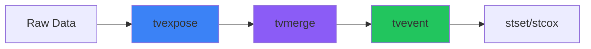

# From Static to Dynamic

## Time-Varying Exposure Analysis with **tvtools**

<div class="pt-12">
  <span class="px-4 py-2 rounded bg-blue-500 text-white text-xl font-semibold">
    A Stata Toolkit for Survival Analysis
  </span>
</div>

<div class="abs-br m-6 flex gap-2">
  <a href="https://github.com/tpcopeland/Stata-Tools" target="_blank" class="text-xl slidev-icon-btn opacity-50 !border-none !hover:text-white">
    <carbon-logo-github />
  </a>
</div>

<style>
h1 {
  background: linear-gradient(135deg, #667eea 0%, #764ba2 100%);
  -webkit-background-clip: text;
  -webkit-text-fill-color: transparent;
}
</style>

---
layout: two-cols
transition: fade-out
---

# The Challenge

<v-clicks>

**Your patient starts Treatment A...**

**...switches to Treatment B...**

**...then back to A.**

<div class="text-red-500 font-bold text-xl mt-8">
How do you model this?
</div>

</v-clicks>

::right::

<div class="pl-8 pt-16">
  <div v-click class="bg-gray-100 dark:bg-gray-800 p-4 rounded-lg mb-4">
    <div class="text-sm text-gray-500 mb-2">Traditional Analysis</div>
    <div class="font-mono text-sm">
      Patient → Treatment at baseline → Outcome
    </div>
  </div>

  <div v-click class="bg-red-100 dark:bg-red-900 p-4 rounded-lg">
    <div class="text-sm text-red-600 dark:text-red-300 mb-2">Reality</div>
    <div class="font-mono text-xs">
      Medications change<br>
      Comorbidities develop<br>
      Exposures accumulate
    </div>
  </div>
</div>

---
transition: slide-up
layout: center
class: text-center
---

# The Transformation We Need

<div class="grid grid-cols-1 gap-8 mt-8">

<div v-click class="transform-box">

### Before: Static Data

```
ID │ Entry    │ Exit     │ Treatment
───┼──────────┼──────────┼──────────
 1 │ 2020-01  │ 2025-01  │ A
```

</div>

<div v-click class="text-4xl animate-bounce">
  ⬇️
</div>

<div v-click class="transform-box">

### After: Time-Varying Data

```
ID │ Start    │ Stop     │ Treatment │ Event
───┼──────────┼──────────┼───────────┼──────
 1 │ 2020-01  │ 2021-06  │ None      │ 0
 1 │ 2021-06  │ 2022-03  │ A         │ 0
 1 │ 2022-03  │ 2023-01  │ B         │ 0
 1 │ 2023-01  │ 2024-08  │ A         │ 0
 1 │ 2024-08  │ 2025-01  │ A         │ 1  ← Event!
```

</div>

</div>

<style>
.transform-box {
  @apply bg-gray-50 dark:bg-gray-800 p-4 rounded-xl shadow-lg;
}
</style>

---
layout: default
transition: slide-left
---

# The tvtools Solution

<div class="grid grid-cols-3 gap-8 mt-12">

<div v-click class="command-card">
  <div class="text-5xl mb-4">📊</div>
  <h3 class="text-xl font-bold text-blue-600">tvexpose</h3>
  <p class="text-sm mt-2 text-gray-600 dark:text-gray-400">
    Create time-varying exposure variables
  </p>
</div>

<div v-click class="command-card">
  <div class="text-5xl mb-4">🔗</div>
  <h3 class="text-xl font-bold text-purple-600">tvmerge</h3>
  <p class="text-sm mt-2 text-gray-600 dark:text-gray-400">
    Combine multiple exposures
  </p>
</div>

<div v-click class="command-card">
  <div class="text-5xl mb-4">🎯</div>
  <h3 class="text-xl font-bold text-green-600">tvevent</h3>
  <p class="text-sm mt-2 text-gray-600 dark:text-gray-400">
    Integrate outcomes & competing risks
  </p>
</div>

</div>

<div v-click class="mt-12 text-center">



</div>

<style>
.command-card {
  @apply bg-white dark:bg-gray-800 p-6 rounded-xl shadow-lg text-center;
  @apply transform hover:scale-105 transition-transform duration-300;
}
</style>

---
layout: two-cols
---

# Meet Our Data

<v-clicks>

**cohort.dta**
- 1,000 MS patients
- Study entry/exit dates
- Demographics & outcomes

**hrt.dta**
- Hormone replacement therapy
- Types: Estrogen, Combined, etc.
- Start/stop dates

**dmt.dta**
- Disease-modifying therapies
- 6 treatment types
- Treatment periods

</v-clicks>

::right::

<div class="pl-8 pt-8">

<div v-click class="research-question">

### Research Question

> Does DMT exposure reduce disability progression, accounting for death as a competing risk?

</div>

<div v-click class="mt-8 text-sm">

```stata
* Our goal:
stcrreg i.dmt_type, compete(outcome==2)
```

</div>

</div>

<style>
.research-question {
  @apply bg-gradient-to-r from-blue-50 to-purple-50;
  @apply dark:from-blue-900 dark:to-purple-900;
  @apply p-6 rounded-xl border-l-4 border-blue-500;
}
</style>

---
layout: section
---

# Step 1: tvexpose
## Transform Raw Exposures into Time-Varying Intervals

---
transition: view-transition
---

# tvexpose: Basic Syntax

<div class="mt-8">

```stata {all|2|3|4|5|6|all}
use cohort, clear

tvexpose using dmt, ///
    id(id) start(dmt_start) stop(dmt_stop) ///
    exposure(dmt) reference(0) ///
    entry(study_entry) exit(study_exit)
```

</div>

<div v-click class="mt-8 grid grid-cols-2 gap-4">

<div class="option-box">
  <span class="font-bold text-blue-600">id()</span>
  <span class="text-sm">Person identifier</span>
</div>

<div class="option-box">
  <span class="font-bold text-blue-600">start() / stop()</span>
  <span class="text-sm">Exposure period dates</span>
</div>

<div class="option-box">
  <span class="font-bold text-blue-600">exposure()</span>
  <span class="text-sm">Treatment variable</span>
</div>

<div class="option-box">
  <span class="font-bold text-blue-600">reference()</span>
  <span class="text-sm">Unexposed value (usually 0)</span>
</div>

</div>

<style>
.option-box {
  @apply bg-gray-100 dark:bg-gray-800 p-3 rounded-lg;
  @apply flex flex-col gap-1;
}
</style>

---
layout: two-cols
transition: slide-up
---

# tvexpose: The Magic

### Before: Raw DMT Data

<div class="mt-4 text-sm">

```
ID │ dmt_start │ dmt_stop  │ dmt
───┼───────────┼───────────┼────────────
 1 │ 2020-03   │ 2021-08   │ 2 (IFN)
 1 │ 2022-01   │ 2024-06   │ 4 (NTZ)
```

</div>

<v-click>

<div class="mt-8 text-gray-500">
  <carbon-arrow-down class="text-2xl animate-bounce" />
</div>

### After: Time-Varying

<div class="mt-4 text-sm">

```
ID │ start     │ stop      │ tv_exposure
───┼───────────┼───────────┼────────────
 1 │ 2019-01   │ 2020-03   │ 0 (None)
 1 │ 2020-03   │ 2021-08   │ 2 (IFN)
 1 │ 2021-08   │ 2022-01   │ 0 (None)
 1 │ 2022-01   │ 2024-06   │ 4 (NTZ)
 1 │ 2024-06   │ 2025-01   │ 0 (None)
```

</div>

</v-click>

::right::

<div class="pl-8 pt-4">

<div v-click="2" class="timeline-visual">

<div class="timeline-row unexposed" style="width: 25%">None</div>
<div class="timeline-row exposed-1" style="width: 30%">IFN</div>
<div class="timeline-row unexposed" style="width: 10%">Gap</div>
<div class="timeline-row exposed-2" style="width: 25%">NTZ</div>
<div class="timeline-row unexposed" style="width: 10%">None</div>

</div>

<div v-click="3" class="mt-8 highlight-box">

**Key insight:** Gaps automatically filled with reference category!

</div>

</div>

<style>
.timeline-visual {
  @apply flex flex-col gap-2 mt-8;
}
.timeline-row {
  @apply py-2 px-3 rounded text-white text-sm font-semibold text-center;
  @apply transform transition-all duration-500;
}
.unexposed { @apply bg-gray-400; }
.exposed-1 { @apply bg-blue-500; }
.exposed-2 { @apply bg-orange-500; }
.highlight-box {
  @apply bg-green-100 dark:bg-green-900 p-4 rounded-lg;
  @apply border-l-4 border-green-500;
}
</style>

---

# tvexpose: Exposure Definitions

<div class="grid grid-cols-2 gap-6 mt-8">

<div v-click class="def-card">
  <h4 class="text-blue-600 font-bold">Basic Time-Varying</h4>
  <code class="text-xs">[no special option]</code>
  <p class="text-sm mt-2">Standard implementation</p>
</div>

<div v-click class="def-card">
  <h4 class="text-purple-600 font-bold">Ever-Treated</h4>
  <code class="text-xs">evertreated</code>
  <p class="text-sm mt-2">Binary switch at first exposure</p>
</div>

<div v-click class="def-card">
  <h4 class="text-green-600 font-bold">Current/Former</h4>
  <code class="text-xs">currentformer</code>
  <p class="text-sm mt-2">0=Never, 1=Current, 2=Former</p>
</div>

<div v-click class="def-card">
  <h4 class="text-orange-600 font-bold">Duration Categories</h4>
  <code class="text-xs">duration(1 5 10)</code>
  <p class="text-sm mt-2">Cumulative exposure time</p>
</div>

</div>

<div v-click class="mt-8">

```stata {2-3}
tvexpose using dmt, id(id) start(dmt_start) stop(dmt_stop) ///
    exposure(dmt) reference(0) entry(study_entry) exit(study_exit) ///
    currentformer generate(dmt_status)
```

</div>

<style>
.def-card {
  @apply bg-white dark:bg-gray-800 p-4 rounded-xl shadow;
  @apply border-t-4;
}
.def-card:nth-child(1) { @apply border-blue-500; }
.def-card:nth-child(2) { @apply border-purple-500; }
.def-card:nth-child(3) { @apply border-green-500; }
.def-card:nth-child(4) { @apply border-orange-500; }
</style>

---

# tvexpose: Advanced Features

<div class="grid grid-cols-3 gap-6 mt-8">

<div v-click class="feature-card">

### Grace Periods

```stata
grace(30)
```

Treat 30-day gaps as continuous exposure

<div class="feature-visual">
  <div class="bg-blue-500 w-16"></div>
  <div class="bg-yellow-400 w-4" title="gap"></div>
  <div class="bg-blue-500 w-16"></div>
</div>

</div>

<div v-click class="feature-card">

### Lag & Washout

```stata
lag(30) washout(90)
```

30-day onset delay, 90-day persistence

<div class="feature-visual">
  <div class="bg-gray-300 w-6" title="lag"></div>
  <div class="bg-blue-500 w-16"></div>
  <div class="bg-blue-300 w-12" title="washout"></div>
</div>

</div>

<div v-click class="feature-card">

### Switching Tracking

```stata
switching switchingdetail
```

Pattern: "0→2→4→0"

<div class="text-2xl mt-4">
  0 → 2 → 4 → 0
</div>

</div>

</div>

<style>
.feature-card {
  @apply bg-gray-50 dark:bg-gray-800 p-4 rounded-xl;
  @apply text-center;
}
.feature-card h3 {
  @apply text-lg font-bold mb-2;
}
.feature-visual {
  @apply flex justify-center items-center gap-1 mt-4 h-8;
}
.feature-visual div {
  @apply h-full rounded;
}
</style>

---
layout: section
---

# Step 2: tvmerge
## Combine Multiple Time-Varying Exposures

---

# tvmerge: The Setup

<div class="grid grid-cols-2 gap-8 mt-8">

<div v-click>

### Create HRT Dataset

```stata {all|1|2-5|6}
use cohort, clear
tvexpose using hrt, ///
    id(id) start(rx_start) stop(rx_stop) ///
    exposure(hrt_type) reference(0) ///
    entry(study_entry) exit(study_exit) ///
    saveas(tv_hrt.dta) replace
```

</div>

<div v-click>

### Create DMT Dataset

```stata {all|1|2-5|6}
use cohort, clear
tvexpose using dmt, ///
    id(id) start(dmt_start) stop(dmt_stop) ///
    exposure(dmt) reference(0) ///
    entry(study_entry) exit(study_exit) ///
    saveas(tv_dmt.dta) replace
```

</div>

</div>

<div v-click class="mt-8 text-center">

<carbon-arrow-down class="text-4xl animate-bounce text-purple-500" />

### Now merge them!

</div>

---
transition: view-transition
---

# tvmerge: The Merge

```stata {all|1|2|3|4}
tvmerge tv_hrt tv_dmt, id(id) ///
    start(rx_start dmt_start) ///
    stop(rx_stop dmt_stop) ///
    exposure(tv_exposure tv_exposure) ///
    generate(hrt dmt_type)
```

<div v-click class="mt-8">

### What tvmerge does:

<div class="grid grid-cols-3 gap-4 mt-4">

<div class="merge-step">
  <div class="text-3xl">1️⃣</div>
  <p>Finds all temporal overlaps</p>
</div>

<div class="merge-step">
  <div class="text-3xl">2️⃣</div>
  <p>Creates intersection intervals</p>
</div>

<div class="merge-step">
  <div class="text-3xl">3️⃣</div>
  <p>Assigns both exposures</p>
</div>

</div>

</div>

<style>
.merge-step {
  @apply bg-purple-100 dark:bg-purple-900 p-4 rounded-lg text-center;
}
</style>

---

# tvmerge: Temporal Cartesian Product

<div class="mt-4">

<div v-click class="timeline-container">
  <div class="timeline-label">HRT:</div>
  <div class="timeline">
    <div class="segment unexposed" style="flex: 3">None</div>
    <div class="segment estrogen" style="flex: 4">Estrogen</div>
    <div class="segment unexposed" style="flex: 3">None</div>
  </div>
</div>

<div v-click class="timeline-container">
  <div class="timeline-label">DMT:</div>
  <div class="timeline">
    <div class="segment unexposed" style="flex: 2">None</div>
    <div class="segment ifn" style="flex: 4">IFN</div>
    <div class="segment unexposed" style="flex: 2">None</div>
    <div class="segment ntz" style="flex: 2">NTZ</div>
  </div>
</div>

<div v-click class="text-center text-2xl my-4">⬇️ Merge at boundaries ⬇️</div>

<div v-click class="timeline-container">
  <div class="timeline-label">Result:</div>
  <div class="timeline merged">
    <div class="segment s1" style="flex: 2">0,0</div>
    <div class="segment s2" style="flex: 1">0,IFN</div>
    <div class="segment s3" style="flex: 2">E,IFN</div>
    <div class="segment s4" style="flex: 1">E,0</div>
    <div class="segment s5" style="flex: 2">0,0</div>
    <div class="segment s6" style="flex: 2">0,NTZ</div>
  </div>
</div>

</div>

<style>
.timeline-container {
  @apply flex items-center gap-4 my-4;
}
.timeline-label {
  @apply w-16 font-bold text-right;
}
.timeline {
  @apply flex flex-1 h-12 rounded-lg overflow-hidden;
}
.segment {
  @apply flex items-center justify-center text-white text-xs font-semibold;
  @apply border-r border-white/30;
}
.unexposed { @apply bg-gray-400; }
.estrogen { @apply bg-pink-500; }
.ifn { @apply bg-blue-500; }
.ntz { @apply bg-orange-500; }
.merged .s1 { @apply bg-gray-400; }
.merged .s2 { @apply bg-blue-500; }
.merged .s3 { background: linear-gradient(135deg, #ec4899 50%, #3b82f6 50%); }
.merged .s4 { @apply bg-pink-500; }
.merged .s5 { @apply bg-gray-400; }
.merged .s6 { @apply bg-orange-500; }
</style>

---

# tvmerge: Output Structure

```
ID │ start     │ stop      │ hrt │ dmt_type
───┼───────────┼───────────┼─────┼──────────
 1 │ 2020-01   │ 2020-06   │ 0   │ 0
 1 │ 2020-06   │ 2021-03   │ 0   │ 2 (IFN)
 1 │ 2021-03   │ 2021-09   │ 1   │ 2 (IFN)
 1 │ 2021-09   │ 2022-04   │ 1   │ 0
 1 │ 2022-04   │ 2023-01   │ 0   │ 0
 1 │ 2023-01   │ 2025-01   │ 0   │ 4 (NTZ)
```

<v-clicks>

<div class="mt-8 grid grid-cols-2 gap-4">

<div class="insight-box">
  <carbon-checkmark-filled class="text-green-500 text-xl" />
  <span>Every interval has BOTH exposures defined</span>
</div>

<div class="insight-box">
  <carbon-checkmark-filled class="text-green-500 text-xl" />
  <span>Periods split at ALL exposure boundaries</span>
</div>

<div class="insight-box">
  <carbon-checkmark-filled class="text-green-500 text-xl" />
  <span>No gaps or overlaps in output</span>
</div>

<div class="insight-box">
  <carbon-checkmark-filled class="text-green-500 text-xl" />
  <span>Ready for survival analysis</span>
</div>

</div>

</v-clicks>

<style>
.insight-box {
  @apply flex items-center gap-2 bg-gray-100 dark:bg-gray-800 p-3 rounded-lg;
}
</style>

---
layout: section
---

# Step 3: tvevent
## Integrate Outcomes & Competing Risks

---

# tvevent: Purpose

<div class="grid grid-cols-2 gap-8 mt-8">

<div>

### The Challenge

<v-clicks>

- Events occur at **specific dates**
- May fall **mid-interval**
- Multiple **competing events**
- Need **proper flagging**

</v-clicks>

</div>

<div v-click>

### The Solution

```stata
tvevent using cohort, ///
    id(id) ///
    date(edss4_dt) ///
    compete(death_dt) ///
    generate(outcome)
```

</div>

</div>

<div v-click class="mt-8">

### tvevent automatically:

<div class="grid grid-cols-4 gap-2 mt-4">
  <div class="auto-step">Finds earliest event</div>
  <div class="auto-step">Splits intervals</div>
  <div class="auto-step">Flags event type</div>
  <div class="auto-step">Truncates follow-up</div>
</div>

</div>

<style>
.auto-step {
  @apply bg-green-100 dark:bg-green-900 p-3 rounded-lg text-center text-sm;
  @apply border-b-4 border-green-500;
}
</style>

---
transition: slide-up
---

# tvevent: Interval Splitting

<div class="split-demo mt-8">

<div v-click class="split-before">
  <div class="label">Before tvevent:</div>
  <div class="interval">
    <span>2023-01</span>
    <div class="bar"></div>
    <span>2025-01</span>
  </div>
  <div class="values">hrt=0, dmt=4</div>
</div>

<div v-click class="event-marker">
  <carbon-flag-filled class="text-red-500 text-2xl" />
  <span>Event: 2024-03</span>
</div>

<div v-click class="split-after">
  <div class="label">After tvevent:</div>
  <div class="interval">
    <span>2023-01</span>
    <div class="bar bar-pre"></div>
    <span class="event-point">2024-03</span>
  </div>
  <div class="values">hrt=0, dmt=4, <span class="text-red-500 font-bold">outcome=1</span></div>
</div>

<div v-click class="dropped">
  <carbon-close-filled class="text-gray-400" />
  <span>Post-event data dropped (type=single)</span>
</div>

</div>

<style>
.split-demo {
  @apply flex flex-col items-center gap-6;
}
.split-before, .split-after {
  @apply bg-gray-50 dark:bg-gray-800 p-6 rounded-xl w-full max-w-xl;
}
.label {
  @apply text-sm text-gray-500 mb-2;
}
.interval {
  @apply flex items-center gap-2;
}
.bar {
  @apply flex-1 h-8 bg-orange-500 rounded;
}
.bar-pre {
  @apply bg-gradient-to-r from-orange-500 to-red-500;
}
.values {
  @apply text-sm mt-2 font-mono;
}
.event-marker {
  @apply flex items-center gap-2 text-red-600 font-bold;
}
.event-point {
  @apply bg-red-500 text-white px-2 py-1 rounded text-sm;
}
.dropped {
  @apply flex items-center gap-2 text-gray-400 text-sm;
}
</style>

---

# tvevent: Competing Risks

```stata
tvevent using cohort, id(id) date(edss4_dt) ///
    compete(death_dt emigration_dt) ///
    eventlabel(0 "Censored" 1 "Progression" 2 "Death" 3 "Emigrated") ///
    generate(status)
```

<div v-click class="mt-8">

### Outcome Coding

<div class="grid grid-cols-4 gap-4 mt-4">

<div class="outcome-box outcome-0">
  <div class="code">0</div>
  <div class="label">Censored</div>
</div>

<div class="outcome-box outcome-1">
  <div class="code">1</div>
  <div class="label">Progression</div>
  <div class="type">Primary</div>
</div>

<div class="outcome-box outcome-2">
  <div class="code">2</div>
  <div class="label">Death</div>
  <div class="type">Competing</div>
</div>

<div class="outcome-box outcome-3">
  <div class="code">3</div>
  <div class="label">Emigrated</div>
  <div class="type">Competing</div>
</div>

</div>

</div>

<style>
.outcome-box {
  @apply p-4 rounded-xl text-center text-white;
}
.outcome-box .code {
  @apply text-3xl font-bold;
}
.outcome-box .label {
  @apply text-lg mt-2;
}
.outcome-box .type {
  @apply text-xs opacity-75 mt-1;
}
.outcome-0 { @apply bg-gray-400; }
.outcome-1 { @apply bg-blue-500; }
.outcome-2 { @apply bg-red-500; }
.outcome-3 { @apply bg-yellow-600; }
</style>

---
layout: section
---

# Complete Workflow
## Putting It All Together

---

# The Full Pipeline

<div class="code-scroll">

```stata {all|1-6|8-13|15-19|21-23|25-26|all}
* Step 1: Create time-varying HRT
use cohort, clear
tvexpose using hrt, id(id) start(rx_start) stop(rx_stop) ///
    exposure(hrt_type) reference(0) ///
    entry(study_entry) exit(study_exit) ///
    saveas(tv_hrt.dta) replace

* Step 2: Create time-varying DMT
use cohort, clear
tvexpose using dmt, id(id) start(dmt_start) stop(dmt_stop) ///
    exposure(dmt) reference(0) ///
    entry(study_entry) exit(study_exit) ///
    saveas(tv_dmt.dta) replace

* Step 3: Merge exposures
tvmerge tv_hrt tv_dmt, id(id) ///
    start(rx_start dmt_start) stop(rx_stop dmt_stop) ///
    exposure(tv_exposure tv_exposure) ///
    generate(hrt dmt_type)

* Step 4: Integrate events
tvevent using cohort, id(id) date(edss4_dt) compete(death_dt) ///
    generate(outcome)

* Step 5: Survival analysis
stset stop, id(id) failure(outcome==1) enter(start)
stcrreg i.hrt i.dmt_type, compete(outcome==2)
```

</div>

---

# The Payoff: Results

<div class="results-table mt-8">

|                    | SHR  | 95% CI        | P       |
|--------------------|------|---------------|---------|
| **HRT**            |      |               |         |
| Estrogen only      | 0.89 | [0.72, 1.10]  | 0.284   |
| Combined HRT       | 0.76 | [0.58, 0.99]  | 0.042   |
| **DMT**            |      |               |         |
| Interferon beta    | 0.65 | [0.51, 0.83]  | 0.001   |
| Glatiramer         | 0.71 | [0.54, 0.93]  | 0.013   |
| Natalizumab        | 0.42 | [0.29, 0.61]  | <0.001  |
| Fingolimod         | 0.53 | [0.38, 0.74]  | <0.001  |

</div>

<v-click>

<div class="insight mt-8">
  <carbon-idea class="text-yellow-500 text-2xl" />
  <span>Properly accounting for time-varying exposure reveals true treatment effects!</span>
</div>

</v-click>

<style>
.results-table {
  @apply text-sm;
}
.results-table table {
  @apply w-full;
}
.results-table th {
  @apply bg-gray-100 dark:bg-gray-800;
}
.insight {
  @apply flex items-center gap-4 bg-yellow-50 dark:bg-yellow-900/30 p-4 rounded-xl;
  @apply border-l-4 border-yellow-500;
}
</style>

---
layout: two-cols
---

# Key Takeaways

<v-clicks>

**Three commands, one workflow:**

- **tvexpose** → Time-varying intervals
- **tvmerge** → Synchronized exposures
- **tvevent** → Analysis-ready data

**Benefits:**

- Handles complex patterns automatically
- Supports competing risks
- Integrates with stset/stcox/stcrreg
- GUI interfaces available

</v-clicks>

::right::

<div class="pl-8 pt-8">

<div v-click class="install-box">

### Installation

```stata
net install tvtools, from(https://
  raw.githubusercontent.com/
  tpcopeland/Stata-Tools/
  main/tvtools)
```

### Help

```stata
help tvexpose
help tvmerge
help tvevent
```

</div>

</div>

<style>
.install-box {
  @apply bg-gray-100 dark:bg-gray-800 p-6 rounded-xl;
}
</style>

---
layout: center
class: text-center
---

# Thank You!

<div class="mt-8">

**tvtools** - Time-Varying Exposure Analysis for Stata

<div class="flex justify-center gap-8 mt-8">

<div>
  <carbon-logo-github class="text-4xl" />
  <div class="text-sm mt-2">tpcopeland/Stata-Tools</div>
</div>

<div>
  <carbon-document class="text-4xl" />
  <div class="text-sm mt-2">help tvexpose</div>
</div>

</div>

</div>

<div class="abs-bl m-6 text-sm text-gray-500">
  Timothy P Copeland | Karolinska Institutet
</div>

---
layout: end
---

# Questions?

<style>
h1 {
  background: linear-gradient(135deg, #667eea 0%, #764ba2 100%);
  -webkit-background-clip: text;
  -webkit-text-fill-color: transparent;
}
</style>
