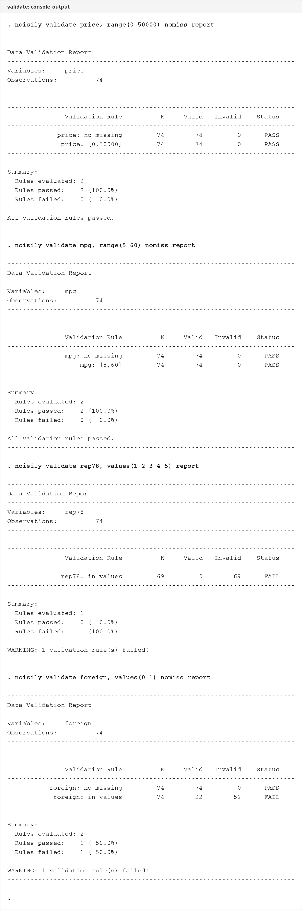
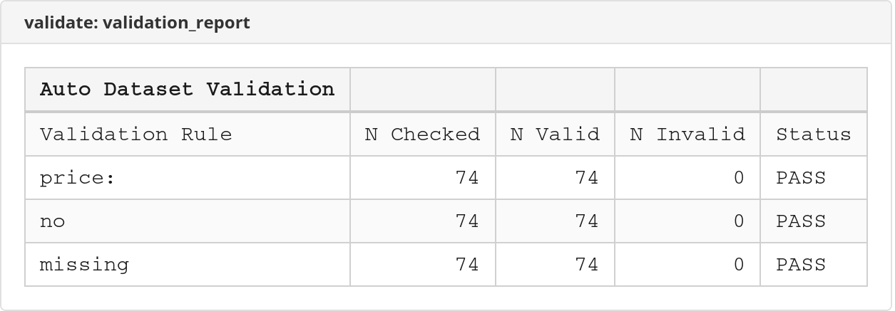

# validate

 

Data validation rules - define expected ranges, patterns, and cross-variable checks with report generation.

## Description

`validate` defines and runs data validation rules to check data quality and integrity. It supports range checks, value checks, pattern matching, missing value detection, uniqueness constraints, and cross-variable conditions.

Key features:
- Multiple validation rule types
- Cross-variable condition checks
- Generate validation indicators
- Assert on failure option
- Excel report export
- Designed for registry data QC

## Screenshots

### Console Output


### Validation Report


## Installation

```stata
net install validate, from("https://raw.githubusercontent.com/tpcopeland/Stata-Dev/main/validate")
```

## Syntax

```stata
validate varlist [if] [in] [, options]
```

## Options

| Option | Description |
|--------|-------------|
| **range(# #)** | Expected numeric range (min max) |
| **values(list)** | Expected values (numeric or string) |
| **pattern(regex)** | Expected regex pattern for strings |
| **type(string)** | Expected type: numeric, string, date |
| **nomiss** | No missing values allowed |
| **unique** | All values must be unique |
| **cross(condition)** | Cross-variable validation expression |
| **assert** | Stop execution on failure |
| **generate(name)** | Generate indicator for valid observations |
| **replace** | Allow replacing existing variable |
| **report** | Display detailed report |
| **xlsx(filename)** | Export validation report to Excel |

## Validation Rule Types

### Range Check
Verify numeric values fall within expected bounds:
```stata
validate age, range(0 120)
```

### Value Check
Verify values match expected set:
```stata
validate sex, values(0 1)
validate status, values("active" "inactive" "pending")
```

### Pattern Check
Verify strings match regex pattern:
```stata
validate patient_id, pattern("^P[0-9]{6}$")
```

### Missing Check
Verify no missing values:
```stata
validate id name dob, nomiss
```

### Uniqueness Check
Verify all values are unique:
```stata
validate id, unique
```

### Cross-Variable Check
Verify relationships between variables:
```stata
validate start_date end_date, cross(start_date <= end_date)
```

## Examples

### Check age is in valid range

```stata
sysuse auto, clear
validate mpg, range(10 50) nomiss
```

### Check categorical values

```stata
validate foreign, values(0 1)
```

### Check multiple variables

```stata
validate price mpg weight, nomiss
```

### Cross-variable validation

```stata
validate price mpg, cross(price > 0 & mpg > 0)
```

### Generate validation indicator

```stata
validate price mpg, range(0 50000) generate(valid)
tab valid
```

### Assert on failure

```stata
validate foreign, values(0 1) assert
```

### Export to Excel

```stata
validate price mpg weight, nomiss xlsx(validation.xlsx)
```

## Typical Workflow

1. Load data
2. Run `validate` with expected rules
3. Review any failures
4. Fix issues or document exceptions
5. Proceed with analysis

```stata
use mydata, clear

* Run validation suite
validate id, unique nomiss
validate age, range(0 120) nomiss
validate sex, values(1 2)
validate start_date end_date, cross(start_date <= end_date)

* Generate validation indicator
validate age sex, nomiss generate(is_valid)

* Keep only valid records
keep if is_valid == 1
```

### Registry data validation suite

```stata
use _examples/cohort.dta, clear

* Validate person identifier
validate id, unique nomiss

* Validate age range
validate index_age, range(18 100) nomiss

* Validate sex coding
validate female, values(0 1)

* Validate date ordering
validate study_entry study_exit, cross(study_entry <= study_exit)

* Validate death date (should be after entry if present)
validate study_entry death_date, ///
    cross(death_date >= study_entry | missing(death_date))

* Generate validation indicator
validate index_age female education, nomiss generate(is_valid)
keep if is_valid == 1
```

### Diagnosis data validation

```stata
use _examples/diagnoses.dta, clear

* Discharge must be on or after visit
validate visit_date discharge_date, cross(discharge_date >= visit_date)

* Care type must be 1 or 2
validate care_type, values(1 2)
```

## Stored Results

`validate` stores the following in `r()`:

**Scalars:**

| Result | Description |
|--------|-------------|
| `r(N)` | Number of observations checked |
| `r(n_rules)` | Total rules evaluated |
| `r(rules_passed)` | Rules that passed |
| `r(rules_failed)` | Rules that failed |
| `r(pct_passed)` | Percentage passed |

**Matrices:**

| Result | Description |
|--------|-------------|
| `r(results)` | Matrix of validation results |

## Requirements

- Stata 16.0 or higher

## Version

- **Version 1.0.0** (21 December 2025): Initial release

## Author

Timothy P Copeland<br>
Department of Clinical Neuroscience<br>
Karolinska Institutet

## License

MIT License

## See Also

- `help assert` - Stata's assert command
- `help codebook` - Describe data contents
- `help describe` - Describe data in memory
